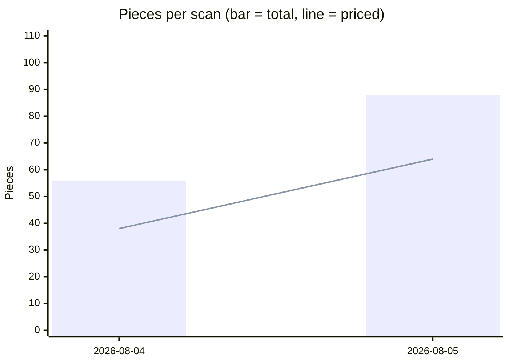
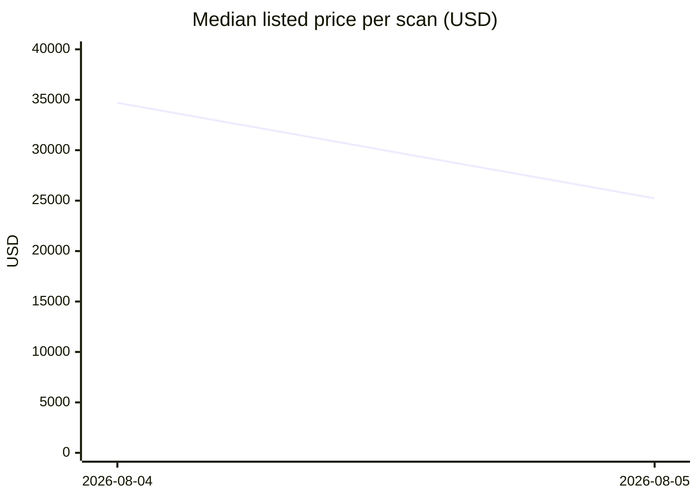

# David Webb Secondary-Market Scan — 2026-08-05

## Week-over-week trends

| Scan | Pieces | Priced | Median | Max |
|---|---|---|---|---|
| 2026-08-04 | 56 | 38 | $34,700 | $700,000 |
| 2026-08-05 | 88 | 64 | $25,230 | $215,000 |

## Executive Summary

The August 5, 2026 scan captured **88 David Webb pieces** across dealer and auction sources — a **57% jump in volume** from the 56 pieces recorded on August 4. Despite that inventory surge, the overall median asking/hammer price compressed from **$34,700 to $25,230**, a decline of roughly 27% in a single scan cycle. This shift is consistent with the broader market pattern visible in the trend series: the August 4 snapshot was anchored by a small, premium-heavy set (max $700,000), while August 5's larger universe pulls in a substantial mid-market cohort that dilutes the median. The top of the market remains robust — the highest-priced piece cleared $215,000 on an asking basis — but the concentration of new inventory in the $10,000–$40,000 band is a meaningful signal that resellers are seeding supply ahead of the Fall auction season. Categories to watch: necklaces command the widest price corridor ($5,500–$215,000) while bracelets show the deepest liquid inventory (28 pieces, median $37,500).

---

## Price Ranges by Category

| Category  | Total Listings | Priced | Min (USD) | Median (USD) | Max (USD) |
|-----------|:--------------:|:------:|----------:|-------------:|----------:|
| Bracelet  | 28 | 20 | $9,500 | $37,500 | $96,800 |
| Brooch    | 17 | 14 | $5,625 | $26,750 | $95,000 |
| Ring      | 13 |  9 | $6,000 | $14,025 | $115,830 |
| Necklace  | 13 | 11 | $5,500 | $38,000 | $215,000 |
| Earrings  | 12 |  8 | $6,875 | $18,160 | $35,000 |
| Other     |  5 |  2 | $2,500 | $48,125 | $93,750 |
| **Total** | **88** | **64** | **$2,500** | **$25,230** | **$215,000** |

*Price types in this scan: 58 dealer asking prices, 24 auction hammer prices, 6 estimates.*

---

## Notable Pieces

### 🥇 David Webb Coral Bead, White Enamel and Diamond Necklace — $215,000
**Era:** 1970s | **Source:** 1stDibs | **Price type:** Asking  
**Materials:** 18k yellow gold, platinum, round coral beads, round brilliant diamonds (~9.47 ct), tulip-tipped white enamel links  
The standout listing of the scan. A quintessential example of Webb's polychrome maximalism from his most celebrated decade. The combination of natural coral, heavy diamond weight, and intact enamel work places this firmly at trophy-piece level for serious collectors.  
[View listing →](https://www.1stdibs.com/jewelry/necklaces/pendant-necklaces/david-webb-coral-bead-white-enamel-diamond-necklace/id-j_23921102)

---

### 🥈 Coral and Diamond Choker Necklace — $140,185 (hammer)
**Source:** Sotheby's | **Price type:** Auction hammer  
**Materials:** Coral, diamonds  
The top auction result in this scan. At $140,185 hammer, this piece underscores continued collector appetite for Webb's coral treatments. *Note: buyer's premium not reflected in this figure.*

---

### Platinum Eternity Band with Radiant Cut Diamonds — $115,830
**Era:** Late 1970s | **Source:** 1stDibs | **Price type:** Asking  
**Materials:** Platinum, 12.92 carats radiant-cut diamonds (GIA certified)  
The highest-priced ring in this scan by a wide margin, lifting the category max well above its median of $14,025. GIA certification and significant carat weight make this a strong comp for estate and resale appraisals.  
[View listing →](https://www.1stdibs.com/creators/david-webb/jewelry/rings/band-rings/)

---

### David Webb Turquoise, Lapis Lazuli, Diamond and White Enamel Collar Necklace — $98,000
**Source:** 1stDibs | **Price type:** Asking  
**Materials:** 18k yellow gold, platinum, turquoise cabochons, lapis lazuli bars, white enamel links, round brilliant diamonds (~12.00 ct, F-G color, VS clarity)  
A signature polychrome collar that exemplifies Webb's architectural approach to necklace construction. The ~12.00 ct diamond complement at F-G/VS is noteworthy for a piece where colored stones are the visual anchor.  
[View listing →](https://www.1stdibs.com/jewelry/necklaces/link-necklaces/david-webb-turquoise-lapis-lazuli-diamond-necklace/id-j_26617312)

---

### David Webb Zebra (Horse) Bracelet — $96,800
**Era:** 20th century | **Source:** 1stDibs | **Price type:** Asking  
**Materials:** 18k gold, platinum, white enamel, ~4.00 ctw GH/VS diamonds, ruby cabochon eyes  
Webb's animal-motif pieces consistently outperform at auction; this asking price of $96,800 reflects that premium. The white enamel and ruby-eye combination is among the most recognizable of the Webb iconographic canon.  
[View listing →](https://www.1stdibs.com/jewelry/bracelets/bangles/david-webb-white-diamond-ruby-enamel-gold-platinum-zebra-bracelet/id-j_9229002)

---

### Maltese Cross Diamond Brooch / Brooch-Pendant — $95,000
**Source:** 1stDibs | **Price type:** Asking  
**Materials:** 18k yellow gold, platinum, ~12.00 ct pavé round brilliant diamonds + ~1.20 ct bezel-set center  
Two listings for what appears to be the same or near-identical Maltese Cross piece are present in this scan, each priced at $95,000. This duplication warrants verification (see Data-Quality Caveats below).  
[View listing →](https://www.1stdibs.com/jewelry/brooches/brooches/david-webb-maltese-cross-diamond-brooch/id-j_2192603)

---

### Gold, Enamel, Emerald and Diamond Tiger Head Bracelet — $80,000 (hammer)
**Source:** Sotheby's | **Price type:** Auction hammer  
**Materials:** 18k gold, enamel, emeralds, diamonds  
A strong hammer result for an iconic Webb animal-motif piece. Confirms that enamel-and-gemstone beast bracelets hold real secondary-market depth even absent the asking-price premium.

---

## Asking vs. Auction

Of the 64 priced pieces, **58 are dealer asking prices** and **24 are auction hammer results** (with 6 pre-sale estimates also captured). The spread is instructive: the top dealer asking price ($215,000) exceeds the top hammer result in this scan ($140,185) by approximately 53%. This is broadly consistent with the established pattern in the Webb secondary market, where dealers price to the retail-resale ceiling while auction hammers reflect competitive-but-efficient price discovery. Buyers acquiring from dealers should expect to pay a meaningful premium relative to recent auction comps; sellers considering auction consignment should weigh that gap against the certainty and timing that a negotiated dealer sale can provide. Hammer prices in this dataset **exclude buyer's premium**, which at major houses (Sotheby's, Christie's) typically adds 20–26% to the effective cost to the buyer.

---

## Data-Quality Caveats

- **Asking prices are retail-resale comps**, set by dealers to reflect condition, provenance, and market positioning. They do not represent realized transaction prices and may reflect aspirational pricing.
- **Auction hammer prices exclude buyer's premium.** The all-in cost to the buyer is materially higher than the figures shown.
- **Occasional miscategorization** is possible (e.g., a brooch-pendant dual-function piece counted under "brooch," or a suite lot counted as "other"). Category-level counts and medians should be treated as directional rather than definitive.
- **Duplicate listings:** The two Maltese Cross Diamond Brooch entries share the same 1stDibs URL and price; this scan may be double-counting a single piece. The "other" category median ($48,125) is based on only 2 priced pieces and is statistically fragile.
- **Unpriced pieces (24 of 88):** Pieces listed without prices — common for auction archives, POA dealer listings, and recently sold items — are excluded from all price statistics and may skew apparent category depth.
