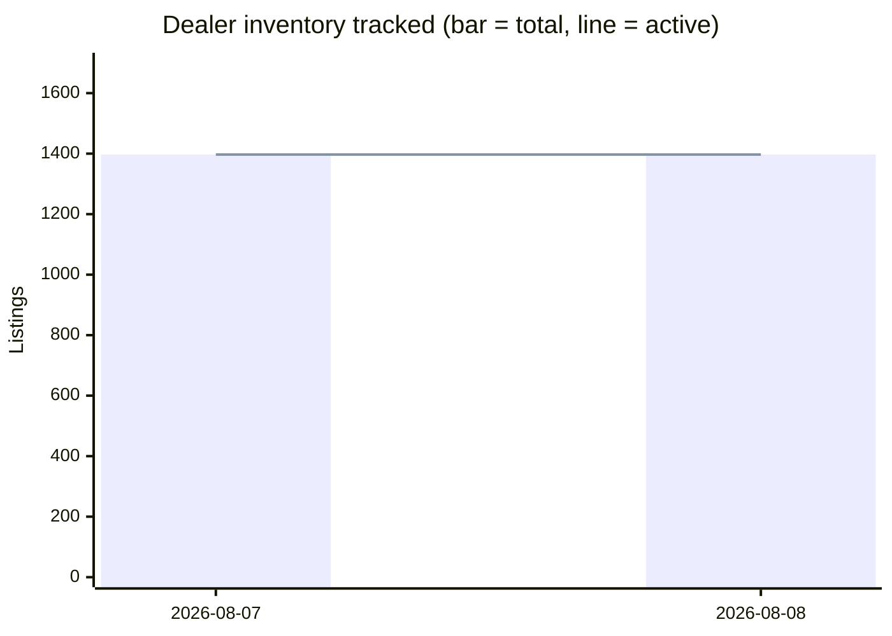

# David Webb Secondary-Market Report — August 8, 2026

## Week-over-week trends

| Week | Auction records | Dealer records | Active listings | New (auction/dealer) |
|---|---|---|---|---|
| 2026-08-07 | 3948 | 1397 | 1397 | 3948/1397 |
| 2026-08-08 | 3948 | 1397 | 1397 | 3948/1397 |

## Executive Summary

This is the **baseline run** of the David Webb secondary-market pipeline. All 3,948 auction records and 1,397 dealer listings appear as "new this week" simply because the database was just backfilled — this does not reflect genuine week-over-week market movement. The trend series contains two entries with identical figures (August 7 and August 8), confirming no real delta has been captured yet; future weekly reports will surface true period-over-period signals. For genuine market intelligence this week, the most meaningful data points are the **28 auction hammer prices recorded in the past 60 days** (median: $44,610) and the **current live dealer inventory**, eight highlights of which are called out below. The dealer asking-price median across all 1,397 active listings sits at **$25,000**, roughly half the recent-auction median, a spread consistent with auction lots skewing toward higher-value consignments. No dealer delistings have been recorded in the past 10 days.

---

## Recent Auction Activity

**28 lots** sold at auction in the 60 days ending August 8, 2026, with a **median hammer price of $44,610** (buyer's premium excluded). Christie's and Sotheby's dominated, with notable Asian-sale results from Sotheby's Hong Kong in mid-June. Selected highlights:

| Piece | House | Date | Hammer | Link |
|---|---|---|---|---|
| A Sensational David Webb Ruby and Diamond Necklace | Christie's | 2026-06-09 | $254,000 | [Lot 6588961](https://www.christies.com/en/lot/lot-6588961) |
| VAN CLEEF & ARPELS Ruby and Diamond Bracelet | Christie's | 2026-06-09 | $215,900 | [Lot 6588851](https://www.christies.com/en/lot/lot-6588851) |
| Pair of Colored Stone and Diamond Pendant-Earclips | Sotheby's | 2026-06-18 | $153,600 | — |
| Diamond, Colored Diamond, Ruby and Gold 'Double Leopard' Bracelet | Sotheby's | 2026-06-16 | $121,600 | — |
| David Webb Emerald and Diamond Necklace | Christie's | 2026-06-09 | $120,650 | [Lot 6588952](https://www.christies.com/en/lot/lot-6588952) |
| Gold, Emerald, Diamond, and Enamel Cuff-Bracelet | Sotheby's | 2026-06-16 | $70,400 | — |
| Emerald and Diamond Ring | Sotheby's | 2026-06-16 | $64,000 | — |
| David Webb Multi-Gem and Diamond Lion Bracelet | Christie's | 2026-06-09 | $60,960 | [Lot 6588841](https://www.christies.com/en/lot/lot-6588841) |

The Christie's June 9 sale was the most productive single session in the recent window, clearing five significant Webb lots. The ruby-and-diamond necklace at $254,000 stands as the strongest recent hammer, consistent with the sustained collector appetite for Webb's bold gemstone-and-gold idiom.

---

## Dealer Market This Week

Because this is the baseline ingestion, all 1,397 listings register as "new." No meaningful "newly listed vs. standing inventory" distinction can be drawn until next week's delta is calculated. **No delistings** were recorded in the past 10 days, so there are no confirmed recent sales to report from the dealer channel.

Eight high-value listings surfaced with a `first_seen` date of August 7–8 and represent either genuinely new-to-market pieces or recently re-priced inventory that will be tracked going forward:

| Piece | Dealer | Asking Price |
|---|---|---|
| [David Webb Cabochon Emerald and Diamond Bracelet](https://ericoriginals.com/products/david-webb-cabochon-emerald-and-diamond-bracelet) | Eric Originals & Antiques | $410,000 |
| [Mid-century Diamond Cocktail Ring, David Webb](https://kentshire.com/products/mid-century-diamond-cocktail-ring-david-webb) | Kentshire | $375,000 |
| [David Webb Jade Platinum & 18K Yellow Gold Jade, Diamond, Blue Enamel Necklace](https://thebackvault.com/products/david-webb-jade-platinum-18k-yellow-gold-jade-diamond-blue-enamel-necklace-rr8093) | The Back Vault | $289,500 |
| [David Webb 27 Carat Diamond Emerald Pearl Gold Platinum Panther Bracelet Watch](https://oakgem.com/products/david-webb-27-carat-diamond-emerald-pearl-gold-platinum-panther-bracelet-watch) | Oak Gem | $280,000 |
| [Vintage 1960s David Webb 48.00 Carat Diamond Necklace](https://ericoriginals.com/products/vintage-1960s-david-webb-48-00-carat-diamond-necklace) | Eric Originals & Antiques | $265,000 |
| [David Webb Platinum & 18K Yellow Gold Carved Coral Bangle Bracelet](https://thebackvault.com/products/david-webb-platinum-18k-yellow-gold-carved-coral-bangle-bracelet-rr5117) | The Back Vault | $250,200 |
| [David Webb Turquoise Platinum Turquoise and Diamond Necklace](https://thebackvault.com/products/david-webb-turquoise-platinum-turquoise-and-diamond-necklace-rr7804) | The Back Vault | $240,500 |
| [DAVID WEBB Amber Tassel Necklace](https://yafasignedjewels.com/products/david-webb-amber-tassel-necklace) | Yafa Signed Jewels | $238,000 |

The Back Vault accounts for three of the eight top listings; Eric Originals & Antiques for two, each at the very top of the range.

---

## Price Snapshot by Category

### Auction Hammer Prices (all-time, 3,948 records; buyer's premium excluded)

| Category | Count | Min | Median | Max |
|---|---|---|---|---|
| Bracelet | 730 | $822 | $20,000 | $7,460,000 |
| Earrings | 695 | $825 | $7,680 | $275,000 |
| Necklace | 608 | $375 | $17,920 | $1,265,000 |
| Ring | 536 | $460 | $8,320 | $7,698,500 |
| Brooch | 404 | $562 | $10,625 | $343,500 |
| Other | 306 | $200 | $14,090 | $11,260,000 |

### Dealer Asking Prices (1,397 active listings; asking prices only, not confirmed sale prices)

| Category | Count | Min | Median | Max |
|---|---|---|---|---|
| Earrings | 399 | $1 | $18,800 | $227,500 |
| Bracelet | 305 | $2,900 | $39,900 | $410,000 |
| Ring | 299 | $3,100 | $20,100 | $375,000 |
| Necklace | 203 | $3,500 | $42,200 | $289,500 |
| Brooch | 118 | $4,500 | $24,750 | $114,400 |
| Other | 5 | $11,950 | $37,500 | $150,000 |

**Observation:** Dealer asking medians for bracelets ($39,900) and necklaces ($42,200) substantially exceed their auction hammer medians ($20,000 and $17,920 respectively), reflecting the standard retail premium over secondary-market hammer — and the fact that dealer inventory skews toward presentation-ready, retail-condition pieces.

---

## All-Time Notable Sales

The five highest-value auction results in the database provide useful ceiling context. Note that two of the top three are denominated in legacy currencies (Italian Lire, Hong Kong Dollars) and reflect their respective sale-date FX rates.

| Piece | House | Date | Price | Link |
|---|---|---|---|---|
| [Demi parure: enamel frog brooch & earrings suite, 18K gold](https://www.christies.com/en/lot/lot-2491651) | Christie's | 1994-05-26 | ITL 11,260,000 | Link |
| [The Annenberg Diamond — exceptional diamond ring, by David Webb](https://www.christies.com/en/lot/lot-5250229) | Christie's | 2009-10-21 | $7,698,500 | Link |
| [A Sapphire and Diamond Bracelet, by David Webb](https://www.christies.com/en/lot/lot-5442124) | Christie's | 2011-05-31 | HKD 7,460,000 | Link |
| [Spilla anni '50: rubies, sapphires, brilliants & yellow sapphires, 18K gold](https://www.christies.com/en/lot/lot-2493463) | Christie's | 1994-12-01 | ITL 4,278,000 | Link |
| [A Diamond Ring, by David Webb](https://www.christies.com/en/lot/lot-5578141) | Christie's | 2012-06-12 | $1,874,500 | Link |

The Annenberg Diamond at $7,698,500 (2009) remains the highest USD-denominated result in the dataset and is a useful reference point for museum-quality Webb solitaire rings.

---

## Data-Quality Caveats

- **Auction hammer prices exclude buyer's premium.** Effective all-in cost to the buyer (typically 20–26% above hammer at major houses) will be materially higher than figures shown.
- **Dealer asking prices are not confirmed sale prices.** They represent the listed retail ask at the time of data collection and may be subject to negotiation.
- **"Delisted" status does not always mean sold.** Items may be withdrawn, transferred to private sale channels, or repriced and relisted under a new SKU. The "recentlyDelisted" signal is a useful but imperfect proxy for sell-through.
- **Currency heterogeneity in all-time records.** Historic lots denominated in ITL (Italian Lire) and HKD (Hong Kong Dollars) are preserved in their original currencies; direct comparison to USD figures requires period-appropriate conversion.
- **Baseline ingestion caveat.** All "new this week" counts in this run reflect the initial database backfill rather than genuine weekly market additions. Week-over-week trend analysis will become meaningful from the next scheduled report onward.
