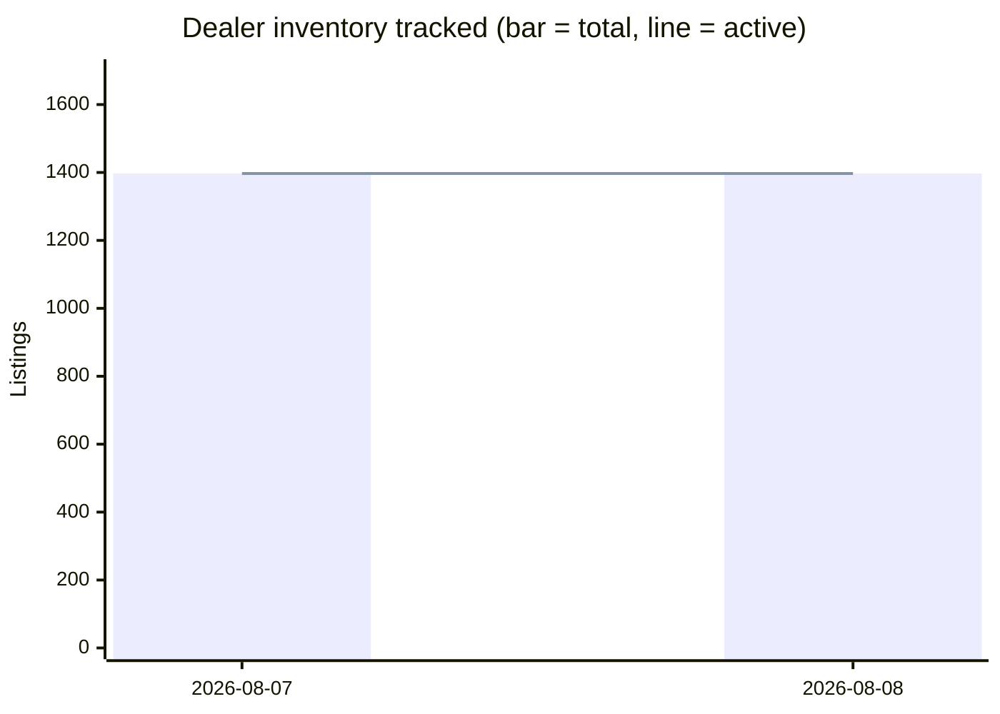

# David Webb Secondary-Market Report — 2026-08-08

## Week-over-week trends

| Week | Auction records | Dealer records | Active listings | New (auction/dealer) |
|---|---|---|---|---|
| 2026-08-07 | 3948 | 1397 | 1397 | 3948/1397 |
| 2026-08-08 | 3948 | 1397 | 1397 | 3948/1397 |

## Executive Summary

This is the **baseline run** of the David Webb secondary-market pipeline. The database has been backfilled in a single pass with 3,948 historical auction records and 1,397 current dealer listings, so the raw "new this week" figures simply reflect the full corpus loaded at once — they are *not* evidence of unusual week-over-week activity. Future weekly reports will carry genuine incremental signals as new auction results and dealer-inventory changes are captured against this baseline. The most meaningful market data available right now are the **28 auction sales recorded in the past 60 days** (median hammer: $44,610) and the current live dealer asking-price landscape (overall median ask: $25,000). Christie's and Sotheby's drove all significant recent hammers, with a Christie's ruby-and-diamond necklace topping the recent period at $254,000. On the dealer side, asking prices run substantially above auction medians in most categories — particularly bracelets and necklaces — consistent with the retail premium typical of estate dealers carrying authenticated, ready-to-wear Webb inventory.

---

## Recent Auction Activity

**28 sales** in the past 60 days (sale dates: 9 Jun – 18 Jun 2026). **Median hammer price: $44,610** (excluding buyer's premium).

| Piece | House | Date | Hammer | Link |
|---|---|---|---|---|
| A Sensational David Webb Ruby and Diamond Necklace | Christie's | 2026-06-09 | $254,000 | [View](https://www.christies.com/en/lot/lot-6588961) |
| VAN CLEEF & ARPELS Ruby and Diamond Bracelet | Christie's | 2026-06-09 | $215,900 | [View](https://www.christies.com/en/lot/lot-6588851) |
| Pair of Colored Stone and Diamond Pendant-Earclips | Sotheby's | 2026-06-18 | $153,600 | — |
| Diamond, Colored Diamond, Ruby and Gold 'Double Leopard' Bracelet | Sotheby's | 2026-06-16 | $121,600 | — |
| David Webb Emerald and Diamond Necklace | Christie's | 2026-06-09 | $120,650 | [View](https://www.christies.com/en/lot/lot-6588952) |
| Gold, Emerald, Diamond, and Enamel Cuff-Bracelet | Sotheby's | 2026-06-16 | $70,400 | — |
| Emerald and Diamond Ring | Sotheby's | 2026-06-16 | $64,000 | — |
| David Webb Multi-Gem and Diamond Lion Bracelet | Christie's | 2026-06-09 | $60,960 | [View](https://www.christies.com/en/lot/lot-6588841) |

*All hammer prices exclude buyer's premium. Results from the full 28-lot window not individually listed above contributed to the $44,610 median.*

---

## Dealer Market This Week

Because this is the baseline run, all 1,397 dealer listings entered the system simultaneously and do not represent a true "new to market" cohort. That said, the following eight pieces carry a `first_seen` date of **2026-08-07** and represent the earliest genuinely timestamped additions — worth monitoring for price changes or delistings in coming weeks.

### Newly Observed Listings

| Piece | Dealer | Ask | Link |
|---|---|---|---|
| David Webb Cabochon Emerald and Diamond Bracelet | Eric Originals & Antiques | $410,000 | [View](https://ericoriginals.com/products/david-webb-cabochon-emerald-and-diamond-bracelet) |
| Mid-Century Diamond Cocktail Ring, David Webb | Kentshire | $375,000 | [View](https://kentshire.com/products/mid-century-diamond-cocktail-ring-david-webb) |
| David Webb Jade Platinum & 18K Yellow Gold Jade, Diamond, Blue Enamel Necklace | The Back Vault | $289,500 | [View](https://thebackvault.com/products/david-webb-jade-platinum-18k-yellow-gold-jade-diamond-blue-enamel-necklace-rr8093) |
| David Webb 27 Carat Diamond Emerald Pearl Gold Platinum Panther Bracelet Watch | Oak Gem | $280,000 | [View](https://oakgem.com/products/david-webb-27-carat-diamond-emerald-pearl-gold-platinum-panther-bracelet-watch) |
| Vintage 1960s David Webb 48.00 Carat Diamond Necklace | Eric Originals & Antiques | $265,000 | [View](https://ericoriginals.com/products/vintage-1960s-david-webb-48-00-carat-diamond-necklace) |
| David Webb Platinum & 18K Yellow Gold Carved Coral Bangle Bracelet | The Back Vault | $250,200 | [View](https://thebackvault.com/products/david-webb-platinum-18k-yellow-gold-carved-coral-bangle-bracelet-rr5117) |
| David Webb Turquoise Platinum Turquoise and Diamond Necklace | The Back Vault | $240,500 | [View](https://thebackvault.com/products/david-webb-turquoise-platinum-turquoise-and-diamond-necklace-rr7804) |
| David Webb Amber Tassel Necklace | Yafa Signed Jewels | $238,000 | [View](https://yafasignedjewels.com/products/david-webb-amber-tassel-necklace) |

### Recently Delisted

**0 listings** removed from the market in the past 10 days. No confirmed delistings to report this cycle.

---

## Price Snapshot by Category

### Auction Results (3,948 total records, all-time)

| Category | Count | Min | Median | Max |
|---|---|---|---|---|
| Bracelet | 730 | $822 | $20,000 | $7,460,000* |
| Earrings | 695 | $825 | $7,680 | $275,000 |
| Necklace | 608 | $375 | $17,920 | $1,265,000 |
| Ring | 536 | $460 | $8,320 | $7,698,500 |
| Brooch | 404 | $562 | $10,625 | $343,500 |
| Other | 306 | $200 | $14,090 | $11,260,000† |

*\* HKD-denominated result converted/recorded as shown. † ITL-denominated result from 1994; see caveats below.*

### Current Dealer Asking Prices (1,397 active listings)

| Category | Count | Min Ask | Median Ask | Max Ask |
|---|---|---|---|---|
| Earrings | 399 | $1 | $18,800 | $227,500 |
| Bracelet | 305 | $2,900 | $39,900 | $410,000 |
| Ring | 299 | $3,100 | $20,100 | $375,000 |
| Necklace | 203 | $3,500 | $42,200 | $289,500 |
| Brooch | 118 | $4,500 | $24,750 | $114,400 |
| Other | 5 | $11,950 | $37,500 | $150,000 |

*Overall dealer asking-price median across all categories: **$25,000.***

---

## All-Time Notable Sales

These landmark results provide historical ceiling context for the Webb market.

| Piece | House | Date | Price | Link |
|---|---|---|---|---|
| [Demi parure: enamel frog brooch & earrings (18k)](https://www.christies.com/en/lot/lot-2491651) | Christie's | 1994-05-26 | ITL 11,260,000 | [View](https://www.christies.com/en/lot/lot-2491651) |
| [The Annenberg Diamond — Exceptional Diamond Ring](https://www.christies.com/en/lot/lot-5250229) | Christie's | 2009-10-21 | $7,698,500 | [View](https://www.christies.com/en/lot/lot-5250229) |
| [A Sapphire and Diamond Bracelet](https://www.christies.com/en/lot/lot-5442124) | Christie's | 2011-05-31 | HKD 7,460,000 | [View](https://www.christies.com/en/lot/lot-5442124) |
| [Spilla anni '50: rubini, zaffiri, brillanti (18k)](https://www.christies.com/en/lot/lot-2493463) | Christie's | 1994-12-01 | ITL 4,278,000 | [View](https://www.christies.com/en/lot/lot-2493463) |
| [A Diamond Ring](https://www.christies.com/en/lot/lot-5578141) | Christie's | 2012-06-12 | $1,874,500 | [View](https://www.christies.com/en/lot/lot-5578141) |

*Note: ITL (Italian lire) and HKD results are recorded in their original sale currency as provided; USD equivalency would require period-appropriate FX conversion.*

---

## Data-Quality Caveats

- **Auction hammer prices exclude buyer's premium.** Actual buyer cost is typically 20–26% higher depending on the house and lot tier.
- **Dealer asking prices are not confirmed sale prices.** They represent listed retail asks and may be subject to negotiation or remain unsold indefinitely.
- **"Delisted" ≠ definitively sold.** When a dealer listing disappears from inventory (`recentlyDelisted`), it most commonly indicates a sale, but items may also be withdrawn, returned to consignor, or re-listed under a different SKU.
- **Multi-currency records** (ITL, HKD) in the all-time sales and category tables are stored in their original transaction currency. Cross-currency median comparisons should be treated with caution.
- **Earrings dealer min of $1** likely reflects a data entry anomaly and should be investigated before relying on that floor figure.
- This is the **baseline run**; all trend-series comparisons will be meaningful from the next weekly report onward.
