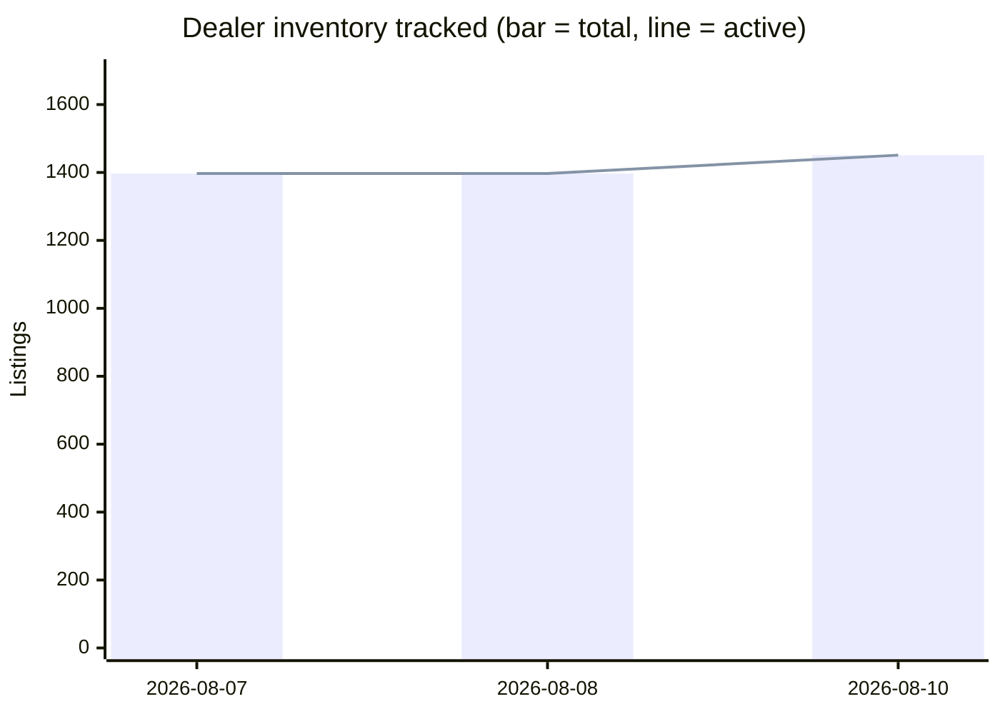

# David Webb Secondary Market Report — August 10, 2026

## Week-over-week trends

| Week | Auction records | Dealer records | Active listings | New (auction/dealer) |
|---|---|---|---|---|
| 2026-08-07 | 3948 | 1397 | 1397 | 3948/1397 |
| 2026-08-08 | 3948 | 1397 | 1397 | 3948/1397 |
| 2026-08-10 | 3884 | 1451 | 1451 | 3884/1451 |

## Trends by motif & material

_Tags are keyword-matched from each piece's own listing text against David Webb's known design vocabulary (Zodiac, animal/creature pieces, fishscale, rock crystal, enamel, carved hardstone, etc.) — a piece can carry several tags. Tags with fewer than 5 matching records are omitted as too thin to be meaningful._

**Auction (sold prices)**

| Tag | Count | Min | Median | Max |
|---|---|---|---|---|
| Enamel | 947 | $719 | $10,800 | $134,500 |
| Cabochon | 933 | $1,250 | $16,380 | $508,000 |
| Carved Hardstone | 555 | $875 | $15,000 | $693,000 |
| Hammered Gold | 428 | $1,250 | $11,420 | $201,600 |
| Animal/Creature | 415 | $719 | $12,065 | $218,500 |
| Cuff/Bangle | 361 | $1,314 | $23,750 | $218,500 |
| Bombé | 201 | $1,250 | $12,454 | $1,426,500 |
| Rock Crystal | 177 | $954 | $12,516 | $106,250 |
| Maltese Cross | 36 | $3,125 | $20,000 | $134,500 |
| Door Knocker | 29 | $3,125 | $9,525 | $106,250 |
| Zodiac | 27 | $812 | $8,713 | $90,000 |
| Shell/Starfish | 17 | $1,700 | $5,175 | $146,500 |

**Current dealer inventory (asking prices)**

| Tag | Count | Min | Median | Max |
|---|---|---|---|---|
| Enamel | 449 | $2,900 | $21,400 | $289,500 |
| Carved Hardstone | 265 | $3,850 | $35,700 | $289,500 |
| Cabochon | 254 | $3,200 | $27,600 | $410,000 |
| Animal/Creature | 221 | $3,100 | $22,100 | $280,000 |
| Hammered Gold | 159 | $4,150 | $24,000 | $132,000 |
| Cuff/Bangle | 149 | $3,200 | $37,300 | $250,200 |
| 1970s | 131 | $3,100 | $26,400 | $289,500 |
| 1960s | 87 | $3,100 | $27,800 | $265,000 |
| Rock Crystal | 60 | $4,800 | $33,250 | $225,000 |
| Bombé | 55 | $6,400 | $18,800 | $214,500 |
| 1980s | 52 | $4,250 | $22,700 | $81,200 |
| Door Knocker | 45 | $9,700 | $20,800 | $214,500 |
| Zodiac | 18 | $4,500 | $18,150 | $64,300 |
| Maltese Cross | 12 | $27,300 | $35,050 | $65,000 |
| Shell/Starfish | 12 | $7,200 | $15,650 | $41,600 |

## Worth a second look

_Implausibly low price for the category — a heuristic signal for a human to check, not a fraud determination. A flagged piece may well be genuine; this just surfaces things worth a closer look before relying on the listing. Click through to validate each one. (360 total, showing the 10 cheapest.)_

- [Pair of Gold Necklace Shorteners, David Webb](https://www.doyle.com/auction/lot/lot-142---pair-of-gold-necklace-shorteners-david-webb/?lot=1044120&so=4&st=david webb&sto=0&au=&ef=&et=&ic=False&sd=1&mc=409&mc=9&mc=4&mc=25&mc=167&mc=5&mc=173&mc=410&mc=554&mc=3&mc=209&mc=31&mc=219&mc=188&mc=325&mc=190&mc=146&pp=96&pn=11&g=1) — $375 via Doyle. $375 is well below the typical range for "necklace" (609 comparable auction records, median $17,920).
- [Gold Leaf Brooch, David Webb](https://www.doyle.com/auction/lot/lot-534---gold-leaf-brooch-david-webb/?lot=1020224&so=4&st=david webb&sto=0&au=&ef=&et=&ic=False&sd=1&mc=409&mc=9&mc=4&mc=25&mc=167&mc=5&mc=173&mc=410&mc=554&mc=3&mc=209&mc=31&mc=219&mc=188&mc=325&mc=190&mc=146&pp=96&pn=12&g=1) — $562 via Doyle. $562 is well below the typical range for "brooch" (390 comparable auction records, median $10,713).
- [A GOLD AND DIAMOND PENDANT, BY DAVID WEBB](https://www.christies.com/en/lot/lot-3830577) — $587 via Christie's. $587 is well below the typical range for "necklace" (609 comparable auction records, median $17,920).
- [A David Webb ring modelled as a leopard's head and tail, with black enamel spots and gem set eyes, signed.](https://www.christies.com/en/lot/lot-711892) — $719 (GBP 460) via Christie's. $719 is well below the typical range for "ring" (536 comparable auction records, median $8,320).
- [A Sagittarius brooch by David Webb](https://www.christies.com/en/lot/lot-2533639) — $812 (GBP 564) via Christie's. $812 is well below the typical range for "brooch" (390 comparable auction records, median $10,713).
- [A MUTLISTRAND CULTURED PEARL AND DIAMOND BRACELET, DAVID WEBB](https://www.christies.com/en/lot/lot-1862648) — $822 via Christie's. $822 is well below the typical range for "bracelet" (644 comparable auction records, median $22,590).
- [[BOOKS-JEWELRY] Group of approximately...](https://www.doyle.com/auction/lot/lot-814---books-jewelry-group-of-approximately/?lot=1277810&so=4&st=david webb&sto=0&au=&ef=&et=&ic=False&sd=1&mc=409&mc=9&mc=4&mc=25&mc=167&mc=5&mc=173&mc=410&mc=554&mc=3&mc=209&mc=31&mc=219&mc=188&mc=325&mc=190&mc=146&pp=96&pn=4&g=1) — $875 via Doyle. $875 is well below the typical range for "other" (296 comparable auction records, median $14,705).
- [Gold Jabot, David Webb](https://www.doyle.com/auction/lot/lot-323---gold-jabot-david-webb/?lot=1181319&so=4&st=david webb&sto=0&au=&ef=&et=&ic=False&sd=1&mc=409&mc=9&mc=4&mc=25&mc=167&mc=5&mc=173&mc=410&mc=554&mc=3&mc=209&mc=31&mc=219&mc=188&mc=325&mc=190&mc=146&pp=96&pn=8&g=1) — $875 via Doyle. $875 is well below the typical range for "other" (296 comparable auction records, median $14,705).
- [Gold and Jade Ring, David Webb](https://www.doyle.com/auction/lot/lot-519---gold-and-jade-ring-david-webb/?lot=1076359&so=4&st=david webb&sto=0&au=&ef=&et=&ic=False&sd=1&mc=409&mc=9&mc=4&mc=25&mc=167&mc=5&mc=173&mc=410&mc=554&mc=3&mc=209&mc=31&mc=219&mc=188&mc=325&mc=190&mc=146&pp=96&pn=11&g=1) — $875 via Doyle. $875 is well below the typical range for "ring" (536 comparable auction records, median $8,320).
- [Two Gold and Enamel Jabots, David Webb](https://www.doyle.com/auction/lot/lot-488---two-gold-and-enamel-jabots-david-webb/?lot=1071094&so=4&st=david webb&sto=0&au=&ef=&et=&ic=False&sd=1&mc=409&mc=9&mc=4&mc=25&mc=167&mc=5&mc=173&mc=410&mc=554&mc=3&mc=209&mc=31&mc=219&mc=188&mc=325&mc=190&mc=146&pp=96&pn=11&g=1) — $875 via Doyle. $875 is well below the typical range for "other" (296 comparable auction records, median $14,705).

## Executive Summary

This is the **baseline run** of the David Webb secondary-market pipeline. The 3,884 auction records and 1,451 dealer listings reflected in the totals were bulk-loaded during initial backfill, so the raw "new this week" counts for both datasets represent the full historical corpus, not genuine week-over-week market movement. The trend series contains three entries spanning August 7–10, all of which are baseline or near-baseline runs; meaningful week-over-week comparisons will emerge from the next report onward. The reliable market signals this week come from two sources: **19 confirmed auction hammer prices in the past 60 days** (median $32,000, led by a strong Sotheby's session in Hong Kong on June 16–18) and **eight notable new dealer listings** entering the market at asking prices between $240,500 and $410,000. No dealer delistings were recorded in the past 10 days. The overall dealer asking-price median is $25,000, consistent across all three trend-series entries to date.

---

## Recent Auction Activity

**19 sales** recorded in the past 60 days — **median hammer price: $32,000** (excluding buyer's premium).

Sotheby's drove all top recent results, with a cluster of lots in Hong Kong on June 16 and a further session on June 18. Notable sales:

| Piece | House | Date | Hammer |
|---|---|---|---|
| Pair of Colored Stone and Diamond Pendant-Earclips | Sotheby's | 2026-06-18 | $153,600 |
| Diamond, Colored Diamond, Ruby & Gold 'Double Leopard' Bracelet | Sotheby's | 2026-06-16 | $121,600 |
| Gold, Emerald, Diamond & Enamel Cuff-Bracelet | Sotheby's | 2026-06-16 | $70,400 |
| Emerald and Diamond Ring | Sotheby's | 2026-06-16 | $64,000 |
| Coral, Emerald, Diamond and Enamel Bracelet | Sotheby's | 2026-06-16 | $57,600 |
| Rubellite, Enamel & Diamond 'Couture' Cuff-Bracelet | Sotheby's | 2026-06-18 | $51,200 |
| Gold, Enamel, Emerald and Diamond Bracelet | Sotheby's | 2026-06-18 | $40,960 |
| Gold and Emerald Cuff-Bracelet | Sotheby's | 2026-06-18 | $38,400 |

*No lot-level URLs were available for these results. Hammer prices exclude buyer's premium.*

---

## Dealer Market This Week

Eight high-value listings were identified as newly on the market. No dealer listings were delisted in the past 10 days (0 delistings recorded).

**New listings (selected):**

| Piece | Dealer | Asking Price |
|---|---|---|
| [David Webb Cabochon Emerald and Diamond Bracelet](https://ericoriginals.com/products/david-webb-cabochon-emerald-and-diamond-bracelet) | Eric Originals & Antiques | $410,000 |
| [Mid-century Diamond Cocktail Ring, David Webb](https://kentshire.com/products/mid-century-diamond-cocktail-ring-david-webb) | Kentshire | $375,000 |
| [Iconic David Webb Necklace](https://www.1stdibs.com/jewelry/necklaces/link-necklaces/iconic-david-webb-necklace/id-j_25653002/) | Joseph Saidian and Sons | $345,000 |
| [David Webb Jade, Diamond & Blue Enamel Necklace (Platinum & 18K Gold)](https://thebackvault.com/products/david-webb-jade-platinum-18k-yellow-gold-jade-diamond-blue-enamel-necklace-rr8093) | The Back Vault | $289,500 |
| [David Webb 27 Carat Diamond Emerald Pearl Gold Platinum Panther Bracelet Watch](https://oakgem.com/products/david-webb-27-carat-diamond-emerald-pearl-gold-platinum-panther-bracelet-watch) | Oak Gem | $280,000 |
| [Vintage 1960s David Webb 48.00 Carat Diamond Necklace](https://ericoriginals.com/products/vintage-1960s-david-webb-48-00-carat-diamond-necklace) | Eric Originals & Antiques | $265,000 |
| [David Webb Platinum & 18K Gold Carved Coral Bangle Bracelet](https://thebackvault.com/products/david-webb-platinum-18k-yellow-gold-carved-coral-bangle-bracelet-rr5117) | The Back Vault | $250,200 |
| [David Webb Turquoise Platinum Turquoise and Diamond Necklace](https://thebackvault.com/products/david-webb-turquoise-platinum-turquoise-and-diamond-necklace-rr7804) | The Back Vault | $240,500 |

**Recently delisted:** None in the past 10 days.

---

## Price Snapshot by Category

### Auction Results (Hammer Prices, All-Time)

| Category | Count | Min | Median | Max |
|---|---|---|---|---|
| Earrings | 709 | $875 | $7,680 | $281,325 |
| Bracelet | 644 | $822 | $22,590 | $959,356 |
| Necklace | 609 | $375 | $17,920 | $1,265,000 |
| Ring | 536 | $719 | $8,320 | $7,698,500 |
| Brooch | 390 | $562 | $10,713 | $343,500 |
| Other | 296 | $875 | $14,705 | $447,000 |
| Cufflinks | 85 | $954 | $2,375 | $5,662 |

### Current Dealer Asking Prices

| Category | Count | Min | Median | Max |
|---|---|---|---|---|
| Earrings | 418 | $1,900 | $18,100 | $227,500 |
| Ring | 315 | $3,100 | $20,000 | $375,000 |
| Bracelet | 290 | $3,200 | $42,200 | $410,000 |
| Necklace | 212 | $3,500 | $42,200 | $345,000 |
| Brooch | 121 | $4,500 | $24,500 | $114,400 |
| Cufflinks | 20 | $2,900 | $6,500 | $14,800 |
| Other | 6 | $8,500 | $27,000 | $150,000 |

*Overall dealer asking-price median across all categories: **$25,000**.*

---

## All-Time Notable Sales

These benchmark results provide context for current dealer asking prices and collector expectations:

| Piece | House | Date | Hammer |
|---|---|---|---|
| [The Annenberg Diamond — Exceptional Diamond Ring, by David Webb](https://www.christies.com/en/lot/lot-5250229) | Christie's | 2009-10-21 | $7,698,500 |
| [A Diamond Ring, by David Webb](https://www.christies.com/en/lot/lot-5578141) | Christie's | 2012-06-12 | $1,874,500 |
| [A Colored Diamond Ring, by David Webb](https://www.christies.com/en/lot/lot-5578014) | Christie's | 2012-06-12 | $1,426,500 |
| [A Pair of Natural Pearl and Diamond Ear Pendants, by David Webb](https://www.christies.com/en/lot/lot-5754780) | Christie's | 2013-12-10 | $1,265,000 |
| [A Sapphire and Diamond Bracelet, by David Webb](https://www.christies.com/en/lot/lot-5442124) | Christie's | 2011-05-31 | $959,356 (originally HKD 7,460,000) |

---

## Data-Quality Caveats

- **Auction hammer prices exclude buyer's premium.** The all-in cost to a buyer is typically 20–26% higher depending on the auction house and lot value.
- **Dealer asking prices are not confirmed sale prices.** They represent current or recently observed list prices and may be subject to negotiation.
- **"Delisted" status for dealer items means the listing was removed from the tracked platform**, which usually — but not always — indicates a completed sale. Items may also be delisted due to withdrawal, relisting under a new URL, or administrative changes.
- **This baseline report reflects a bulk data load**, not a single week of market activity. Week-over-week trend analysis will be available from the next report onward.
