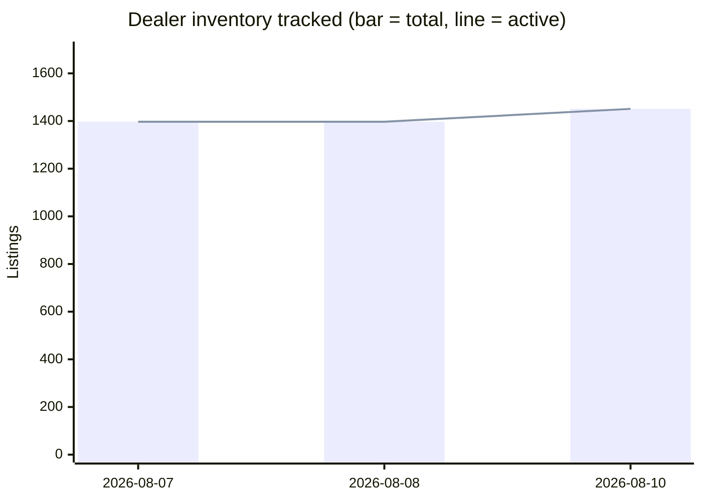

# David Webb Secondary-Market Report — August 10, 2026

## Week-over-week trends

| Week | Auction records | Dealer records | Active listings | New (auction/dealer) |
|---|---|---|---|---|
| 2026-08-07 | 3948 | 1397 | 1397 | 3948/1397 |
| 2026-08-08 | 3948 | 1397 | 1397 | 3948/1397 |
| 2026-08-10 | 3892 | 1451 | 1451 | 3892/1451 |

## Trends by motif & material

_Tags are keyword-matched from each piece's own listing text against David Webb's known design vocabulary (Zodiac, animal/creature pieces, fishscale, rock crystal, enamel, carved hardstone, etc.) — a piece can carry several tags. Tags with fewer than 5 matching records are omitted as too thin to be meaningful._

**Auction (sold prices)**

| Tag | Count | Min | Median | Max |
|---|---|---|---|---|
| Enamel | 947 | $460 | $10,710 | $450,000 |
| Cabochon | 934 | $688 | $16,450 | $11,260,000 |
| Carved Hardstone | 555 | $573 | $15,000 | $693,000 |
| Hammered Gold | 428 | $1,250 | $11,250 | $201,600 |
| Animal/Creature | 415 | $460 | $12,065 | $218,500 |
| Cuff/Bangle | 361 | $1,314 | $23,750 | $450,000 |
| Bombé | 201 | $1,000 | $12,500 | $1,426,500 |
| Rock Crystal | 177 | $1,645 | $13,750 | $106,250 |
| Maltese Cross | 36 | $3,125 | $19,600 | $134,500 |
| Door Knocker | 29 | $3,125 | $9,525 | $106,250 |
| Zodiac | 27 | $564 | $6,875 | $90,000 |
| Shell/Starfish | 17 | $1,700 | $5,175 | $146,500 |

**Current dealer inventory (asking prices)**

| Tag | Count | Min | Median | Max |
|---|---|---|---|---|
| Enamel | 449 | $2,900 | $21,400 | $289,500 |
| Carved Hardstone | 265 | $3,850 | $35,700 | $289,500 |
| Cabochon | 254 | $3,200 | $27,600 | $410,000 |
| Animal/Creature | 221 | $3,100 | $22,100 | $280,000 |
| Hammered Gold | 159 | $4,150 | $24,000 | $132,000 |
| Cuff/Bangle | 149 | $3,200 | $37,300 | $250,200 |
| 1970s | 131 | $3,100 | $26,400 | $289,500 |
| 1960s | 87 | $3,100 | $27,800 | $265,000 |
| Rock Crystal | 60 | $4,800 | $33,250 | $225,000 |
| Bombé | 55 | $6,400 | $18,800 | $214,500 |
| 1980s | 52 | $4,250 | $22,700 | $81,200 |
| Door Knocker | 45 | $9,700 | $20,800 | $214,500 |
| Zodiac | 18 | $4,500 | $18,150 | $64,300 |
| Maltese Cross | 12 | $27,300 | $35,050 | $65,000 |
| Shell/Starfish | 12 | $7,200 | $15,650 | $41,600 |

## Worth a second look

_Heuristic signals for a human to check — not fraud determinations. A flagged piece may well be genuine; these just surface things worth a closer look before relying on the listing._

**Implausibly low price** (371 total)

- [WEBB, DAVID K. and STEVENS, JOHN M., eds....](https://www.doyle.com/auction/lot/lot-275---webb-david-k-and-stevens-john-m-eds/) — $200 via Doyle. $200 is well below the typical range for "other" (298 comparable auction records, median $15,000).
- [[ASTRONAUTS] COOPER, L. GORDON., Jr. Autograph...](https://www.doyle.com/auction/lot/lot-6---astronauts-cooper-l-gordon-jr-autograph/) — $281 via Doyle. $281 is well below the typical range for "other" (298 comparable auction records, median $15,000).
- [Pair of Gold Necklace Shorteners, David Webb](https://www.doyle.com/auction/lot/lot-142---pair-of-gold-necklace-shorteners-david-webb/) — $375 via Doyle. $375 is well below the typical range for "necklace" (609 comparable auction records, median $17,920).
- [A David Webb ring modelled as a leopard's head and tail, with black enamel spots and gem set eyes, signed.](https://www.christies.com/en/lot/lot-711892) — $460 via Christie's. $460 is well below the typical range for "ring" (536 comparable auction records, median $8,320).
- [Gold Leaf Brooch, David Webb](https://www.doyle.com/auction/lot/lot-534---gold-leaf-brooch-david-webb/) — $562 via Doyle. $562 is well below the typical range for "brooch" (391 comparable auction records, median $11,250).
- [A Sagittarius brooch by David Webb](https://www.christies.com/en/lot/lot-2533639) — $564 via Christie's. $564 is well below the typical range for "brooch" (391 comparable auction records, median $11,250).
- [A turquoise brooch by David Webb](https://www.christies.com/en/lot/lot-4341181) — $573 via Christie's. $573 is well below the typical range for "brooch" (391 comparable auction records, median $11,250).
- [A ring by David Webb , modelled as a mythical bearded figure pouring water from a vessel, the shank with black enamel scale work decoration, interior of shank signed.](https://www.christies.com/en/lot/lot-683796) — $575 via Christie's. $575 is well below the typical range for "ring" (536 comparable auction records, median $8,320).
- [A GOLD AND DIAMOND PENDANT, BY DAVID WEBB](https://www.christies.com/en/lot/lot-3830577) — $587 via Christie's. $587 is well below the typical range for "necklace" (609 comparable auction records, median $17,920).
- [Gold and Cabochon Amethyst Spider's Webb Brooch, David Andersen, Norway](https://www.doyle.com/auction/lot/lot-477---gold-and-cabochon-amethyst-spiders-webb-brooch-david-andersen-norway/) — $688 via Doyle. $688 is well below the typical range for "brooch" (391 comparable auction records, median $11,250).

**Cheap AND no signature/hallmark/certificate mentioned** (64 total — a subset of the price flags above, worth extra scrutiny)

- [David Webb 18K Yellow Gold Square Open Link Nameplate Bracelet](https://thebackvault.com/products/david-webb-18k-yellow-gold-square-open-link-nameplate-bracelet-rr7250) — $9,700 via The Back Vault. Also: listing description doesn't mention a signature, hallmark, maker's mark, or certificate.
- [David Webb 18K Yellow Gold Tiger Eye Star Pendant](https://thebackvault.com/products/david-webb-18k-yellow-gold-tiger-eye-star-pendant-rr7867) — $9,700 via The Back Vault. Also: listing description doesn't mention a signature, hallmark, maker's mark, or certificate.
- [David Webb Platinum & 18K Yellow Gold Diamond Cuff Bracelet](https://thebackvault.com/products/david-webb-platinum-18k-yellow-gold-diamond-cuff-bracelet-rr7669) — $9,700 via The Back Vault. Also: listing description doesn't mention a signature, hallmark, maker's mark, or certificate.
- [David Webb Platinum & 18K Yellow Gold 1.75cts Diamond Cuff Bracelet](https://thebackvault.com/products/david-webb-platinum-18k-yellow-gold-1-75cts-diamond-cuff-bracelet-rr7668) — $9,700 via The Back Vault. Also: listing description doesn't mention a signature, hallmark, maker's mark, or certificate.
- [David Webb 18K Yellow Gold Aries Zodiac Pendant](https://thebackvault.com/products/david-webb-18k-yellow-gold-aries-zodiac-pendant-rr6776) — $9,200 via The Back Vault. Also: listing description doesn't mention a signature, hallmark, maker's mark, or certificate.
- [18K Yellow Gold Ruby Eye Ram’s Head Bangle](https://yafasignedjewels.com/products/18k-yellow-gold-ruby-eye-ram-s-head-bangle) — $9,000 via Yafa Signed Jewels. Also: listing description doesn't mention a signature, hallmark, maker's mark, or certificate.
- [David Webb 18K Yellow Gold Satin Finish ID Tag Chain Bracelet](https://thebackvault.com/products/david-webb-18k-yellow-gold-satin-finish-id-tag-chain-bracelet-rr7294) — $8,700 via The Back Vault. Also: listing description doesn't mention a signature, hallmark, maker's mark, or certificate.
- [David Webb 18K Yellow Gold Twist Rope Sectional "Fishscale" Flexible Bracelet](https://thebackvault.com/products/david-webb-18k-yellow-gold-twist-rope-sectional-fishscale-flexible-bracelet-rr6806) — $8,200 via The Back Vault. Also: listing description doesn't mention a signature, hallmark, maker's mark, or certificate.
- [David Webb 1960's Vintage Tahitian South Sea Pearl 18 Karat Gold Tri-Gold Necklace](https://wilsonsestatejewelry.com/products/david-webb-1960s-vintage-tahitian-south-sea-pearl-18-karat-gold-tri-gold-necklace) — $6,750 via Wilson's Estate Jewelry. Also: listing description doesn't mention a signature, hallmark, maker's mark, or certificate.
- [David Webb Pearl Platinum Pearl With A Diamond Clasp Necklace](https://thebackvault.com/products/david-webb-pearl-platinum-pearl-with-a-diamond-clasp-necklace-rr2729) — $6,700 via The Back Vault. Also: listing description doesn't mention a signature, hallmark, maker's mark, or certificate.

## Executive Summary

This is the **baseline run** of the David Webb secondary-market pipeline. The full historical dataset — 3,892 auction records and 1,451 active dealer listings — was ingested simultaneously on August 10, 2026, so the "new this week" record counts reflect a complete backfill rather than a single week of genuine market activity. Future weekly reports will show true week-over-week changes in inventory, pricing, and sales velocity. The trend series contains three closely-spaced preliminary entries (August 7–10) that are artifacts of the same backfill process; meaningful trend commentary will begin once the pipeline accumulates independent weekly snapshots.

The most reliable market signals available today are: (1) **19 confirmed auction hammer prices** from the past 60 days, with a median of **$32,000**, concentrated in Sotheby's Hong Kong and New York June sales; and (2) **eight high-value dealer listings** freshly appearing in the database this week, topped by a $410,000 cabochon emerald and diamond bracelet. The dealer asking-price median across all 1,451 active listings stands at **$25,000**, running meaningfully above the all-category auction hammer median, consistent with the typical retail-to-auction spread for signed vintage jewelry.

---

## Recent Auction Activity

**Window:** Last 60 days (from August 10, 2026) | **Sales recorded:** 19 | **Median hammer price:** $32,000

Sotheby's dominated this window with a cluster of results from its June 16 and June 18, 2026 sales (Hong Kong and New York). Prices excluded buyer's premium — see data-quality note below.

| Piece | House | Date | Hammer Price |
|---|---|---|---|
| Pair of Colored Stone and Diamond Pendant-Earclips | Sotheby's | Jun 18, 2026 | $153,600 |
| Diamond, Colored Diamond, Ruby & Gold 'Double Leopard' Bracelet | Sotheby's | Jun 16, 2026 | $121,600 |
| Gold, Emerald, Diamond & Enamel Cuff-Bracelet | Sotheby's | Jun 16, 2026 | $70,400 |
| Emerald and Diamond Ring | Sotheby's | Jun 16, 2026 | $64,000 |
| Coral, Emerald, Diamond & Enamel Bracelet | Sotheby's | Jun 16, 2026 | $57,600 |
| Rubellite, Enamel & Diamond 'Couture' Cuff-Bracelet | Sotheby's | Jun 18, 2026 | $51,200 |
| Gold, Enamel, Emerald & Diamond Bracelet | Sotheby's | Jun 18, 2026 | $40,960 |
| Gold and Emerald Cuff-Bracelet | Sotheby's | Jun 18, 2026 | $38,400 |

*No URLs are available for these lots in the current dataset.*

The top result — the colored-stone pendant-earclips at **$153,600** — and the 'Double Leopard' bracelet at **$121,600** are both meaningfully above the 60-day median, signaling continued collector appetite for statement animal-motif and polychrome pieces. Bracelets account for five of the eight results listed, reinforcing their position as the highest-volume and highest-value auction category.

---

## Dealer Market This Week

**Active listings:** 1,451 | **New this week (backfill):** 1,451 | **Recently delisted (last 10 days):** 0

Because this is the baseline run, all 1,451 listings appear "new." There are **no delistings** recorded in the past 10 days — either inventory is sticky right now, or pre-pipeline removals are not yet captured. The eight highest-priced listings surfacing in the dataset this week are highlighted below as they represent the top of current asking-price supply:

### Newly Catalogued High-Value Listings

| Piece | Dealer | Asking Price |
|---|---|---|
| [David Webb Cabochon Emerald and Diamond Bracelet](https://ericoriginals.com/products/david-webb-cabochon-emerald-and-diamond-bracelet) | Eric Originals & Antiques | $410,000 |
| [Mid-Century Diamond Cocktail Ring, David Webb](https://kentshire.com/products/mid-century-diamond-cocktail-ring-david-webb) | Kentshire | $375,000 |
| [Iconic David Webb Necklace](https://www.1stdibs.com/jewelry/necklaces/link-necklaces/iconic-david-webb-necklace/id-j_25653002/) | Joseph Saidian and Sons | $345,000 |
| [David Webb Jade, Diamond & Blue Enamel Necklace](https://thebackvault.com/products/david-webb-jade-platinum-18k-yellow-gold-jade-diamond-blue-enamel-necklace-rr8093) | The Back Vault | $289,500 |
| [David Webb 27-Carat Diamond Emerald Pearl Gold Platinum Panther Bracelet Watch](https://oakgem.com/products/david-webb-27-carat-diamond-emerald-pearl-gold-platinum-panther-bracelet-watch) | Oak Gem | $280,000 |
| [Vintage 1960s David Webb 48.00-Carat Diamond Necklace](https://ericoriginals.com/products/vintage-1960s-david-webb-48-00-carat-diamond-necklace) | Eric Originals & Antiques | $265,000 |
| [David Webb Platinum & 18K Yellow Gold Carved Coral Bangle Bracelet](https://thebackvault.com/products/david-webb-platinum-18k-yellow-gold-carved-coral-bangle-bracelet-rr5117) | The Back Vault | $250,200 |
| [David Webb Turquoise, Platinum, Turquoise & Diamond Necklace](https://thebackvault.com/products/david-webb-turquoise-platinum-turquoise-and-diamond-necklace-rr7804) | The Back Vault | $240,500 |

The Back Vault and Eric Originals & Antiques each contributed multiple top-tier listings, accounting for five of the eight entries above. The Panther Bracelet Watch from Oak Gem at **$280,000** is a particularly rare crossover between jewelry and horology.

---

## Price Snapshot by Category

### Auction Hammer Prices (All-Time, 3,892 Records)

| Category | Count | Min | Median | Max |
|---|---|---|---|---|
| Earrings | 709 | $825 | $7,560 | $275,000 |
| Bracelet | 644 | $822 | $22,500 | $7,460,000 |
| Necklace | 609 | $375 | $17,920 | $1,265,000 |
| Ring | 536 | $460 | $8,320 | $7,698,500 |
| Brooch | 391 | $562 | $11,250 | $343,500 |
| Other | 298 | $200 | $15,000 | $11,260,000 |
| Cufflinks | 85 | $1,134 | $2,350 | $20,160 |

### Current Dealer Asking Prices (1,451 Active Listings)

| Category | Count | Min | Median | Max |
|---|---|---|---|---|
| Earrings | 418 | $1,900 | $18,100 | $227,500 |
| Ring | 315 | $3,100 | $20,000 | $375,000 |
| Bracelet | 290 | $3,200 | $42,200 | $410,000 |
| Necklace | 212 | $3,500 | $42,200 | $345,000 |
| Brooch | 121 | $4,500 | $24,500 | $114,400 |
| Cufflinks | 20 | $2,900 | $6,500 | $14,800 |
| Other | 6 | $8,500 | $27,000 | $150,000 |

**Key observation:** Dealer asking medians for bracelets and necklaces ($42,200 each) are roughly **1.9× and 2.4× their respective auction hammer medians** ($22,500 and $17,920). This retail premium is typical for signed estate jewelry but is worth monitoring as auction results firm or soften. Cufflinks are the only category where dealer medians and auction medians are closely aligned ($6,500 vs. $2,350 — still a meaningful spread, but the absolute dollar gap is modest).

---

## All-Time Notable Sales

These benchmark results provide long-term context for the top of the David Webb market:

| Piece | House | Date | Price |
|---|---|---|---|
| [Demi-parure: Enamel Frog Brooch & Earrings (18k)](https://www.christies.com/en/lot/lot-2491651) | Christie's | May 26, 1994 | ITL 11,260,000 |
| [The Annenberg Diamond Ring](https://www.christies.com/en/lot/lot-5250229) | Christie's | Oct 21, 2009 | $7,698,500 |
| [Sapphire and Diamond Bracelet](https://www.christies.com/en/lot/lot-5442124) | Christie's | May 31, 2011 | HKD 7,460,000 |
| [Gold Brooch with Rubies, Sapphires & Diamonds (18k)](https://www.christies.com/en/lot/lot-2493463) | Christie's | Dec 1, 1994 | ITL 4,278,000 |
| [A Diamond Ring](https://www.christies.com/en/lot/lot-5578141) | Christie's | Jun 12, 2012 | $1,874,500 |

Christie's has been the dominant venue for Webb's highest-value results. The Annenberg Diamond Ring at **$7,698,500** (USD) remains the benchmark for rings in the database. Note that the 1994 Italian lira results and the 2011 HKD bracelet result are reported in their original transaction currencies and have not been converted.

---

## Data-Quality Caveats

- **Auction hammer prices exclude buyer's premium.** The true all-in cost to buyers is typically 20–26% higher than figures shown.
- **Dealer asking prices are not confirmed sale prices.** They represent what sellers are currently seeking; actual transaction prices may differ substantially.
- **"Delisted" dealer status** generally indicates a piece sold or was withdrawn, but the pipeline cannot distinguish between these outcomes. Delistings are therefore described as "came off the market" rather than "sold."
- **Currency heterogeneity in all-time records:** A small number of historic auction results (particularly 1990s Christie's Italy sales) are recorded in original currencies (ITL, HKD) and have not been converted to USD in the statistics above.
- **Baseline run limitation:** Because all records were ingested simultaneously, week-over-week trend data will not be meaningful until the next independent weekly snapshot is captured.
