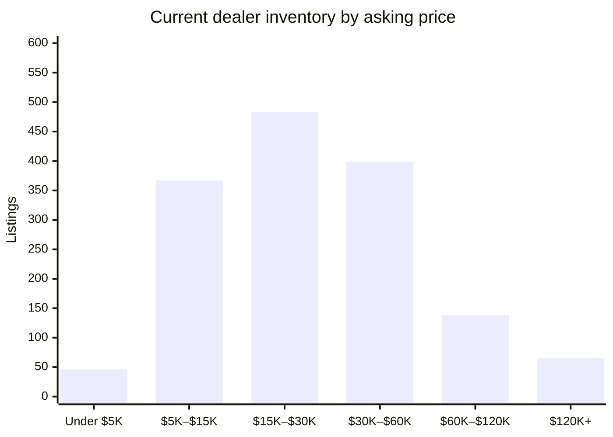

# David Webb Secondary Market — 2026-08-12

## Executive Summary

As of August 12, 2026, the David Webb secondary market database encompasses 3,884 auction records and 1,578 dealer listings — though it bears noting that this is a baseline pipeline run, meaning virtually all dealer inventory reads as newly ingested due to a recent backfill rather than any genuine week-over-week acceleration in supply. With that caveat in place, the active dealer market of 1,567 listings carries a median asking price of $24,000, while only 11 listings have closed in the past four weeks, pointing to a deliberate rather than brisk pace of dealer-side transactions. On the auction side, 19 sales over the past 60 days produced a median hammer of $32,000, anchored by a cluster of Sotheby's results in mid-June that included a Colored Stone and Diamond Pendant-Earclip pair clearing $153,600 and a Double Leopard Bracelet at $121,600. At the top of the current dealer asking-price ladder sits an Emerald and Diamond Bracelet offered by Eric Originals & Antiques at $410,000, followed closely by a Mid-century Diamond Cocktail Ring from Kentshire at $375,000 — both representative of the six-figure statement pieces that define Webb's upper secondary tier. The detailed category breakdowns, inventory tables, and closed-listing analysis that follow should be read against this baseline-run context.

## Currently Available

_1,567 active listings across all tracked dealer marketplaces (estate jewelers, 1stDibs, Sotheby's Buy Now, The RealReal), with a combined asking-price total of $53,756,828. This section is dealer inventory only — there is currently no live, biddable David Webb auction inventory to track; every auction-history record on file is a completed, historical sale (see "Recent Auction Sales" below)._

_That combined total is a sum of current asking prices, not an appraisal or a market valuation — it will run high wherever the same physical piece is listed on more than one platform (see Data-Quality Caveats)._

**By price**

**By category**

| Category | Count | Min | Median | Max |
|---|---|---|---|---|
| Earrings | 474 | $1,900 | $17,500 | $227,500 |
| Ring | 331 | $3,100 | $19,500 | $375,000 |
| Bracelet | 307 | $3,200 | $40,900 | $410,000 |
| Necklace | 225 | $2,796 | $41,600 | $345,000 |
| Brooch | 130 | $3,658 | $24,150 | $125,000 |
| Cufflinks | 24 | $2,250 | $5,675 | $14,800 |
| Other | 7 | $4,800 | $16,500 | $150,000 |

**By dealer**

_23 dealer(s) currently carry David Webb pieces — showing the top 20 by listing count, the rest bucketed into "Other" below._

| Dealer | Active Listings | Median Asking |
|---|---|---|
| The Back Vault | 953 | $24,000 |
| The RealReal | 120 | $13,498 |
| Oak Gem | 114 | $27,500 |
| Eric Originals & Antiques | 83 | $29,500 |
| Yafa Signed Jewels | 66 | $56,850 |
| Wilson's Estate Jewelry | 36 | $11,025 |
| Saidian & Sons | 31 | $30,000 |
| Sotheby's (Buy Now) | 31 | $18,500 |
| Legacy Vintage Jewels | 19 | $104,000 |
| Macklowe Gallery | 11 | $35,000 |
| Estate Diamond Jewelry | 7 | $12,000 |
| Kentshire | 6 | $36,000 |
| Joseph Saidian and Sons | 4 | $75,000 |
| Louis Martin | 4 | $24,500 |
| A. Brandt + Son | 3 | $14,995 |
| Lawrence Jeffrey | 3 | $9,800 |
| ISKENDERIAN | 1 | $133,900 |
| Tesori Belli | 1 | $58,000 |
| Keyamour | 1 | $58,000 |
| Pierre/Famille | 1 | $27,900 |
| Other (3 additional dealers) | 3 | $13,500 |

## Trends by Motif & Material

_Tags are keyword-matched from each piece's own listing text against David Webb's known design vocabulary (Zodiac, animal/creature pieces, fishscale, rock crystal, enamel, carved hardstone, etc.) — a piece can carry several tags. Tags with fewer than 5 matching records are omitted as too thin to be meaningful. Click a tag to see those exact pieces in the live database._

**Auction (sold prices)**

| Tag | Count | Min | Median | Max |
|---|---|---|---|---|
| [Enamel](https://david-webb-new-york.github.io/david-webb-market-agent/?tag=Enamel) | 947 | $719 | $10,800 | $134,500 |
| [Cabochon](https://david-webb-new-york.github.io/david-webb-market-agent/?tag=Cabochon) | 933 | $1,250 | $16,380 | $508,000 |
| [Carved Hardstone](https://david-webb-new-york.github.io/david-webb-market-agent/?tag=Carved%20Hardstone) | 555 | $875 | $15,000 | $693,000 |
| [Hammered Gold](https://david-webb-new-york.github.io/david-webb-market-agent/?tag=Hammered%20Gold) | 428 | $1,250 | $11,420 | $201,600 |
| [Animal/Creature](https://david-webb-new-york.github.io/david-webb-market-agent/?tag=Animal%2FCreature) | 415 | $719 | $12,065 | $218,500 |
| [Cuff/Bangle](https://david-webb-new-york.github.io/david-webb-market-agent/?tag=Cuff%2FBangle) | 361 | $1,314 | $23,750 | $218,500 |
| [Bombé](https://david-webb-new-york.github.io/david-webb-market-agent/?tag=Bomb%C3%A9) | 201 | $1,250 | $12,454 | $1,426,500 |
| [Rock Crystal](https://david-webb-new-york.github.io/david-webb-market-agent/?tag=Rock%20Crystal) | 177 | $954 | $12,516 | $106,250 |
| [Maltese Cross](https://david-webb-new-york.github.io/david-webb-market-agent/?tag=Maltese%20Cross) | 36 | $3,125 | $20,000 | $134,500 |
| [Door Knocker](https://david-webb-new-york.github.io/david-webb-market-agent/?tag=Door%20Knocker) | 29 | $3,125 | $9,525 | $106,250 |
| [Zodiac](https://david-webb-new-york.github.io/david-webb-market-agent/?tag=Zodiac) | 27 | $812 | $8,713 | $90,000 |
| [Shell/Starfish](https://david-webb-new-york.github.io/david-webb-market-agent/?tag=Shell%2FStarfish) | 17 | $1,700 | $5,175 | $146,500 |

**Current dealer inventory (asking prices)**

| Tag | Count | Min | Median | Max |
|---|---|---|---|---|
| [Enamel](https://david-webb-new-york.github.io/david-webb-market-agent/?tag=Enamel) | 481 | $2,796 | $20,400 | $289,500 |
| [Carved Hardstone](https://david-webb-new-york.github.io/david-webb-market-agent/?tag=Carved%20Hardstone) | 275 | $3,850 | $34,000 | $289,500 |
| [Cabochon](https://david-webb-new-york.github.io/david-webb-market-agent/?tag=Cabochon) | 253 | $3,200 | $27,900 | $410,000 |
| [Animal/Creature](https://david-webb-new-york.github.io/david-webb-market-agent/?tag=Animal%2FCreature) | 226 | $3,100 | $22,100 | $280,000 |
| [Hammered Gold](https://david-webb-new-york.github.io/david-webb-market-agent/?tag=Hammered%20Gold) | 167 | $1,995 | $22,700 | $132,000 |
| [Cuff/Bangle](https://david-webb-new-york.github.io/david-webb-market-agent/?tag=Cuff%2FBangle) | 159 | $3,200 | $36,000 | $250,200 |
| [1970s](https://david-webb-new-york.github.io/david-webb-market-agent/?tag=1970s) | 131 | $3,100 | $26,400 | $289,500 |
| [1960s](https://david-webb-new-york.github.io/david-webb-market-agent/?tag=1960s) | 86 | $3,100 | $27,650 | $265,000 |
| [Rock Crystal](https://david-webb-new-york.github.io/david-webb-market-agent/?tag=Rock%20Crystal) | 61 | $4,800 | $34,000 | $225,000 |
| [Bombé](https://david-webb-new-york.github.io/david-webb-market-agent/?tag=Bomb%C3%A9) | 55 | $6,400 | $18,800 | $214,500 |
| [1980s](https://david-webb-new-york.github.io/david-webb-market-agent/?tag=1980s) | 52 | $4,250 | $22,700 | $81,200 |
| [Door Knocker](https://david-webb-new-york.github.io/david-webb-market-agent/?tag=Door%20Knocker) | 47 | $9,225 | $20,700 | $214,500 |
| [Zodiac](https://david-webb-new-york.github.io/david-webb-market-agent/?tag=Zodiac) | 18 | $4,500 | $18,150 | $64,300 |
| [Maltese Cross](https://david-webb-new-york.github.io/david-webb-market-agent/?tag=Maltese%20Cross) | 12 | $27,300 | $35,050 | $65,000 |
| [Shell/Starfish](https://david-webb-new-york.github.io/david-webb-market-agent/?tag=Shell%2FStarfish) | 12 | $7,200 | $15,650 | $41,600 |

## New in the Last Week

_1,578 dealer listing(s) first seen in the last 7 days, across all sources and price points — showing the 20 biggest by price._

| Piece | Category | Dealer | Price | Date |
|---|---|---|---|---|
| [David Webb Cabochon Emerald and Diamond Bracelet](https://ericoriginals.com/products/david-webb-cabochon-emerald-and-diamond-bracelet) | Bracelet | Eric Originals & Antiques | $410,000 | 2026-08-07 |
| [Mid-century diamond cocktail ring, David Webb](https://kentshire.com/products/mid-century-diamond-cocktail-ring-david-webb) | Ring | Kentshire | $375,000 | 2026-08-07 |
| [Iconic David Webb Necklace](https://www.1stdibs.com/jewelry/necklaces/link-necklaces/iconic-david-webb-necklace/id-j_25653002/) | Necklace | Joseph Saidian and Sons | $345,000 | 2026-08-10 |
| [David Webb Jade Platinum & 18K Yellow Gold Jade, Diamond, Blue Enamel Necklace](https://thebackvault.com/products/david-webb-jade-platinum-18k-yellow-gold-jade-diamond-blue-enamel-necklace-rr8093) | Necklace | The Back Vault | $289,500 | 2026-08-07 |
| [David Webb 27 Carat Diamond Emerald Pearl Gold Platinum Panther Bracelet Watch](https://oakgem.com/products/david-webb-27-carat-diamond-emerald-pearl-gold-platinum-panther-bracelet-watch) | Bracelet | Oak Gem | $280,000 | 2026-08-07 |
| [Vintage 1960s David Webb 48.00 Carat Diamond Necklace](https://ericoriginals.com/products/vintage-1960s-david-webb-48-00-carat-diamond-necklace) | Necklace | Eric Originals & Antiques | $265,000 | 2026-08-07 |
| [David Webb Platinum & 18K Yellow Gold Carved Coral Bangle Bracelet](https://thebackvault.com/products/david-webb-platinum-18k-yellow-gold-carved-coral-bangle-bracelet-rr5117) | Bracelet | The Back Vault | $250,200 | 2026-08-07 |
| [David Webb Turquoise Platinum Turquoise And Diamond Necklace](https://thebackvault.com/products/david-webb-turquoise-platinum-turquoise-and-diamond-necklace-rr7804) | Bracelet | The Back Vault | $240,500 | 2026-08-07 |
| [DAVID WEBB Amber Tassel Necklace](https://yafasignedjewels.com/products/david-webb-amber-tassel-necklace) | Necklace | Yafa Signed Jewels | $238,000 | 2026-08-07 |
| [David Webb Platinum & 18K White Gold Day And Night 50 Carat Diamond Earrings](https://thebackvault.com/products/david-webb-platinum-18k-white-gold-day-and-night-50-carat-diamond-earrings-rr6293) | Earrings | The Back Vault | $227,500 | 2026-08-07 |
| [DAVID WEBB Cabochon Amethyst, Chrysoprase and Diamond Necklace](https://yafasignedjewels.com/products/david-webb-cabochon-amethyst-chrysoprase-and-diamond-necklace-and-ear-clips) | Necklace | Yafa Signed Jewels | $225,000 | 2026-08-07 |
| [David Webb Tassel 'Dusk' Necklace](https://yafasignedjewels.com/products/david-webb-tassel-dusk-necklace) | Necklace | Yafa Signed Jewels | $225,000 | 2026-08-07 |
| [David Webb Carved Jade Diamond Ruby Enamel Gold Platinum Bracelet](https://oakgem.com/products/david-webb-carved-jade-diamond-ruby-enamel-gold-platinum-bracelet) | Bracelet | Oak Gem | $220,000 | 2026-08-07 |
| [David Webb Rock Crystal Necklace](https://legacyvintagejewels.com/products/webb-rock-crystal-necklace) | Necklace | Legacy Vintage Jewels | $220,000 | 2026-08-07 |
| [David Webb Rock Crystal Necklace](https://www.1stdibs.com/jewelry/necklaces/chain-necklaces/david-webb-rock-crystal-necklace/id-j_24965412/) | Necklace | Legacy Vintage Jewels | $220,000 | 2026-08-10 |
| [DAVID WEBB Tiger’s Eye, Turquoise and Diamond “X” Necklace/Bracelet](https://yafasignedjewels.com/products/david-webb-tiger-s-eye-turquoise-and-diamond-x-necklace-bracelet) | Bracelet | Yafa Signed Jewels | $215,000 | 2026-08-07 |
| [DAVID WEBB Coral Bead, White Enamel and Diamond Necklace](https://yafasignedjewels.com/products/david-webb-coral-bead-white-enamel-and-diamond-necklace) | Necklace | Yafa Signed Jewels | $215,000 | 2026-08-07 |
| [David Webb Platinum & 18K Yellow Gold Coral Dragon Carved Green Emerald Necklace](https://thebackvault.com/products/david-webb-platinum-18k-yellow-gold-coral-dragon-carved-green-emerald-necklace-rr7600) | Necklace | The Back Vault | $214,500 | 2026-08-07 |
| [David Webb Bombe Platinum 56.84 carats Hanging Door Knocker Earrings](https://thebackvault.com/products/david-webb-bombe-platinum-56-84-carats-hanging-door-knocker-earrings-rr3917) | Earrings | The Back Vault | $214,500 | 2026-08-07 |
| [David Webb Ruby and Diamond Bracelet](https://legacyvintagejewels.com/products/david-webb-ruby-and-diamond-bracelet) | Bracelet | Legacy Vintage Jewels | $210,000 | 2026-08-07 |

_...and 1558 more. [See the full list in the live dashboard](https://david-webb-new-york.github.io/david-webb-market-agent/?type=dealer)._

## Closed / Sold in the Last 4 Weeks

_11 dealer listing(s) delisted in the last 28 days — "closed" usually but not always means sold (see Data-Quality Caveats)._

| Piece | Category | Dealer | Price | Date |
|---|---|---|---|---|
| [David Webb Certified Unheated Burmese Ruby & Diamond Earrings](https://www.1stdibs.com/jewelry/earrings/stud-earrings/david-webb-certified-unheated-burmese-ruby-diamond-earrings/id-j_27340252/) | Earrings | Legacy Vintage Jewels | $55,000 | 2026-08-11 |
| [Vintage 1960s David Webb Coral and Diamond Earrings](https://ericoriginals.com/products/vintage-1960s-david-webb-coral-and-diamond-earrings) | Earrings | Eric Originals & Antiques | $34,750 | 2026-08-07 |
| [David Webb 18 Karat Ribbed Yellow Gold Hinged Bangle Bracelet](https://www.1stdibs.com/jewelry/bracelets/bangles/david-webb-18-karat-ribbed-yellow-gold-hinged-bangle-bracelet/id-j_24865542/) | Bracelet | Bardy's Estate Jewelry | $25,000 | 2026-08-11 |
| [David Webb Zebra Ring, Diamond and Enamel 18K Yellow Gold Platinum](https://www.1stdibs.com/jewelry/rings/cocktail-rings/david-webb-zebra-ring-diamond-enamel-18k-yellow-gold-platinum/id-j_28437452/) | Ring | Aryamehr Fine Jewelry | $19,300 | 2026-08-10 |
| [David Webb Ruby and Enamel Frog Pin in 18K Yellow Gold](https://www.1stdibs.com/jewelry/brooches/brooches/david-webb-ruby-enamel-frog-pin-18k-yellow-gold/id-j_23891282/) | Brooch | Skibell Fine Jewelry | $13,200 | 2026-08-10 |
| [David Webb Fishscale Bracelet](https://www.1stdibs.com/jewelry/bracelets/link-bracelets/david-webb-fishscale-bracelet/id-j_19549292/) | Bracelet | Ahdoot & Co. | $9,500 | 2026-08-10 |
| [David Webb Fishscale Bracelet](https://www.1stdibs.com/jewelry/bracelets/retro-bracelets/david-webb-fishscale-bracelet/id-j_19381862/) | Bracelet | Ahdoot & Co. | $9,500 | 2026-08-10 |
| [David Webb Carved Topaz and Black Enamel Earrings](https://www.1stdibs.com/jewelry/earrings/clip-on-earrings/david-webb-carved-topaz-black-enamel-earrings/id-j_8517041/) | Earrings | Skibell Fine Jewelry | $8,800 | 2026-08-10 |
| [David Webb Trio of Gemstone Rings](https://www.1stdibs.com/jewelry/rings/fashion-rings/david-webb-trio-gemstone-rings/id-j_17080732/) | Other | Stella Rubin Jewelry | $8,500 | 2026-08-10 |
| [David Webb Ribbed Gold Earrings with Diamond Shaped Pattern](https://www.1stdibs.com/jewelry/earrings/lever-back-earrings/david-webb-ribbed-gold-earrings-diamond-shaped-pattern/id-j_24274802/) | Earrings | Stella Rubin Jewelry | $6,800 | 2026-08-10 |
| [David Webb Platinum & 18K Yellow Gold Cabochon Cut Turquoise Flower Clip-On Earrings](https://thebackvault.com/products/david-webb-platinum-18k-yellow-gold-cabochon-cut-turquoise-flower-clip-on-earrings-rr9020) | Earrings | The Back Vault | $22,700 | 2026-08-07 |

## Recent Auction Sales (Past 60 Days)

_19 completed sale(s) in the last 60 days, median hammer $32,000. These are historical results, not current inventory — see "Currently Available" above._

| Piece | House | Sale Date | Price |
|---|---|---|---|
| Pair of Colored Stone and Diamond Pendant-Earclips | Sotheby's | 2026-06-18 | $153,600 |
| Rubellite, Enamel, and Diamond ‘Couture’ Cuff-Bracelet | Sotheby's | 2026-06-18 | $51,200 |
| Gold, Enamel, Emerald and Diamond Bracelet | Sotheby's | 2026-06-18 | $40,960 |
| Gold and Emerald Cuff-Bracelet | Sotheby's | 2026-06-18 | $38,400 |
| Ruby, Colored Diamond and Diamond Ring | Sotheby's | 2026-06-18 | $35,840 |
| Pair of Jade and Diamond Pendant-Earclips | Sotheby's | 2026-06-18 | $32,000 |
| Gold and Diamond 'Geodesic Dome' Ring | Sotheby's | 2026-06-18 | $25,600 |
| Ruby and Diamond Ring | Sotheby's | 2026-06-18 | $20,480 |
| Gold Cuff-Bracelet | Sotheby's | 2026-06-18 | $19,200 |
| Chalcedony, Emerald, Ruby and Diamond Pendant-Brooch | Sotheby's | 2026-06-18 | $19,200 |
| Gold and Diamond Clip-Brooch | Sotheby's | 2026-06-18 | $17,920 |
| Pair of Gold and Diamond Pendant-Earclips | Sotheby's | 2026-06-18 | $17,920 |
| Pair of Gold Bangle-Bracelets | Sotheby's | 2026-06-18 | $17,920 |
| Gold and Diamond Ring | Sotheby's | 2026-06-18 | $17,920 |
| Pair of Rock Crystal, Cultured Pearl & Diamond Earclips | Sotheby's | 2026-06-18 | $15,360 |
| Diamond, Colored Diamond, Ruby and Gold ‘Double Leopard’ Bracelet 鑽石 配 彩色鑽石 配 紅寶石 及 K金 'Double Leopard' 手鐲 | Sotheby's | 2026-06-16 | $121,600 |
| Gold, Emerald, Diamond, and Enamel Cuff-Bracelet K金 配 祖母綠 配 鑽石 及 琺瑯彩 手鐲 | Sotheby's | 2026-06-16 | $70,400 |
| Emerald and Diamond Ring 祖母綠 配 鑽石 戒指 | Sotheby's | 2026-06-16 | $64,000 |
| Coral, Emerald, Diamond and Enamel Bracelet 珊瑚 配 祖母綠 配 鑽石 及 琺瑯彩 手鐲 | Sotheby's | 2026-06-16 | $57,600 |

## All-Time Notable Sales

These benchmark results provide context for current dealer asking prices and collector expectations:

| Piece | House | Date | Hammer |
|---|---|---|---|
| [THE ANNENBERG DIAMOND AN EXCEPTIONAL DIAMOND RING, BY DAVID WEBB](https://www.christies.com/en/lot/lot-5250229) | Christie's | 2009-10-21 | $7,698,500 |
| [A DIAMOND RING, BY DAVID WEBB](https://www.christies.com/en/lot/lot-5578141) | Christie's | 2012-06-12 | $1,874,500 |
| [A COLORED DIAMOND RING, BY DAVID WEBB](https://www.christies.com/en/lot/lot-5578014) | Christie's | 2012-06-12 | $1,426,500 |
| [A PAIR OF NATURAL PEARL AND DIAMOND EAR PENDANTS, BY DAVID WEBB](https://www.christies.com/en/lot/lot-5754780) | Christie's | 2013-12-10 | $1,265,000 |
| [A SAPPHIRE AND DIAMOND BRACELET, BY DAVID WEBB](https://www.christies.com/en/lot/lot-5442124) | Christie's | 2011-05-31 | $959,356 (orig. HKD 7,460,000) |

## Worth a Second Look

_Implausibly low price for the category — a heuristic signal for a human to check, not a fraud determination. A flagged piece may well be genuine; this just surfaces things worth a closer look before relying on the listing. Click through to validate each one. (366 total, showing the 10 cheapest.)_

- [Pair of Gold Necklace Shorteners, David Webb](https://www.doyle.com/auction/lot/lot-142---pair-of-gold-necklace-shorteners-david-webb/?lot=1044120&so=4&st=david webb&sto=0&au=&ef=&et=&ic=False&sd=1&mc=409&mc=9&mc=4&mc=25&mc=167&mc=5&mc=173&mc=410&mc=554&mc=3&mc=209&mc=31&mc=219&mc=188&mc=325&mc=190&mc=146&pp=96&pn=11&g=1) — $375 via Doyle. $375 is well below the typical range for "necklace" (609 comparable auction records, median $17,920).
- [Gold Leaf Brooch, David Webb](https://www.doyle.com/auction/lot/lot-534---gold-leaf-brooch-david-webb/?lot=1020224&so=4&st=david webb&sto=0&au=&ef=&et=&ic=False&sd=1&mc=409&mc=9&mc=4&mc=25&mc=167&mc=5&mc=173&mc=410&mc=554&mc=3&mc=209&mc=31&mc=219&mc=188&mc=325&mc=190&mc=146&pp=96&pn=12&g=1) — $562 via Doyle. $562 is well below the typical range for "brooch" (390 comparable auction records, median $10,713).
- [A GOLD AND DIAMOND PENDANT, BY DAVID WEBB](https://www.christies.com/en/lot/lot-3830577) — $587 via Christie's. $587 is well below the typical range for "necklace" (609 comparable auction records, median $17,920).
- [A David Webb ring modelled as a leopard's head and tail, with black enamel spots and gem set eyes, signed.](https://www.christies.com/en/lot/lot-711892) — $719 (GBP 460) via Christie's. $719 is well below the typical range for "ring" (536 comparable auction records, median $8,320).
- [A Sagittarius brooch by David Webb](https://www.christies.com/en/lot/lot-2533639) — $812 (GBP 564) via Christie's. $812 is well below the typical range for "brooch" (390 comparable auction records, median $10,713).
- [A MUTLISTRAND CULTURED PEARL AND DIAMOND BRACELET, DAVID WEBB](https://www.christies.com/en/lot/lot-1862648) — $822 via Christie's. $822 is well below the typical range for "bracelet" (644 comparable auction records, median $22,590).
- [[BOOKS-JEWELRY] Group of approximately...](https://www.doyle.com/auction/lot/lot-814---books-jewelry-group-of-approximately/?lot=1277810&so=4&st=david webb&sto=0&au=&ef=&et=&ic=False&sd=1&mc=409&mc=9&mc=4&mc=25&mc=167&mc=5&mc=173&mc=410&mc=554&mc=3&mc=209&mc=31&mc=219&mc=188&mc=325&mc=190&mc=146&pp=96&pn=4&g=1) — $875 via Doyle. $875 is well below the typical range for "other" (296 comparable auction records, median $14,705).
- [Gold Jabot, David Webb](https://www.doyle.com/auction/lot/lot-323---gold-jabot-david-webb/?lot=1181319&so=4&st=david webb&sto=0&au=&ef=&et=&ic=False&sd=1&mc=409&mc=9&mc=4&mc=25&mc=167&mc=5&mc=173&mc=410&mc=554&mc=3&mc=209&mc=31&mc=219&mc=188&mc=325&mc=190&mc=146&pp=96&pn=8&g=1) — $875 via Doyle. $875 is well below the typical range for "other" (296 comparable auction records, median $14,705).
- [Gold and Jade Ring, David Webb](https://www.doyle.com/auction/lot/lot-519---gold-and-jade-ring-david-webb/?lot=1076359&so=4&st=david webb&sto=0&au=&ef=&et=&ic=False&sd=1&mc=409&mc=9&mc=4&mc=25&mc=167&mc=5&mc=173&mc=410&mc=554&mc=3&mc=209&mc=31&mc=219&mc=188&mc=325&mc=190&mc=146&pp=96&pn=11&g=1) — $875 via Doyle. $875 is well below the typical range for "ring" (536 comparable auction records, median $8,320).
- [Two Gold and Enamel Jabots, David Webb](https://www.doyle.com/auction/lot/lot-488---two-gold-and-enamel-jabots-david-webb/?lot=1071094&so=4&st=david webb&sto=0&au=&ef=&et=&ic=False&sd=1&mc=409&mc=9&mc=4&mc=25&mc=167&mc=5&mc=173&mc=410&mc=554&mc=3&mc=209&mc=31&mc=219&mc=188&mc=325&mc=190&mc=146&pp=96&pn=11&g=1) — $875 via Doyle. $875 is well below the typical range for "other" (296 comparable auction records, median $14,705).

## Data-Quality Caveats

- **Auction hammer prices exclude buyer's premium** — typically +15–26% depending on the house.
- **Dealer asking prices are not confirmed sale prices** — they're the dealer's current ask, which may be negotiated down or never sell.
- **"Closed" (dealer status: inactive) usually but not always means sold** — could also be a price relist under a new SKU or a data-feed gap.
- **"Currently available" is dealer inventory only.** There is no live, biddable David Webb auction inventory being tracked right now — genuine upcoming auction lots were confirmed absent at the major houses as of the last investigation.
- **A piece can be listed on more than one platform** (e.g. a dealer's own site and 1stDibs) — "total listings" counts platform presence, not unique physical pieces.
- **Foreign-currency prices are converted to USD** using approximate historical annual-average exchange rates, not settlement-date-precise figures — the original native-currency amount is footnoted wherever it differs from the displayed USD figure.

