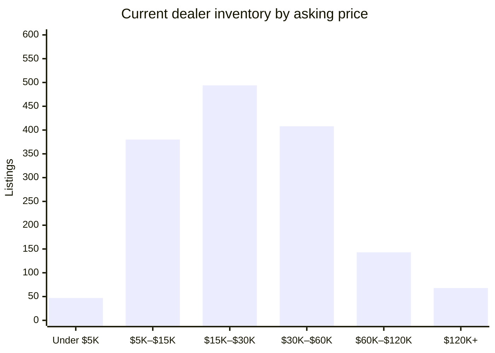

# David Webb Secondary Market — 2026-08-17

## Executive Summary

This report reflects the initial baseline population of the David Webb secondary-market pipeline as of August 17, 2026, with 1,607 active dealer listings and 3,967 auction records now on file; the elevated "new listing" count of 239 this week is an artifact of that backfill process and should not be read as an unusual spike in fresh supply. On the auction side, 16 sales have cleared over the past 60 days at a median hammer of $23,040, closely mirroring the current dealer asking median of $24,000 — a rare moment of pricing coherence between the two channels. The standout recent result is a David Webb 18K gold, platinum, jade, diamond, and enamel necklace that realized $232,000 at Mynt Auctions on August 13, while the dealer market's current headline ask is $345,000 for an "Iconic David Webb Necklace" offered by Joseph Saidian & Sons. With just 29 dealer listings closed over the past four weeks, estate-side sell-through remains measured, and the detailed breakdowns that follow will provide category-level context as the pipeline matures beyond this baseline state.

## Currently Available

_1,607 active listings across all tracked dealer marketplaces (estate jewelers, 1stDibs, Sotheby's Buy Now, The RealReal), with a combined asking-price total of $55,221,501. This section is dealer inventory only — there is currently no live, biddable David Webb auction inventory to track; every auction-history record on file is a completed, historical sale (see "Recent Auction Sales" below)._

_That combined total is a sum of current asking prices, not an appraisal or a market valuation — it will run high wherever the same physical piece is listed on more than one platform (see Data-Quality Caveats)._

**By price**

**By category**

| Category | Count | Min | Median | Max |
|---|---|---|---|---|
| Earrings | 488 | $1,900 | $17,500 | $227,500 |
| Ring | 343 | $3,100 | $19,100 | $375,000 |
| Bracelet | 319 | $3,200 | $42,200 | $410,000 |
| Necklace | 227 | $2,796 | $39,750 | $345,000 |
| Brooch | 132 | $3,658 | $24,000 | $125,000 |
| Cufflinks | 24 | $2,250 | $5,675 | $14,800 |
| Other | 7 | $4,800 | $16,500 | $150,000 |

**By dealer**

_24 dealer(s) currently carry David Webb pieces — showing the top 20 by listing count, the rest bucketed into "Other" below._

| Dealer | Active Listings | Median Asking |
|---|---|---|
| The Back Vault | 952 | $24,000 |
| The RealReal | 120 | $13,311 |
| Oak Gem | 114 | $27,500 |
| Eric Originals & Antiques | 83 | $29,500 |
| Yafa Signed Jewels | 66 | $56,850 |
| Greenleaf & Crosby | 41 | $25,000 |
| Wilson's Estate Jewelry | 36 | $11,025 |
| Saidian & Sons | 32 | $34,000 |
| Sotheby's (Buy Now) | 31 | $18,500 |
| Legacy Vintage Jewels | 18 | $107,000 |
| Macklowe Gallery | 11 | $35,000 |
| Estate Diamond Jewelry | 7 | $12,000 |
| Kentshire | 6 | $36,000 |
| Joseph Saidian and Sons | 4 | $75,000 |
| Louis Martin | 4 | $24,500 |
| A. Brandt + Son | 3 | $14,995 |
| Eric Originals and Antiques LTD | 3 | $18,000 |
| Charles Schwartz & Son | 2 | $15,250 |
| Lawrence Jeffrey | 2 | $8,900 |
| ISKENDERIAN | 1 | $133,900 |
| Other (4 additional dealers) | 4 | $22,700 |

## Trends by Motif & Material

_Tags are keyword-matched from each piece's own listing text against David Webb's known design vocabulary (Zodiac, animal/creature pieces, fishscale, rock crystal, enamel, carved hardstone, etc.) — a piece can carry several tags. Tags with fewer than 5 matching records are omitted as too thin to be meaningful. Click a tag to see those exact pieces in the live database._

**Auction (sold prices)**

| Tag | Count | Min | Median | Max |
|---|---|---|---|---|
| [Enamel](https://david-webb-new-york.github.io/david-webb-market-agent/?tag=Enamel) | 949 | $719 | $10,925 | $232,000 |
| [Cabochon](https://david-webb-new-york.github.io/david-webb-market-agent/?tag=Cabochon) | 934 | $1,250 | $16,410 | $508,000 |
| [Carved Hardstone](https://david-webb-new-york.github.io/david-webb-market-agent/?tag=Carved%20Hardstone) | 556 | $875 | $15,000 | $693,000 |
| [Hammered Gold](https://david-webb-new-york.github.io/david-webb-market-agent/?tag=Hammered%20Gold) | 428 | $1,250 | $11,420 | $201,600 |
| [Animal/Creature](https://david-webb-new-york.github.io/david-webb-market-agent/?tag=Animal%2FCreature) | 416 | $719 | $12,155 | $218,500 |
| [Cuff/Bangle](https://david-webb-new-york.github.io/david-webb-market-agent/?tag=Cuff%2FBangle) | 361 | $1,314 | $23,750 | $218,500 |
| [Bombé](https://david-webb-new-york.github.io/david-webb-market-agent/?tag=Bomb%C3%A9) | 201 | $1,250 | $12,454 | $1,426,500 |
| [Rock Crystal](https://david-webb-new-york.github.io/david-webb-market-agent/?tag=Rock%20Crystal) | 177 | $954 | $12,516 | $106,250 |
| [Maltese Cross](https://david-webb-new-york.github.io/david-webb-market-agent/?tag=Maltese%20Cross) | 36 | $3,125 | $20,000 | $134,500 |
| [Door Knocker](https://david-webb-new-york.github.io/david-webb-market-agent/?tag=Door%20Knocker) | 29 | $3,125 | $9,525 | $106,250 |
| [Zodiac](https://david-webb-new-york.github.io/david-webb-market-agent/?tag=Zodiac) | 27 | $812 | $8,713 | $90,000 |
| [Shell/Starfish](https://david-webb-new-york.github.io/david-webb-market-agent/?tag=Shell%2FStarfish) | 17 | $1,700 | $5,175 | $146,500 |

**Current dealer inventory (asking prices)**

| Tag | Count | Min | Median | Max |
|---|---|---|---|---|
| [Enamel](https://david-webb-new-york.github.io/david-webb-market-agent/?tag=Enamel) | 500 | $2,796 | $20,400 | $289,500 |
| [Carved Hardstone](https://david-webb-new-york.github.io/david-webb-market-agent/?tag=Carved%20Hardstone) | 292 | $3,850 | $33,250 | $289,500 |
| [Cabochon](https://david-webb-new-york.github.io/david-webb-market-agent/?tag=Cabochon) | 263 | $3,200 | $27,900 | $410,000 |
| [Animal/Creature](https://david-webb-new-york.github.io/david-webb-market-agent/?tag=Animal%2FCreature) | 232 | $3,100 | $22,000 | $280,000 |
| [Hammered Gold](https://david-webb-new-york.github.io/david-webb-market-agent/?tag=Hammered%20Gold) | 175 | $1,995 | $22,500 | $132,000 |
| [Cuff/Bangle](https://david-webb-new-york.github.io/david-webb-market-agent/?tag=Cuff%2FBangle) | 165 | $3,200 | $37,000 | $250,200 |
| [1970s](https://david-webb-new-york.github.io/david-webb-market-agent/?tag=1970s) | 145 | $3,100 | $27,500 | $289,500 |
| [1960s](https://david-webb-new-york.github.io/david-webb-market-agent/?tag=1960s) | 87 | $3,100 | $27,800 | $265,000 |
| [Rock Crystal](https://david-webb-new-york.github.io/david-webb-market-agent/?tag=Rock%20Crystal) | 64 | $4,800 | $34,200 | $225,000 |
| [Bombé](https://david-webb-new-york.github.io/david-webb-market-agent/?tag=Bomb%C3%A9) | 57 | $6,400 | $18,800 | $214,500 |
| [1980s](https://david-webb-new-york.github.io/david-webb-market-agent/?tag=1980s) | 54 | $4,250 | $22,700 | $81,200 |
| [Door Knocker](https://david-webb-new-york.github.io/david-webb-market-agent/?tag=Door%20Knocker) | 47 | $8,713 | $20,700 | $214,500 |
| [Zodiac](https://david-webb-new-york.github.io/david-webb-market-agent/?tag=Zodiac) | 18 | $4,500 | $18,150 | $64,300 |
| [Shell/Starfish](https://david-webb-new-york.github.io/david-webb-market-agent/?tag=Shell%2FStarfish) | 13 | $7,200 | $13,500 | $41,600 |
| [Maltese Cross](https://david-webb-new-york.github.io/david-webb-market-agent/?tag=Maltese%20Cross) | 12 | $27,300 | $35,050 | $65,000 |

## New in the Last Week

_239 dealer listing(s) first seen in the last 7 days, across all sources and price points — showing the 20 biggest by price._

| Piece | Category | Dealer | Price | Date |
|---|---|---|---|---|
| [Iconic David Webb Necklace](https://www.1stdibs.com/jewelry/necklaces/link-necklaces/iconic-david-webb-necklace/id-j_25653002/) | Necklace | Joseph Saidian and Sons | $345,000 | 2026-08-10 |
| [David Webb Rock Crystal Necklace](https://www.1stdibs.com/jewelry/necklaces/chain-necklaces/david-webb-rock-crystal-necklace/id-j_24965412/) | Necklace | Legacy Vintage Jewels | $220,000 | 2026-08-10 |
| [Lapis Emerald Diamond Chimera Bracelet](https://greenleafcrosby.com/products/david-webb-lapis-emerald-diamond-chimera-bracelet) | Bracelet | Greenleaf & Crosby | $145,000 | 2026-08-13 |
| [Ruby Emerald Sapphire Diamond Pendant Necklace](https://greenleafcrosby.com/products/david-webb-ruby-sapphire-emerald-diamond-pendant-necklace) | Bracelet | Greenleaf & Crosby | $145,000 | 2026-08-13 |
| Gold, Platinum, Emerald, Ruby and Diamond Ram's Head Bracelet | Bracelet | Sotheby's (Buy Now) | $138,000 | 2026-08-10 |
| [David Webb Ruby Diamond Bracelet](https://www.1stdibs.com/jewelry/bracelets/retro-bracelets/david-webb-ruby-diamond-bracelet/id-j_20812622/) | Bracelet | ISKENDERIAN | $133,900 | 2026-08-10 |
| [David Webb Multigem and Diamond Floral Gold Brooch](https://www.1stdibs.com/jewelry/brooches/brooches/david-webb-multigem-diamond-floral-gold-brooch/id-j_30067222/) | Brooch | Legacy Vintage Jewels | $125,000 | 2026-08-11 |
| [18k Gold White Enamel Heraldic Pendant Necklace](https://greenleafcrosby.com/products/david-webb-gold-white-enamel-heraldic-pendant-necklace) | Bracelet | Greenleaf & Crosby | $125,000 | 2026-08-13 |
| [David Webb Turquoise, Ruby, and Diamond Necklace](https://www.1stdibs.com/jewelry/necklaces/beaded-necklaces/david-webb-turquoise-ruby-diamond-necklace/id-j_25225442/) | Necklace | Legacy Vintage Jewels | $110,000 | 2026-08-10 |
| [David Webb Emerald & Diamond Pendent Earrings](https://www.1stdibs.com/jewelry/earrings/dangle-earrings/david-webb-emerald-diamond-pendent-earrings/id-j_24936592/) | Earrings | Legacy Vintage Jewels | $104,000 | 2026-08-10 |
| [David Webb 8 Carat Colombian Emerald and Diamond Ring](https://saidiansons.com/products/david-webb-8-carat-colombian-emerald-and-diamond-ring) | Ring | Saidian & Sons | $100,000 | 2026-08-13 |
| [David Webb Platinum & 18K Yellow Gold Rock Crystal Ruby And Diamond Necklace](https://thebackvault.com/products/david-webb-platinum-18k-yellow-gold-rock-crystal-ruby-and-diamond-necklace-rr8253) | Necklace | The Back Vault | $94,200 | 2026-08-12 |
| [David Webb Diamond Earrings](https://www.1stdibs.com/jewelry/earrings/clip-on-earrings/david-webb-diamond-earrings/id-j_29851652/) | Earrings | Joseph Saidian and Sons | $90,000 | 2026-08-10 |
| Platinum, Gold, Turquoise and Diamond Day & Night Earclips | Earrings | Sotheby's (Buy Now) | $85,000 | 2026-08-10 |
| [David Webb Bird Brooch with Sapphire, Emerald, Ruby, and Diamonds](https://www.1stdibs.com/jewelry/brooches/brooches/david-webb-bird-brooch-sapphire-emerald-ruby-diamonds/id-j_25153132/) | Brooch | Legacy Vintage Jewels | $80,000 | 2026-08-12 |
| [David Webb 18k Yellow Gold Rock Crystal Diamond Link Bracelet](https://greenleafcrosby.com/products/david-webb-gold-rock-crystal-diamond-link-bracelet) | Bracelet | Greenleaf & Crosby | $75,000 | 2026-08-13 |
| [1970s 18k Yellow Gold Platinum Diamond Cuff Bracelet](https://greenleafcrosby.com/products/david-webb-gold-platinum-diamond-cuff) | Bracelet | Greenleaf & Crosby | $72,000 | 2026-08-13 |
| [18k Gold Platinum Black Enamel Diamond Horse Bracelet](https://greenleafcrosby.com/products/david-webb-black-enamel-horse-bracelet) | Bracelet | Greenleaf & Crosby | $68,000 | 2026-08-13 |
| [1970s 18k Gold White Enamel Diamond Zebra Bracelet](https://greenleafcrosby.com/products/david-webb-zebra-bracelet) | Bracelet | Greenleaf & Crosby | $68,000 | 2026-08-13 |
| [18K Multistone Drop Earrings](https://www.therealreal.com/products/details/jewelry/earrings/clip-on/david-webb-18k-multistone-drop-earrings-s904j) | Earrings | The RealReal | $67,500 | 2026-08-12 |

_...and 219 more. [See the full list in the live dashboard](https://david-webb-new-york.github.io/david-webb-market-agent/?type=dealer)._

## Closed / Sold in the Last 4 Weeks

_29 dealer listing(s) delisted in the last 28 days — "closed" usually but not always means sold (see Data-Quality Caveats)._

| Piece | Category | Dealer | Price | Date |
|---|---|---|---|---|
| [Vintage Pair of David Webb Baroque Pearl Diamond Pendant Earrings](https://www.1stdibs.com/jewelry/earrings/dangle-earrings/vintage-pair-of-david-webb-baroque-pearl-diamond-pendant-earrings/id-j_30159182/) | Necklace | Keyamour | $58,000 | 2026-08-10 |
| [David Webb Sapphire Emerald, Diamond and Gold Ear Clips](https://www.1stdibs.com/jewelry/earrings/clip-on-earrings/david-webb-sapphire-emerald-diamond-gold-ear-clips/id-j_29062702/) | Earrings | Tiina Smith Jewelry | $29,000 | 2026-08-13 |
| [David Webb Modernist Coral Ring](https://www.1stdibs.com/jewelry/rings/fashion-rings/david-webb-modernist-coral-ring/id-j_29089142/) | Ring | Lawrence Jeffrey | $21,000 | 2026-08-10 |
| [David Webb Star Natural Star Sapphire & Diamond Ring](https://www.1stdibs.com/jewelry/rings/cocktail-rings/david-webb-star-natural-star-sapphire-diamond-ring/id-j_24981562/) | Ring | Legacy Vintage Jewels | $20,500 | 2026-08-13 |
| [18K Twisted Rope Hoops](https://www.therealreal.com/products/jewelry/earrings/hoop/david-webb-18k-twisted-rope-hoops-s2rtd) | Earrings | The RealReal | $7,996 | 2026-08-12 |
| [1.84ctw Emerald & Diamond Pipe Ring](https://www.therealreal.com/products/details/jewelry/rings/band/david-webb-1-84ctw-emerald-diamond-pipe-ring-vrdne) | Ring | The RealReal | $6,495 | 2026-08-12 |
| [18K Enamel Band](https://www.therealreal.com/products/jewelry/rings/band/david-webb-18k-enamel-band-ubuzf) | Other | The RealReal | $4,800 | 2026-08-12 |
| [18K Enamel Jabot Pin](https://www.therealreal.com/products/jewelry/brooches/pin/david-webb-18k-enamel-jabot-pin-u79zn) | Brooch | The RealReal | $3,658 | 2026-08-12 |
| [18K Enamel Umbrella Cufflinks](https://www.therealreal.com/products/jewelry/cufflinks/david-webb-18k-enamel-umbrella-cufflinks-va4pz) | Cufflinks | The RealReal | $3,353 | 2026-08-12 |
| [David Webb 18 Karat Yellow Gold Black Enamel Bracelet](https://www.1stdibs.com/jewelry/bracelets/cuff-bracelets/david-webb-18-karat-yellow-gold-black-enamel-bracelet/id-j_27636812/) | Bracelet | The Estate Watch and Jewelry Company | $28,500 | 2026-08-13 |
| [David Webb Enamel, 18K & Platinum Tire Ring signed with a David Webb Certificate](https://www.1stdibs.com/jewelry/rings/cocktail-rings/david-webb-enamel-18k-platinum-tire-ring-signed-david-webb-certificate/id-j_30112182/) | Ring | Pierre/Famille | $25,900 | 2026-08-13 |
| [David Webb Half-Hoop Earrings](https://www.1stdibs.com/jewelry/earrings/hoop-earrings/david-webb-half-hoop-earrings/id-j_27356082/) | Earrings | Macklowe Gallery Jewelry | $13,500 | 2026-08-11 |
| [David Webb Ruby and Enamel Frog Pin in 18K Yellow Gold](https://www.1stdibs.com/jewelry/brooches/brooches/david-webb-ruby-enamel-frog-pin-18k-yellow-gold/id-j_23891282/) | Brooch | Skibell Fine Jewelry | $13,200 | 2026-08-10 |
| [David Webb Carved Topaz and Black Enamel Earrings](https://www.1stdibs.com/jewelry/earrings/clip-on-earrings/david-webb-carved-topaz-black-enamel-earrings/id-j_8517041/) | Earrings | Skibell Fine Jewelry | $8,800 | 2026-08-10 |
| [David Webb 1970s 18K Gold Enamel Leaf Dome Statement Ring](https://www.1stdibs.com/jewelry/rings/cocktail-rings/david-webb-1970s-18k-gold-enamel-leaf-dome-statement-ring/id-j_25360572/) | Ring | Dover Jewelry | $7,700 | 2026-08-13 |
| [David Webb Jade Ruby and Diamond Earrings](https://saidiansons.com/products/david-webb-jade-ruby-and-diamond-earrings) | Earrings | Saidian & Sons | n/a | 2026-08-07 |
| [David Webb Ruby and Diamond Lion Bangle Bracelet](https://saidiansons.com/products/david-webb-ruby-and-diamond-lion-bangle-bracelet) | Bracelet | Saidian & Sons | n/a | 2026-08-07 |
| [David Webb Bird Brooch with Sapphire, Emerald, Ruby, and Diamonds](https://www.1stdibs.com/jewelry/brooches/brooches/david-webb-bird-brooch-sapphire-emerald-ruby-diamonds/id-j_25153132/) | Brooch | Legacy Vintage Jewels | $80,000 | 2026-08-12 |
| [David Webb 18K Yellow Gold  Ring](https://thebackvault.com/products/david-webb-18k-yellow-gold-ring-rr7335) | Ring | The Back Vault | $30,500 | 2026-08-12 |
| [David Webb Oval Hoop Earrings](https://www.1stdibs.com/jewelry/earrings/lever-back-earrings/david-webb-oval-hoop-earrings/id-j_17350342/) | Earrings | Stella Rubin Jewelry | $9,600 | 2026-08-10 |
| [David Webb Certified Unheated Burmese Ruby & Diamond Earrings](https://www.1stdibs.com/jewelry/earrings/stud-earrings/david-webb-certified-unheated-burmese-ruby-diamond-earrings/id-j_27340252/) | Earrings | Legacy Vintage Jewels | $55,000 | 2026-08-11 |
| [Vintage 1960s David Webb Coral and Diamond Earrings](https://ericoriginals.com/products/vintage-1960s-david-webb-coral-and-diamond-earrings) | Earrings | Eric Originals & Antiques | $34,750 | 2026-08-07 |
| [David Webb 18 Karat Ribbed Yellow Gold Hinged Bangle Bracelet](https://www.1stdibs.com/jewelry/bracelets/bangles/david-webb-18-karat-ribbed-yellow-gold-hinged-bangle-bracelet/id-j_24865542/) | Bracelet | Bardy's Estate Jewelry | $25,000 | 2026-08-11 |
| [David Webb Zebra Ring, Diamond and Enamel 18K Yellow Gold Platinum](https://www.1stdibs.com/jewelry/rings/cocktail-rings/david-webb-zebra-ring-diamond-enamel-18k-yellow-gold-platinum/id-j_28437452/) | Ring | Aryamehr Fine Jewelry | $19,300 | 2026-08-10 |
| [David Webb Fishscale Bracelet](https://www.1stdibs.com/jewelry/bracelets/link-bracelets/david-webb-fishscale-bracelet/id-j_19549292/) | Bracelet | Ahdoot & Co. | $9,500 | 2026-08-10 |
| [David Webb Fishscale Bracelet](https://www.1stdibs.com/jewelry/bracelets/retro-bracelets/david-webb-fishscale-bracelet/id-j_19381862/) | Bracelet | Ahdoot & Co. | $9,500 | 2026-08-10 |
| [David Webb Trio of Gemstone Rings](https://www.1stdibs.com/jewelry/rings/fashion-rings/david-webb-trio-gemstone-rings/id-j_17080732/) | Other | Stella Rubin Jewelry | $8,500 | 2026-08-10 |
| [David Webb Ribbed Gold Earrings with Diamond Shaped Pattern](https://www.1stdibs.com/jewelry/earrings/lever-back-earrings/david-webb-ribbed-gold-earrings-diamond-shaped-pattern/id-j_24274802/) | Earrings | Stella Rubin Jewelry | $6,800 | 2026-08-10 |
| [David Webb Platinum & 18K Yellow Gold Cabochon Cut Turquoise Flower Clip-On Earrings](https://thebackvault.com/products/david-webb-platinum-18k-yellow-gold-cabochon-cut-turquoise-flower-clip-on-earrings-rr9020) | Earrings | The Back Vault | $22,700 | 2026-08-07 |

## Recent Auction Sales (Past 60 Days)

_16 completed sale(s) in the last 60 days, median hammer $23,040. These are historical results, not current inventory — see "Currently Available" above._

| Piece | House | Sale Date | Price |
|---|---|---|---|
| [David Webb 18K Gold Platinum Jade Diamond Enamel Necklace](https://www.liveauctioneers.com/item/237761875_david-webb-18k-gold-platinum-jade-diamond-enamel-necklace-new-york-ny) | Mynt Auctions | 2026-08-13 | $232,000 |
| Pair of Colored Stone and Diamond Pendant-Earclips | Sotheby's | 2026-06-18 | $153,600 |
| Rubellite, Enamel, and Diamond ‘Couture’ Cuff-Bracelet | Sotheby's | 2026-06-18 | $51,200 |
| Gold, Enamel, Emerald and Diamond Bracelet | Sotheby's | 2026-06-18 | $40,960 |
| Gold and Emerald Cuff-Bracelet | Sotheby's | 2026-06-18 | $38,400 |
| Ruby, Colored Diamond and Diamond Ring | Sotheby's | 2026-06-18 | $35,840 |
| Pair of Jade and Diamond Pendant-Earclips | Sotheby's | 2026-06-18 | $32,000 |
| Gold and Diamond 'Geodesic Dome' Ring | Sotheby's | 2026-06-18 | $25,600 |
| Ruby and Diamond Ring | Sotheby's | 2026-06-18 | $20,480 |
| Gold Cuff-Bracelet | Sotheby's | 2026-06-18 | $19,200 |
| Chalcedony, Emerald, Ruby and Diamond Pendant-Brooch | Sotheby's | 2026-06-18 | $19,200 |
| Gold and Diamond Clip-Brooch | Sotheby's | 2026-06-18 | $17,920 |
| Pair of Gold and Diamond Pendant-Earclips | Sotheby's | 2026-06-18 | $17,920 |
| Pair of Gold Bangle-Bracelets | Sotheby's | 2026-06-18 | $17,920 |
| Gold and Diamond Ring | Sotheby's | 2026-06-18 | $17,920 |
| Pair of Rock Crystal, Cultured Pearl & Diamond Earclips | Sotheby's | 2026-06-18 | $15,360 |

## All-Time Notable Sales

These benchmark results provide context for current dealer asking prices and collector expectations:

| Piece | House | Date | Hammer |
|---|---|---|---|
| [THE ANNENBERG DIAMOND AN EXCEPTIONAL DIAMOND RING, BY DAVID WEBB](https://www.christies.com/en/lot/lot-5250229) | Christie's | 2009-10-21 | $7,698,500 |
| [A DIAMOND RING, BY DAVID WEBB](https://www.christies.com/en/lot/lot-5578141) | Christie's | 2012-06-12 | $1,874,500 |
| [A COLORED DIAMOND RING, BY DAVID WEBB](https://www.christies.com/en/lot/lot-5578014) | Christie's | 2012-06-12 | $1,426,500 |
| [A PAIR OF NATURAL PEARL AND DIAMOND EAR PENDANTS, BY DAVID WEBB](https://www.christies.com/en/lot/lot-5754780) | Christie's | 2013-12-10 | $1,265,000 |
| [A SAPPHIRE AND DIAMOND BRACELET, BY DAVID WEBB](https://www.christies.com/en/lot/lot-5442124) | Christie's | 2011-05-31 | $959,356 (orig. HKD 7,460,000) |

## Worth a Second Look

_Implausibly low price for the category — a heuristic signal for a human to check, not a fraud determination. A flagged piece may well be genuine; this just surfaces things worth a closer look before relying on the listing. Click through to validate each one. (370 total, showing the 10 cheapest.)_

- [Pair of Gold Necklace Shorteners, David Webb](https://www.doyle.com/auction/lot/lot-142---pair-of-gold-necklace-shorteners-david-webb/?lot=1044120&so=4&st=david webb&sto=0&au=&ef=&et=&ic=False&sd=1&mc=409&mc=9&mc=4&mc=25&mc=167&mc=5&mc=173&mc=410&mc=554&mc=3&mc=209&mc=31&mc=219&mc=188&mc=325&mc=190&mc=146&pp=96&pn=11&g=1) — $375 via Doyle. $375 is well below the typical range for "necklace" (610 comparable auction records, median $17,920).
- [Gold Leaf Brooch, David Webb](https://www.doyle.com/auction/lot/lot-534---gold-leaf-brooch-david-webb/?lot=1020224&so=4&st=david webb&sto=0&au=&ef=&et=&ic=False&sd=1&mc=409&mc=9&mc=4&mc=25&mc=167&mc=5&mc=173&mc=410&mc=554&mc=3&mc=209&mc=31&mc=219&mc=188&mc=325&mc=190&mc=146&pp=96&pn=12&g=1) — $562 via Doyle. $562 is well below the typical range for "brooch" (390 comparable auction records, median $10,713).
- [A GOLD AND DIAMOND PENDANT, BY DAVID WEBB](https://www.christies.com/en/lot/lot-3830577) — $587 via Christie's. $587 is well below the typical range for "necklace" (610 comparable auction records, median $17,920).
- [A David Webb ring modelled as a leopard's head and tail, with black enamel spots and gem set eyes, signed.](https://www.christies.com/en/lot/lot-711892) — $719 (GBP 460) via Christie's. $719 is well below the typical range for "ring" (536 comparable auction records, median $8,320).
- [A Sagittarius brooch by David Webb](https://www.christies.com/en/lot/lot-2533639) — $812 (GBP 564) via Christie's. $812 is well below the typical range for "brooch" (390 comparable auction records, median $10,713).
- [A MUTLISTRAND CULTURED PEARL AND DIAMOND BRACELET, DAVID WEBB](https://www.christies.com/en/lot/lot-1862648) — $822 via Christie's. $822 is well below the typical range for "bracelet" (645 comparable auction records, median $22,680).
- [[BOOKS-JEWELRY] Group of approximately...](https://www.doyle.com/auction/lot/lot-814---books-jewelry-group-of-approximately/?lot=1277810&so=4&st=david webb&sto=0&au=&ef=&et=&ic=False&sd=1&mc=409&mc=9&mc=4&mc=25&mc=167&mc=5&mc=173&mc=410&mc=554&mc=3&mc=209&mc=31&mc=219&mc=188&mc=325&mc=190&mc=146&pp=96&pn=4&g=1) — $875 via Doyle. $875 is well below the typical range for "other" (296 comparable auction records, median $14,705).
- [Gold Jabot, David Webb](https://www.doyle.com/auction/lot/lot-323---gold-jabot-david-webb/?lot=1181319&so=4&st=david webb&sto=0&au=&ef=&et=&ic=False&sd=1&mc=409&mc=9&mc=4&mc=25&mc=167&mc=5&mc=173&mc=410&mc=554&mc=3&mc=209&mc=31&mc=219&mc=188&mc=325&mc=190&mc=146&pp=96&pn=8&g=1) — $875 via Doyle. $875 is well below the typical range for "other" (296 comparable auction records, median $14,705).
- [Gold and Jade Ring, David Webb](https://www.doyle.com/auction/lot/lot-519---gold-and-jade-ring-david-webb/?lot=1076359&so=4&st=david webb&sto=0&au=&ef=&et=&ic=False&sd=1&mc=409&mc=9&mc=4&mc=25&mc=167&mc=5&mc=173&mc=410&mc=554&mc=3&mc=209&mc=31&mc=219&mc=188&mc=325&mc=190&mc=146&pp=96&pn=11&g=1) — $875 via Doyle. $875 is well below the typical range for "ring" (536 comparable auction records, median $8,320).
- [Two Gold and Enamel Jabots, David Webb](https://www.doyle.com/auction/lot/lot-488---two-gold-and-enamel-jabots-david-webb/?lot=1071094&so=4&st=david webb&sto=0&au=&ef=&et=&ic=False&sd=1&mc=409&mc=9&mc=4&mc=25&mc=167&mc=5&mc=173&mc=410&mc=554&mc=3&mc=209&mc=31&mc=219&mc=188&mc=325&mc=190&mc=146&pp=96&pn=11&g=1) — $875 via Doyle. $875 is well below the typical range for "other" (296 comparable auction records, median $14,705).

## Data-Quality Caveats

- **Auction hammer prices exclude buyer's premium** — typically +15–26% depending on the house.
- **Dealer asking prices are not confirmed sale prices** — they're the dealer's current ask, which may be negotiated down or never sell.
- **"Closed" (dealer status: inactive) usually but not always means sold** — could also be a price relist under a new SKU or a data-feed gap.
- **"Currently available" is dealer inventory only.** There is no live, biddable David Webb auction inventory being tracked right now — genuine upcoming auction lots were confirmed absent at the major houses as of the last investigation.
- **A piece can be listed on more than one platform** (e.g. a dealer's own site and 1stDibs) — "total listings" and the combined asking-price total above count platform presence, not unique physical pieces. A 2026-08-12 audit had Claude visually compare the actual photos for every plausible cross-dealer duplicate candidate in the full active dataset (164 candidates, narrowed by price/category/title similarity) and confirmed 4 genuine duplicates (0.55% of active inventory) — each backed by a specific matching physical detail (a fracture pattern, a wear mark, an enamel-link arrangement), not just style similarity. Critically, **none** of the 395 listings from dealers other than The Back Vault/The RealReal were confirmed as also posted to either of those two — so there's no evidence every dealer is double-posting there. (An earlier same-night pass using Google reverse-image search over-flagged several pairs as duplicates that were actually distinct pieces of the same signature David Webb design — Google's "visual match" is a style-similarity tool, not a duplicate detector; the Claude-vision check applied a stricter, physical-identity bar.) This is a lower bound — only candidates the price/title filter surfaced were checked, so a duplicate priced or titled very differently across platforms, or on an untracked dealer, wouldn't be caught.
- **Foreign-currency prices are converted to USD** using approximate historical annual-average exchange rates, not settlement-date-precise figures — the original native-currency amount is footnoted wherever it differs from the displayed USD figure.

