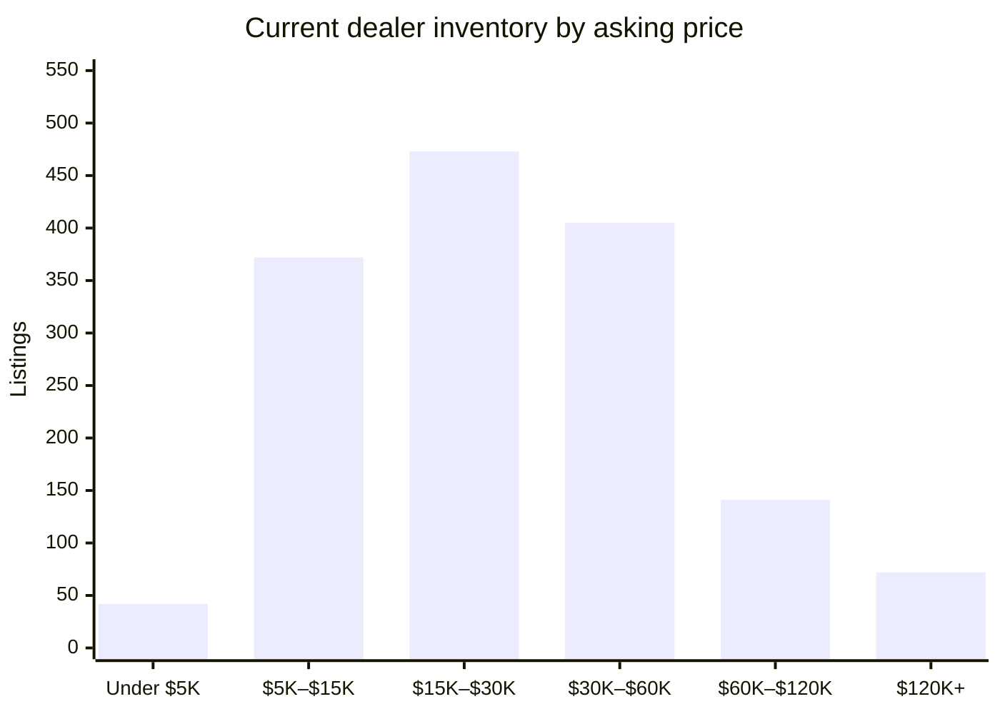

# David Webb Secondary Market — 2026-09-14

## Executive Summary

As of September 14, 2026, the David Webb secondary market presents a picture of measured, orderly activity: 1,573 active dealer listings carry a median asking price of $24,000, with just 14 new listings entering the market over the past week against 112 closures over the past four weeks — a closure-to-new-listing ratio that reflects genuine, sustained demand rather than accumulation. Auction activity has been notably quiet, with only one hammer result recorded in the past 60 days: a David Webb 18K Gold Platinum Jade Diamond Enamel Necklace that sold through Mynt Auctions on August 13 for $232,000, setting the lone verifiable price benchmark for the period. On the dealer side, the week's most significant arrival is a Coral Double Lion Head Bangle Bracelet offered by The Back Vault at $288,000, closely followed by a Coral Chimera Bracelet from Joseph Saidian and Sons at $185,000 — both underscoring continued collector appetite for Webb's sculptural, animal-motif statement pieces at the upper tier of the market.

## Currently Available

_1,573 active listings across all tracked dealer marketplaces (estate jewelers, 1stDibs, Sotheby's Buy Now, The RealReal), with a combined asking-price total of $55,340,412. This section is dealer inventory only — there is currently no live, biddable David Webb auction inventory to track; every auction-history record on file is a completed, historical sale (see "Recent Auction Sales" below)._

_That combined total is a sum of current asking prices, not an appraisal or a market valuation — it will run high wherever the same physical piece is listed on more than one platform (see Data-Quality Caveats)._

**By price**

**By category**

| Category | Count | Min | Median | Max |
|---|---|---|---|---|
| Earrings | 470 | $1,900 | $17,800 | $227,500 |
| Ring | 332 | $3,100 | $19,400 | $375,000 |
| Bracelet | 321 | $3,200 | $42,200 | $410,000 |
| Necklace | 218 | $3,146 | $41,050 | $345,000 |
| Brooch | 135 | $3,658 | $24,500 | $125,000 |
| Cufflinks | 21 | $2,250 | $6,400 | $14,800 |
| Other | 8 | $4,800 | $27,000 | $150,000 |

**By dealer**

_21 dealer(s) currently carry David Webb pieces — showing the top 20 by listing count, the rest bucketed into "Other" below._

| Dealer | Active Listings | Median Asking |
|---|---|---|
| The Back Vault | 952 | $24,000 |
| The RealReal | 120 | $13,498 |
| Oak Gem | 111 | $28,000 |
| Eric Originals & Antiques | 85 | $29,750 |
| Yafa Signed Jewels | 66 | $56,850 |
| Greenleaf & Crosby | 41 | $25,000 |
| Wilson's Estate Jewelry | 36 | $11,025 |
| Saidian & Sons | 32 | $40,000 |
| Legacy Vintage Jewels | 18 | $87,500 |
| Macklowe Gallery | 11 | $35,000 |
| Estate Diamond Jewelry | 7 | $12,000 |
| Kentshire | 6 | $36,000 |
| Joseph Saidian and Sons | 4 | $167,500 |
| Louis Martin | 4 | $24,500 |
| A. Brandt + Son | 3 | $14,995 |
| 66 mint | 2 | $32,675 |
| Lawrence Jeffrey | 2 | $15,400 |
| Eric Originals and Antiques LTD | 2 | $18,485 |
| ISKENDERIAN | 1 | $133,900 |
| Pierre/Famille | 1 | $20,720 |
| Other (1 additional dealers) | 1 | $12,500 |

## Trends by Motif & Material

_Tags are keyword-matched from each piece's own listing text against David Webb's known design vocabulary (Zodiac, animal/creature pieces, fishscale, rock crystal, enamel, carved hardstone, etc.) — a piece can carry several tags. Tags with fewer than 5 matching records are omitted as too thin to be meaningful. Click a tag to see those exact pieces in the live database._

**Auction (sold prices)**

| Tag | Count | Min | Median | Max |
|---|---|---|---|---|
| [Enamel](https://david-webb-new-york.github.io/david-webb-market-agent/?tag=Enamel) | 949 | $719 | $10,925 | $232,000 |
| [Cabochon](https://david-webb-new-york.github.io/david-webb-market-agent/?tag=Cabochon) | 934 | $1,250 | $16,410 | $508,000 |
| [Carved Hardstone](https://david-webb-new-york.github.io/david-webb-market-agent/?tag=Carved%20Hardstone) | 556 | $875 | $15,000 | $693,000 |
| [Hammered Gold](https://david-webb-new-york.github.io/david-webb-market-agent/?tag=Hammered%20Gold) | 428 | $1,250 | $11,420 | $201,600 |
| [Animal/Creature](https://david-webb-new-york.github.io/david-webb-market-agent/?tag=Animal%2FCreature) | 416 | $719 | $12,155 | $218,500 |
| [Cuff/Bangle](https://david-webb-new-york.github.io/david-webb-market-agent/?tag=Cuff%2FBangle) | 361 | $1,314 | $23,750 | $218,500 |
| [Bombé](https://david-webb-new-york.github.io/david-webb-market-agent/?tag=Bomb%C3%A9) | 201 | $1,250 | $12,454 | $1,426,500 |
| [Rock Crystal](https://david-webb-new-york.github.io/david-webb-market-agent/?tag=Rock%20Crystal) | 177 | $954 | $12,516 | $106,250 |
| [Maltese Cross](https://david-webb-new-york.github.io/david-webb-market-agent/?tag=Maltese%20Cross) | 36 | $3,125 | $20,000 | $134,500 |
| [Door Knocker](https://david-webb-new-york.github.io/david-webb-market-agent/?tag=Door%20Knocker) | 29 | $3,125 | $9,525 | $106,250 |
| [Zodiac](https://david-webb-new-york.github.io/david-webb-market-agent/?tag=Zodiac) | 27 | $812 | $8,713 | $90,000 |
| [Shell/Starfish](https://david-webb-new-york.github.io/david-webb-market-agent/?tag=Shell%2FStarfish) | 17 | $1,700 | $5,175 | $146,500 |

**Current dealer inventory (asking prices)**

| Tag | Count | Min | Median | Max |
|---|---|---|---|---|
| [Enamel](https://david-webb-new-york.github.io/david-webb-market-agent/?tag=Enamel) | 483 | $2,900 | $20,700 | $335,000 |
| [Carved Hardstone](https://david-webb-new-york.github.io/david-webb-market-agent/?tag=Carved%20Hardstone) | 290 | $3,850 | $35,000 | $289,500 |
| [Cabochon](https://david-webb-new-york.github.io/david-webb-market-agent/?tag=Cabochon) | 261 | $3,200 | $27,500 | $410,000 |
| [Animal/Creature](https://david-webb-new-york.github.io/david-webb-market-agent/?tag=Animal%2FCreature) | 232 | $3,100 | $22,100 | $335,000 |
| [Hammered Gold](https://david-webb-new-york.github.io/david-webb-market-agent/?tag=Hammered%20Gold) | 175 | $1,995 | $22,500 | $132,000 |
| [Cuff/Bangle](https://david-webb-new-york.github.io/david-webb-market-agent/?tag=Cuff%2FBangle) | 168 | $3,200 | $37,000 | $288,000 |
| [1970s](https://david-webb-new-york.github.io/david-webb-market-agent/?tag=1970s) | 146 | $3,100 | $27,700 | $289,500 |
| [1960s](https://david-webb-new-york.github.io/david-webb-market-agent/?tag=1960s) | 88 | $3,100 | $28,650 | $265,000 |
| [Rock Crystal](https://david-webb-new-york.github.io/david-webb-market-agent/?tag=Rock%20Crystal) | 63 | $4,800 | $39,000 | $225,000 |
| [Bombé](https://david-webb-new-york.github.io/david-webb-market-agent/?tag=Bomb%C3%A9) | 55 | $6,400 | $18,800 | $214,500 |
| [1980s](https://david-webb-new-york.github.io/david-webb-market-agent/?tag=1980s) | 55 | $4,250 | $22,700 | $81,200 |
| [Door Knocker](https://david-webb-new-york.github.io/david-webb-market-agent/?tag=Door%20Knocker) | 47 | $8,713 | $20,700 | $214,500 |
| [Zodiac](https://david-webb-new-york.github.io/david-webb-market-agent/?tag=Zodiac) | 17 | $4,500 | $17,800 | $64,300 |
| [Maltese Cross](https://david-webb-new-york.github.io/david-webb-market-agent/?tag=Maltese%20Cross) | 12 | $27,300 | $35,050 | $65,000 |
| [Shell/Starfish](https://david-webb-new-york.github.io/david-webb-market-agent/?tag=Shell%2FStarfish) | 10 | $7,200 | $12,100 | $30,700 |

## New in the Last Week

_14 dealer listing(s) first seen in the last 7 days, across all sources and price points._

| Piece | Category | Dealer | Price | Date |
|---|---|---|---|---|
| [David Webb Coral Double Lion Head Bangle Bracelet](https://www.1stdibs.com/jewelry/bracelets/bangles/david-webb-coral-double-lion-head-bangle-bracelet/id-j_8543371/) | Bracelet | The Back Vault | $288,000 | 2026-09-14 |
| [David Webb Coral Chimera Bracelet](https://www.1stdibs.com/jewelry/bracelets/bangles/david-webb-coral-chimera-bracelet/id-j_28629522/) | Bracelet | Joseph Saidian and Sons | $185,000 | 2026-09-14 |
| [David Webb Emerald Bangle Bracelet](https://www.1stdibs.com/jewelry/bracelets/bangles/david-webb-emerald-bangle-bracelet/id-j_29923222/) | Bracelet | Joseph Saidian and Sons | $125,000 | 2026-09-07 |
| [18K 6.83ctw Diamond Cocktail Ring](https://www.therealreal.com/products/jewelry/rings/cocktail-ring/david-webb-18k-6-83ctw-diamond-cocktail-ring-vlbv0) | Ring | The RealReal | $124,995 | 2026-09-14 |
| [David Webb 18k Gold & Platinum Turquoise and Diamond Clip-On Earrings](https://legacyvintagejewels.com/products/david-webb-18k-gold-platinum-turquoise-and-diamond-clip-on-earrings) | Earrings | Legacy Vintage Jewels | $55,000 | 2026-09-09 |
| [David Webb 18K Yellow Gold 6.00cttw Aquamarine And Diamond Earrings](https://thebackvault.com/products/david-webb-18k-yellow-gold-6-00cttw-aquamarine-and-diamond-earrings-j10159) | Earrings | The Back Vault | $53,300 | 2026-09-14 |
| [David Webb Pearl, Diamond, Onyx & Rock Crystal Necklace](https://www.1stdibs.com/jewelry/necklaces/pendant-necklaces/david-webb-pearl-diamond-onyx-rock-crystal-necklace/id-j_29659532/) | Necklace | Odeon Collection | $42,000 | 2026-09-08 |
| [David Webb Green-Blue Enamel Emerald Diamond Pendant Brooch](https://www.1stdibs.com/jewelry/brooches/brooches/david-webb-green-blue-enamel-emerald-diamond-pendant-brooch/id-j_23451002/) | Necklace | Greenleaf & Crosby | $39,500 | 2026-09-07 |
| [David Webb 18K Yellow Gold Black Enamel And Roses Coral Link Necklace](https://thebackvault.com/products/david-webb-18k-yellow-gold-black-enamel-and-roses-coral-link-necklace-j10156) | Necklace | The Back Vault | $35,700 | 2026-09-14 |
| [Coral & Diamond Earclips](https://www.therealreal.com/products/details/jewelry/earrings/earclip/david-webb-coral-diamond-earclips-uyph3) | Earrings | The RealReal | $19,546 | 2026-09-14 |
| [18K Twisted Hammered Nail Collar Necklace](https://www.therealreal.com/products/jewelry/necklaces/collar/david-webb-18k-twisted-hammered-nail-collar-necklace-s0v65) | Necklace | The RealReal | $16,000 | 2026-09-09 |
| [David Webb Gold Brooch](https://www.1stdibs.com/jewelry/brooches/brooches/david-webb-gold-brooch/id-j_28836742/) | Brooch | Stella Rubin Jewelry | $12,500 | 2026-09-10 |
| [2.75ctw Diamond Band](https://www.therealreal.com/products/jewelry/rings/band/david-webb-2-75ctw-diamond-band-v4e86) | Other | The RealReal | $9,000 | 2026-09-09 |
| [18K Textured Signet Ring](https://www.therealreal.com/products/details/jewelry/rings/signet-ring/david-webb-18k-textured-signet-ring-vnv2d) | Ring | The RealReal | $3,895 | 2026-09-14 |

## Closed / Sold in the Last 4 Weeks

_112 dealer listing(s) delisted in the last 28 days — "closed" usually but not always means sold (see Data-Quality Caveats)._

| Piece | Category | Dealer | Price | Date |
|---|---|---|---|---|
| Gold, Platinum, Emerald, Ruby and Diamond Ram's Head Bracelet | Bracelet | Sotheby's (Buy Now) | $138,000 | 2026-08-10 |
| [David Webb Emerald Bangle Bracelet](https://www.1stdibs.com/jewelry/bracelets/bangles/david-webb-emerald-bangle-bracelet/id-j_29923222/) | Bracelet | Joseph Saidian and Sons | $125,000 | 2026-09-07 |
| [David Webb Turquoise, Ruby, and Diamond Necklace](https://www.1stdibs.com/jewelry/necklaces/beaded-necklaces/david-webb-turquoise-ruby-diamond-necklace/id-j_25225442/) | Necklace | Legacy Vintage Jewels | $110,000 | 2026-08-10 |
| Platinum, Gold, Turquoise and Diamond Day & Night Earclips | Earrings | Sotheby's (Buy Now) | $85,000 | 2026-08-10 |
| Vintage Platinum, Gold, 6.00ct Colombian Emerald and Diamond Convertible Ring | Ring | Sotheby's (Buy Now) | $67,000 | 2026-08-10 |
| [David Webb Certified Unheated Burmese Ruby & Diamond Earrings](https://www.1stdibs.com/jewelry/earrings/stud-earrings/david-webb-certified-unheated-burmese-ruby-diamond-earrings/id-j_27340252/) | Earrings | Legacy Vintage Jewels | $55,000 | 2026-08-11 |
| [David Webb Diamond and White Enamel Slice Cuff](https://www.1stdibs.com/jewelry/bracelets/cuff-bracelets/david-webb-diamond-white-enamel-slice-cuff/id-j_29002292/) | Bracelet | Tiina Smith Jewelry | $55,000 | 2026-09-01 |
| Vintage Gold and Diamond Earclips and Convertible Pendant Brooch Set | Necklace | Sotheby's (Buy Now) | $41,000 | 2026-08-10 |
| Gold Bracelet | Bracelet | Sotheby's (Buy Now) | $38,000 | 2026-08-10 |
| Vintage Gold and Quartz Choker Necklace | Necklace | Sotheby's (Buy Now) | $31,500 | 2026-08-10 |
| Gold, Platinum, Diamond and Liberty Head Coin Necklace | Necklace | Sotheby's (Buy Now) | $30,000 | 2026-08-10 |
| Vintage Gold, Black Enamel and Diamond Ski Slope Ring | Ring | Sotheby's (Buy Now) | $28,000 | 2026-08-10 |
| Vintage Gold, Platinum and Diamond Pisces Zodiac Convertible Pendant Brooch | Necklace | Sotheby's (Buy Now) | $27,000 | 2026-08-10 |
| Vintage Gold, Turquoise and Diamond Ring | Ring | Sotheby's (Buy Now) | $24,000 | 2026-08-10 |
| Gold, Platinum, Enamel, Emerald, Ruby and Diamond Lion Brooch | Brooch | Sotheby's (Buy Now) | $22,000 | 2026-08-10 |
| Vintage Gold Nautilus Shell Earclips | Earrings | Sotheby's (Buy Now) | $22,000 | 2026-08-10 |
| [Coral & Diamond Earclips](https://www.therealreal.com/products/jewelry/earrings/earclip/david-webb-coral-diamond-earclips-uyph3) | Earrings | The RealReal | $19,546 | 2026-08-12 |
| Gold Concentric Earclips | Earrings | Sotheby's (Buy Now) | $19,000 | 2026-08-21 |
| Gold, Amethyst and Diamond Ring | Ring | Sotheby's (Buy Now) | $18,875 | 2026-08-10 |
| Gold, Diamond and White Enamel Ring | Ring | Sotheby's (Buy Now) | $18,500 | 2026-08-10 |
| Gold, Platinum, Coral and Diamond Ring | Ring | Sotheby's (Buy Now) | $18,000 | 2026-08-10 |
| Gold Swirl Earclips | Earrings | Sotheby's (Buy Now) | $18,000 | 2026-08-10 |
| Gold, Platinum, Rock Crystal Quartz and Diamond Earclips | Earrings | Sotheby's (Buy Now) | $16,500 | 2026-08-10 |
| [David Webb Diamond Leaf Earrings](https://www.1stdibs.com/jewelry/earrings/clip-on-earrings/david-webb-diamond-leaf-earrings/id-j_27874372/) | Earrings | Macklowe Gallery Jewelry | $16,500 | 2026-08-17 |
| Gold, Turquoise and Enamel Earclips | Earrings | Sotheby's (Buy Now) | $16,000 | 2026-08-10 |
| Gold, Platinum, Enamel and Diamond Ring | Ring | Sotheby's (Buy Now) | $16,000 | 2026-08-26 |
| Gold Crescent Earrings | Earrings | Sotheby's (Buy Now) | $15,000 | 2026-08-10 |
| Gold, Platinum and Diamond Earclips | Earrings | Sotheby's (Buy Now) | $14,000 | 2026-08-10 |
| Vintage Gold, Ruby and Diamond Earclips | Earrings | Sotheby's (Buy Now) | $13,500 | 2026-08-10 |
| Vintage Gold and Diamond Bombé Earclips | Earrings | Sotheby's (Buy Now) | $13,500 | 2026-08-10 |
| Platinum Topped Gold, Diamond and Enamel Earclips | Earrings | Sotheby's (Buy Now) | $13,000 | 2026-08-10 |
| Platinum, Gold, Enamel and Diamond Earclips | Earrings | Sotheby's (Buy Now) | $12,000 | 2026-08-10 |
| Gold and Enamel Shell Earclips | Earrings | Sotheby's (Buy Now) | $10,500 | 2026-08-10 |
| [18K 1.15ctw Diamond Cocktail Ring](https://www.therealreal.com/products/details/jewelry/rings/cocktail-ring/david-webb-18k-1-15ctw-diamond-cocktail-ring-s7w6k) | Ring | The RealReal | $8,813 | 2026-08-17 |
| Gold Hammered Earclips | Earrings | Sotheby's (Buy Now) | $8,500 | 2026-08-10 |
| [David Webb 18 Karat Yellow Gold and Red Enamel Cufflinks](https://www.1stdibs.com/jewelry/cufflinks/cufflinks/david-webb-18-karat-yellow-gold-red-enamel-cufflinks/id-j_29405472/) | Cufflinks | Tiina Smith Jewelry | $7,500 | 2026-09-02 |
| Gold and Enamel Cufflinks | Cufflinks | Sotheby's (Buy Now) | $4,500 | 2026-08-10 |
| [18K Textured Signet Ring](https://www.therealreal.com/products/jewelry/rings/signet-ring/david-webb-18k-textured-signet-ring-vnv2d) | Ring | The RealReal | $3,895 | 2026-08-14 |
| [18K Diamond & Enamel Skip Pendant Necklace](https://www.therealreal.com/products/details/jewelry/necklaces/pendant-necklace/david-webb-18k-diamond-enamel-skip-pendant-necklace-s11bh) | Necklace | The RealReal | $2,796 | 2026-08-25 |
| [18K Hammered Cushion Earclips](https://www.therealreal.com/products/details/jewelry/earrings/clip-on/david-webb-18k-hammered-cushion-earclips-u79xb) | Earrings | The RealReal | $6,476 | 2026-08-31 |
| [David Webb Tassel Necklace](https://www.1stdibs.com/jewelry/necklaces/pendant-necklaces/david-webb-tassel-necklace/id-j_29923192/) | Necklace | Joseph Saidian and Sons | $55,000 | 2026-08-10 |
| [David Webb Enamel, 18K & Platinum Tire Ring signed with a David Webb Certificate](https://www.1stdibs.com/jewelry/rings/dome-rings/david-webb-enamel-18k-platinum-tire-ring-signed-david-webb-certificate/id-j_24069042/) | Ring | Pierre/Famille | $22,320 | 2026-08-10 |
| [David Webb Tassel Necklace](https://saidiansons.com/products/david-webb-tassel-necklace) | Bracelet | Saidian & Sons | n/a | 2026-08-07 |
| [David Webb Diamond Earrings](https://saidiansons.com/products/david-webb-diamond-earrings-2) | Earrings | Saidian & Sons | $90,000 | 2026-08-07 |
| [David Webb Diamond Earrings](https://www.1stdibs.com/jewelry/earrings/clip-on-earrings/david-webb-diamond-earrings/id-j_29851652/) | Earrings | Joseph Saidian and Sons | $90,000 | 2026-08-10 |
| [David Webb Pearl, Diamond, Onyx & Rock Crystal Necklace](https://www.1stdibs.com/jewelry/necklaces/pendant-necklaces/david-webb-pearl-diamond-onyx-rock-crystal-necklace/id-j_29659532/) | Necklace | Odeon Collection | $42,000 | 2026-09-08 |
| [David Webb Emerald & Diamond Ring](https://legacyvintagejewels.com/products/david-webb-emerald-diamond-ring) | Ring | Legacy Vintage Jewels | $40,000 | 2026-08-07 |
| [David Webb 18K Yellow Gold Star Sapphire Nephrite Jade Ring](https://thebackvault.com/products/david-webb-18k-yellow-gold-star-sapphire-nephrite-jade-ring-rr7335) | Ring | The Back Vault | $30,500 | 2026-08-07 |
| [David Webb White Enamel 18K Lion Head Cufflinks with Cabochon Emerald Eye](https://www.1stdibs.com/jewelry/cufflinks/cufflinks/david-webb-white-enamel-18k-lion-head-cufflinks-cabochon-emerald-eye/id-j_29732702/) | Cufflinks | Greenwich Bazzar | $13,800 | 2026-08-31 |
| [18K Diamond & Emerald Aries Ram Cuff Bracelet](https://www.therealreal.com/products/details/jewelry/bracelets/cuff/david-webb-18k-diamond-emerald-aries-ram-cuff-bracelet-rdb1r) | Bracelet | The RealReal | $12,120 | 2026-08-25 |
| [Vintage Diamond & Enamel Tiger Ring, 21.2 Grams 18K Gold David Webb Style](https://www.1stdibs.com/jewelry/rings/cocktail-rings/vintage-diamond-enamel-tiger-ring-212-grams-18k-gold-david-webb-style/id-j_30198172/) | Ring | Nikka Jewelry | $4,796 | 2026-09-01 |
| [David Webb Green-Blue Enamel Emerald Diamond Pendant Brooch](https://www.1stdibs.com/jewelry/brooches/brooches/david-webb-green-blue-enamel-emerald-diamond-pendant-brooch/id-j_23451002/) | Necklace | Greenleaf & Crosby | $39,500 | 2026-09-07 |
| [2.75ctw Diamond Band](https://www.therealreal.com/products/details/jewelry/rings/band/david-webb-2-75ctw-diamond-band-v4e86) | Other | The RealReal | $9,000 | 2026-08-12 |
| [David Webb Convertible Yellow Gold Chain](https://www.1stdibs.com/jewelry/necklaces/chain-necklaces/david-webb-convertible-yellow-gold-chain/id-j_24467672/) | Necklace | M.S. Rau | $54,500 | 2026-09-04 |
| [18K 5.60ctw Diamond Strap Clip-On Earrings](https://www.therealreal.com/products/jewelry/earrings/clip-on/david-webb-18k-5-60ctw-diamond-strap-clip-on-earrings-u7k7b) | Earrings | The RealReal | $24,646 | 2026-08-12 |
| [David Webb Black Enamel and 18K Yellow Gold Bracelet](https://www.1stdibs.com/jewelry/bracelets/link-bracelets/david-webb-black-enamel-18k-yellow-gold-bracelet/id-j_23210762/) | Bracelet | Charles Schwartz & Son | $17,000 | 2026-08-17 |
| [David Webb 0.50 Carat Round Brilliant Diamond and Striped Enamel Cocktail Ring](https://www.1stdibs.com/jewelry/rings/cocktail-rings/david-webb-050-carat-round-brilliant-diamond-striped-enamel-cocktail-ring/id-j_17092542/) | Ring | Charles Schwartz & Son | $13,500 | 2026-08-17 |
| [David Webb Emerald & Diamond Pendent Earrings](https://www.1stdibs.com/jewelry/earrings/dangle-earrings/david-webb-emerald-diamond-pendent-earrings/id-j_24936592/) | Earrings | Legacy Vintage Jewels | $104,000 | 2026-08-10 |
| [David Webb Carved Rock Crystal and Diamond Earrings](https://saidiansons.com/products/david-webb-carved-rock-crystal-and-diamond-earrings) | Earrings | Saidian & Sons | $20,000 | 2026-08-07 |
| [18K Enamel Stud Earrings](https://www.therealreal.com/products/jewelry/earrings/stud/david-webb-18k-enamel-stud-earrings-u79ha) | Earrings | The RealReal | $4,584 | 2026-08-12 |
| [David Webb Multigem and Diamond Floral Gold Brooch](https://legacyvintagejewels.com/products/david-webb-multigem-and-diamond-floral-gold-brooch) | Necklace | Legacy Vintage Jewels | $125,000 | 2026-08-07 |
| [Vintage Pair of David Webb Baroque Pearl Diamond Pendant Earrings](https://www.1stdibs.com/jewelry/earrings/dangle-earrings/vintage-pair-of-david-webb-baroque-pearl-diamond-pendant-earrings/id-j_30159182/) | Necklace | Keyamour | $58,000 | 2026-08-10 |
| [Vintage David Webb 18K Black Enamel Link Bracelet](https://www.1stdibs.com/jewelry/bracelets/link-bracelets/vintage-david-webb-18k-black-enamel-link-bracelet/id-j_30055212/) | Bracelet | Jewelry Grove | $25,000 | 2026-09-02 |
| [David Webb Three Stone Cabochon and Diamond Earrings](https://legacyvintagejewels.com/products/david-webb-three-stone-cabochon-and-diamond-earrings) | Earrings | Legacy Vintage Jewels | $15,000 | 2026-08-07 |
| [David Webb Enamel Ring](https://www.1stdibs.com/jewelry/rings/fashion-rings/david-webb-enamel-ring/id-j_29089132/) | Ring | Lawrence Jeffrey | $8,000 | 2026-08-10 |
| [David Webb 18k Gold Enamel Earrings](https://www.1stdibs.com/jewelry/earrings/clip-on-earrings/david-webb-18k-gold-enamel-earrings/id-j_30054762/) | Earrings | Jewelry Grove | $8,000 | 2026-09-02 |
| [David Webb 18K Gold Blue & Red Enamel Cufflinks](https://www.1stdibs.com/jewelry/cufflinks/cufflinks/david-webb-18k-gold-blue-red-enamel-cufflinks/id-j_26568042/) | Cufflinks | Jewelry Grove | $6,000 | 2026-09-02 |
| [David Webb Black Enamel and Diamond Gift Box Ear Clips](https://www.1stdibs.com/jewelry/earrings/clip-on-earrings/david-webb-black-enamel-diamond-gift-box-ear-clips/id-j_29002222/) | Earrings | Tiina Smith Jewelry | $21,000 | 2026-09-01 |
| [18K Scaled Clip-On Earrings](https://www.therealreal.com/products/jewelry/earrings/drop/david-webb-18k-scaled-clip-on-earrings-uh5p9) | Earrings | The RealReal | $11,246 | 2026-08-12 |
| [18K Hammered Cufflinks](https://www.therealreal.com/products/jewelry/cufflinks/david-webb-18k-hammered-cufflinks-uh8k8) | Cufflinks | The RealReal | $3,236 | 2026-08-12 |
| [David Webb Emerald & Diamond Ring](https://www.1stdibs.com/jewelry/rings/cocktail-rings/david-webb-emerald-diamond-ring/id-j_24963432/) | Ring | Legacy Vintage Jewels | $40,000 | 2026-08-25 |
| White Gold, Platinum, Rock Crystal and Diamond Ring | Ring | Sotheby's (Buy Now) | $18,000 | 2026-08-10 |
| [18K Twisted Hammered Nail Collar Necklace](https://www.therealreal.com/products/details/jewelry/necklaces/collar/david-webb-18k-twisted-hammered-nail-collar-necklace-s0v65) | Necklace | The RealReal | $16,000 | 2026-08-12 |
| [David Webb Vintage 18K Yellow Gold Spiral Greek Pattern Large Cufflinks](https://www.1stdibs.com/jewelry/cufflinks/cufflinks/david-webb-vintage-18k-yellow-gold-spiral-greek-pattern-large-cufflinks/id-j_15512672/) | Cufflinks | Dover Jewelry | $8,799 | 2026-08-31 |
| [18K Coral, Enamel & Amethyst Cocktail Ring](https://www.therealreal.com/products/jewelry/rings/cocktail-ring/david-webb-18k-coral-enamel-amethyst-cocktail-ring-sgda8) | Ring | The RealReal | $7,776 | 2026-08-12 |
| [David Webb 1970s 18K Gold Enamel Leaf Dome Statement Ring](https://www.1stdibs.com/jewelry/rings/cocktail-rings/david-webb-1970s-18k-gold-enamel-leaf-dome-statement-ring/id-j_25360572/) | Ring | Dover Jewelry | $7,700 | 2026-08-13 |
| [18K 2.59ctw Diamond & Enamel Leopard Bracelet](https://www.therealreal.com/products/jewelry/bracelets/bangle/david-webb-18k-2-59ctw-diamond-enamel-leopard-bracelet-ruvre) | Bracelet | The RealReal | $31,500 | 2026-08-28 |
| [David Webb Frog Brooch](https://www.1stdibs.com/jewelry/brooches/brooches/david-webb-frog-brooch/id-j_30182992/) | Brooch | Eric Originals and Antiques LTD | $6,320 | 2026-08-13 |
| [David Webb Frog Brooch](https://ericoriginals.com/products/david-webb-frog-brooch-1) | Brooch | Eric Originals & Antiques | $5,500 | 2026-08-07 |
| [18K Enamel Jabot Pin](https://www.therealreal.com/products/details/jewelry/brooches/pin/david-webb-18k-enamel-jabot-pin-u79zn) | Brooch | The RealReal | $3,658 | 2026-08-17 |
| Gold, Platinum, Turquoise, Diamond and Enamel Long Swing Drop Earclips | Earrings | Sotheby's (Buy Now) | $25,000 | 2026-08-10 |
| [David Webb Diamond & Gold Earrings](https://saidiansons.com/products/david-webb-diamond-gold-earrings) | Earrings | Saidian & Sons | $15,000 | 2026-08-07 |
| [18K Twisted Rope Hoops](https://www.therealreal.com/products/details/jewelry/earrings/hoop/david-webb-18k-twisted-rope-hoops-s2rtd) | Earrings | The RealReal | $7,996 | 2026-08-17 |
| [2.06ctw Diamond & Quartz Twilight Crossover Ring](https://www.therealreal.com/products/jewelry/rings/cocktail-ring/david-webb-2-06ctw-diamond-quartz-twilight-crossover-ring-u9cca) | Ring | The RealReal | $7,950 | 2026-08-12 |
| [18K Beaded Clip-On Earrings](https://www.therealreal.com/products/jewelry/earrings/clip-on/david-webb-18k-beaded-clip-on-earrings-uz063) | Earrings | The RealReal | $3,995 | 2026-08-12 |
| [David Webb Heraldic Lapis Diamond Enamel Gold Platinum Brooch Pendant](https://oakgem.com/products/david-webb-heraldic-lapis-diamond-enamel-gold-platinum-brooch-pendant) | Necklace | Oak Gem | $36,000 | 2026-08-07 |
| [David Webb 18K Gold Diamonds Textured Bracelet](https://www.1stdibs.com/jewelry/bracelets/link-bracelets/david-webb-18k-gold-diamonds-textured-bracelet/id-j_27754622/) | Bracelet | Jewelry Grove | $32,500 | 2026-08-26 |
| [David Webb Coral Enamel Diamond Gold Platinum Ring](https://oakgem.com/products/david-webb-coral-enamel-diamond-gold-platinum-ring) | Ring | Oak Gem | $17,000 | 2026-08-07 |
| [David Webb Turquoise Enamel Gold Bypass Ring](https://oakgem.com/products/david-webb-turquoise-enamel-gold-bypass-ring) | Ring | Oak Gem | $16,000 | 2026-08-07 |
| [David Webb Trio of Gemstone Rings](https://www.1stdibs.com/jewelry/rings/fashion-rings/david-webb-trio-gemstone-rings/id-j_17080732/) | Other | Stella Rubin Jewelry | $8,500 | 2026-08-10 |
| [David Webb Snake Platinum & 18K Yellow Gold Diamonds Green Cabochon Red Ruby Bracelet](https://thebackvault.com/products/david-webb-snake-platinum-18k) | Bracelet | The Back Vault | $64,300 | 2026-08-07 |
| [Vintage David Webb Coral and Emerald Brooch](https://www.1stdibs.com/jewelry/brooches/brooches/vintage-david-webb-coral-emerald-brooch/id-j_17567082/) | Brooch | Tesori Belli | $58,000 | 2026-08-10 |
| Gold, Multigem and Diamond Ring | Ring | Sotheby's (Buy Now) | $25,000 | 2026-08-10 |
| [David Webb Carved Topaz and Black Enamel Earrings](https://www.1stdibs.com/jewelry/earrings/clip-on-earrings/david-webb-carved-topaz-black-enamel-earrings/id-j_8517041/) | Earrings | Skibell Fine Jewelry | $8,800 | 2026-08-10 |
| [Vintage 18K Nephrite Intaglio Cocktail Ring](https://www.therealreal.com/products/details/jewelry/rings/signet-ring/david-webb-vintage-18k-nephrite-intaglio-cocktail-ring-rp0gx) | Ring | The RealReal | $5,960 | 2026-08-12 |
| [David Webb Platinum & 18K Yellow Gold Coral And 4.00cttw Diamond Drop Earrings](https://thebackvault.com/products/david-webb-platinum-18k-yellow-gold-coral-and-4-00cttw-diamond-drop-earrings-rr9474) | Earrings | The Back Vault | $35,700 | 2026-08-07 |
| [David Webb Turquoise And Diamond Vintage 18k Yellow Gold Ring](https://www.1stdibs.com/jewelry/rings/cocktail-rings/david-webb-turquoise-diamond-vintage-18k-yellow-gold-ring/id-j_19439402/) | Ring | The Back Vault | $57,600 | 2026-08-21 |
| [David Webb 18K Yellow Gold Garnet, Turquoise and Diamond Bib Necklace](https://www.1stdibs.com/jewelry/necklaces/link-necklaces/david-webb-18k-yellow-gold-garnet-turquoise-diamond-bib-necklace/id-j_28469292/) | Necklace | The Back Vault | $56,000 | 2026-08-21 |
| [David Webb Platinum & 18K Yellow Gold Escargot Fluted Round Gold Link Bracelet](https://thebackvault.com/products/david-webb-platinum-18k-yellow-gold-escargot-fluted-round-gold-link-bracelet-rr8567) | Bracelet | The Back Vault | $41,600 | 2026-08-07 |
| [David Webb 18K Yellow Gold Black Enamel With Gemstones And Diamonds Bracelet](https://www.1stdibs.com/jewelry/bracelets/bangles/david-webb-18k-yellow-gold-black-enamel-gemstones-diamonds-bracelet/id-j_26857032/) | Bracelet | The Back Vault | $36,300 | 2026-08-21 |
| [David Webb Black Enamel 18 Karat Gold Emerald Eyes Tiger Brooch](https://www.1stdibs.com/jewelry/brooches/brooches/david-webb-black-enamel-18-karat-gold-emerald-eyes-tiger-brooch/id-j_8784561/) | Brooch | The Back Vault | $30,525 | 2026-08-21 |
| [David Webb Carved Smooth Purple Amethyst, Green Enamel And Diamond Ring](https://www.1stdibs.com/jewelry/rings/fashion-rings/david-webb-carved-smooth-purple-amethyst-green-enamel-diamond-ring/id-j_14642152/) | Ring | The Back Vault | $26,400 | 2026-08-21 |
| [David Webb Cuff Links and Stud Dress Set](https://www.1stdibs.com/jewelry/cufflinks/cufflinks/david-webb-cuff-links-stud-dress-set/id-j_11287632/) | Bracelet | The Back Vault | $22,687 | 2026-08-21 |
| [Diamond & Enamel Peace Sign Pendant Necklace](https://www.therealreal.com/products/jewelry/necklaces/pendant-necklace/david-webb-diamond-enamel-peace-sign-pendant-necklace-v6x74) | Necklace | The RealReal | $4,421 | 2026-08-12 |
| [18K Diamond & Enamel Peace Sign Pendant Necklace](https://www.therealreal.com/products/jewelry/necklaces/pendant-necklace/david-webb-18k-diamond-enamel-peace-sign-pendant-necklace-ue7o9) | Necklace | The RealReal | $4,421 | 2026-08-12 |
| [18K Diamond & Enamel Skip Pendant Necklace](https://www.therealreal.com/products/jewelry/necklaces/pendant-necklace/david-webb-18k-diamond-enamel-skip-pendant-necklace-s11bh) | Necklace | The RealReal | $2,796 | 2026-08-12 |
| [David Webb Star Natural Star Sapphire & Diamond Ring](https://www.1stdibs.com/jewelry/rings/cocktail-rings/david-webb-star-natural-star-sapphire-diamond-ring/id-j_24981562/) | Ring | Legacy Vintage Jewels | $20,500 | 2026-08-13 |
| Gold and Enamel Tie Bar and Cufflinks Set | Cufflinks | Sotheby's (Buy Now) | $4,500 | 2026-08-10 |
| [David Webb Sapphire Emerald, Diamond and Gold Ear Clips](https://www.1stdibs.com/jewelry/earrings/clip-on-earrings/david-webb-sapphire-emerald-diamond-gold-ear-clips/id-j_29062702/) | Earrings | Tiina Smith Jewelry | $29,000 | 2026-08-13 |
| [David Webb Zebra Ring, Diamond and Enamel 18K Yellow Gold Platinum](https://www.1stdibs.com/jewelry/rings/cocktail-rings/david-webb-zebra-ring-diamond-enamel-18k-yellow-gold-platinum/id-j_28437452/) | Ring | Aryamehr Fine Jewelry | $19,300 | 2026-08-10 |
| [Vintage 1970s David Webb Coral Cufflinks](https://ericoriginals.com/products/vintage-1970s-david-webb-coral-cufflinks) | Cufflinks | Eric Originals & Antiques | $5,650 | 2026-08-07 |
| [18K Ruby, Emerald & Sapphire Clip-On Earrings](https://www.therealreal.com/products/jewelry/earrings/clip-on/david-webb-18k-ruby-emerald-sapphire-clip-on-earrings-sbzw8) | Earrings | The RealReal | $7,697 | 2026-08-12 |

## Recent Auction Sales (Past 60 Days)

_1 completed sale(s) in the last 60 days, median hammer $232,000. These are historical results, not current inventory — see "Currently Available" above._

| Piece | House | Sale Date | Price |
|---|---|---|---|
| [David Webb 18K Gold Platinum Jade Diamond Enamel Necklace](https://www.liveauctioneers.com/item/237761875_david-webb-18k-gold-platinum-jade-diamond-enamel-necklace-new-york-ny) | Mynt Auctions | 2026-08-13 | $232,000 |

## All-Time Notable Sales

These benchmark results provide context for current dealer asking prices and collector expectations:

| Piece | House | Date | Hammer |
|---|---|---|---|
| [THE ANNENBERG DIAMOND AN EXCEPTIONAL DIAMOND RING, BY DAVID WEBB](https://www.christies.com/en/lot/lot-5250229) | Christie's | 2009-10-21 | $7,698,500 |
| [A DIAMOND RING, BY DAVID WEBB](https://www.christies.com/en/lot/lot-5578141) | Christie's | 2012-06-12 | $1,874,500 |
| [A COLORED DIAMOND RING, BY DAVID WEBB](https://www.christies.com/en/lot/lot-5578014) | Christie's | 2012-06-12 | $1,426,500 |
| [A PAIR OF NATURAL PEARL AND DIAMOND EAR PENDANTS, BY DAVID WEBB](https://www.christies.com/en/lot/lot-5754780) | Christie's | 2013-12-10 | $1,265,000 |
| [A SAPPHIRE AND DIAMOND BRACELET, BY DAVID WEBB](https://www.christies.com/en/lot/lot-5442124) | Christie's | 2011-05-31 | $959,356 (orig. HKD 7,460,000) |

## Worth a Second Look

_Implausibly low price for the category — a heuristic signal for a human to check, not a fraud determination. A flagged piece may well be genuine; this just surfaces things worth a closer look before relying on the listing. Click through to validate each one. (369 total, showing the 10 cheapest.)_

- [Pair of Gold Necklace Shorteners, David Webb](https://www.doyle.com/auction/lot/lot-142---pair-of-gold-necklace-shorteners-david-webb/?lot=1044120&so=4&st=david webb&sto=0&au=&ef=&et=&ic=False&sd=1&mc=409&mc=9&mc=4&mc=25&mc=167&mc=5&mc=173&mc=410&mc=554&mc=3&mc=209&mc=31&mc=219&mc=188&mc=325&mc=190&mc=146&pp=96&pn=11&g=1) — $375 via Doyle. $375 is well below the typical range for "necklace" (610 comparable auction records, median $17,920).
- [Gold Leaf Brooch, David Webb](https://www.doyle.com/auction/lot/lot-534---gold-leaf-brooch-david-webb/?lot=1020224&so=4&st=david webb&sto=0&au=&ef=&et=&ic=False&sd=1&mc=409&mc=9&mc=4&mc=25&mc=167&mc=5&mc=173&mc=410&mc=554&mc=3&mc=209&mc=31&mc=219&mc=188&mc=325&mc=190&mc=146&pp=96&pn=12&g=1) — $562 via Doyle. $562 is well below the typical range for "brooch" (390 comparable auction records, median $10,713).
- [A GOLD AND DIAMOND PENDANT, BY DAVID WEBB](https://www.christies.com/en/lot/lot-3830577) — $587 via Christie's. $587 is well below the typical range for "necklace" (610 comparable auction records, median $17,920).
- [A David Webb ring modelled as a leopard's head and tail, with black enamel spots and gem set eyes, signed.](https://www.christies.com/en/lot/lot-711892) — $719 (GBP 460) via Christie's. $719 is well below the typical range for "ring" (536 comparable auction records, median $8,320).
- [A Sagittarius brooch by David Webb](https://www.christies.com/en/lot/lot-2533639) — $812 (GBP 564) via Christie's. $812 is well below the typical range for "brooch" (390 comparable auction records, median $10,713).
- [A MUTLISTRAND CULTURED PEARL AND DIAMOND BRACELET, DAVID WEBB](https://www.christies.com/en/lot/lot-1862648) — $822 via Christie's. $822 is well below the typical range for "bracelet" (645 comparable auction records, median $22,680).
- [[BOOKS-JEWELRY] Group of approximately...](https://www.doyle.com/auction/lot/lot-814---books-jewelry-group-of-approximately/?lot=1277810&so=4&st=david webb&sto=0&au=&ef=&et=&ic=False&sd=1&mc=409&mc=9&mc=4&mc=25&mc=167&mc=5&mc=173&mc=410&mc=554&mc=3&mc=209&mc=31&mc=219&mc=188&mc=325&mc=190&mc=146&pp=96&pn=4&g=1) — $875 via Doyle. $875 is well below the typical range for "other" (296 comparable auction records, median $14,705).
- [Gold Jabot, David Webb](https://www.doyle.com/auction/lot/lot-323---gold-jabot-david-webb/?lot=1181319&so=4&st=david webb&sto=0&au=&ef=&et=&ic=False&sd=1&mc=409&mc=9&mc=4&mc=25&mc=167&mc=5&mc=173&mc=410&mc=554&mc=3&mc=209&mc=31&mc=219&mc=188&mc=325&mc=190&mc=146&pp=96&pn=8&g=1) — $875 via Doyle. $875 is well below the typical range for "other" (296 comparable auction records, median $14,705).
- [Gold and Jade Ring, David Webb](https://www.doyle.com/auction/lot/lot-519---gold-and-jade-ring-david-webb/?lot=1076359&so=4&st=david webb&sto=0&au=&ef=&et=&ic=False&sd=1&mc=409&mc=9&mc=4&mc=25&mc=167&mc=5&mc=173&mc=410&mc=554&mc=3&mc=209&mc=31&mc=219&mc=188&mc=325&mc=190&mc=146&pp=96&pn=11&g=1) — $875 via Doyle. $875 is well below the typical range for "ring" (536 comparable auction records, median $8,320).
- [Two Gold and Enamel Jabots, David Webb](https://www.doyle.com/auction/lot/lot-488---two-gold-and-enamel-jabots-david-webb/?lot=1071094&so=4&st=david webb&sto=0&au=&ef=&et=&ic=False&sd=1&mc=409&mc=9&mc=4&mc=25&mc=167&mc=5&mc=173&mc=410&mc=554&mc=3&mc=209&mc=31&mc=219&mc=188&mc=325&mc=190&mc=146&pp=96&pn=11&g=1) — $875 via Doyle. $875 is well below the typical range for "other" (296 comparable auction records, median $14,705).

## Data-Quality Caveats

- **Auction hammer prices exclude buyer's premium** — typically +15–26% depending on the house.
- **Dealer asking prices are not confirmed sale prices** — they're the dealer's current ask, which may be negotiated down or never sell.
- **"Closed" (dealer status: inactive) usually but not always means sold** — could also be a price relist under a new SKU or a data-feed gap.
- **"Currently available" is dealer inventory only.** There is no live, biddable David Webb auction inventory being tracked right now — genuine upcoming auction lots were confirmed absent at the major houses as of the last investigation.
- **A piece can be listed on more than one platform** (e.g. a dealer's own site and 1stDibs) — "total listings" and the combined asking-price total above count platform presence, not unique physical pieces. A 2026-08-12 audit had Claude visually compare the actual photos for every plausible cross-dealer duplicate candidate in the full active dataset (164 candidates, narrowed by price/category/title similarity) and confirmed 4 genuine duplicates (0.55% of active inventory) — each backed by a specific matching physical detail (a fracture pattern, a wear mark, an enamel-link arrangement), not just style similarity. Critically, **none** of the 395 listings from dealers other than The Back Vault/The RealReal were confirmed as also posted to either of those two — so there's no evidence every dealer is double-posting there. (An earlier same-night pass using Google reverse-image search over-flagged several pairs as duplicates that were actually distinct pieces of the same signature David Webb design — Google's "visual match" is a style-similarity tool, not a duplicate detector; the Claude-vision check applied a stricter, physical-identity bar.) This is a lower bound — only candidates the price/title filter surfaced were checked, so a duplicate priced or titled very differently across platforms, or on an untracked dealer, wouldn't be caught.
- **Foreign-currency prices are converted to USD** using approximate historical annual-average exchange rates, not settlement-date-precise figures — the original native-currency amount is footnoted wherever it differs from the displayed USD figure.

