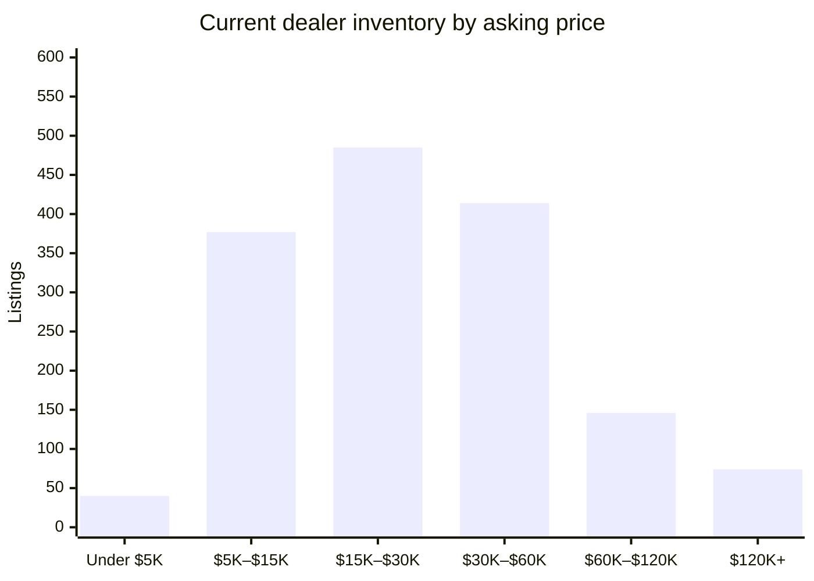

# David Webb Secondary Market — 2026-10-05

## Executive Summary

As of October 5, 2026, the David Webb secondary market presents a picture of steady dealer-side activity against a notably quiet auction season: just three hammer sales recorded in the past 60 days from a cumulative database of 4,432 auction results, with a 60-day median of $62,356 — anchored by a Mynt Auctions result of $232,000 for an 18K Gold Platinum Jade Diamond Enamel Necklace in August, the most significant lot cleared in this window. On the dealer side, 1,605 listings are currently active across 1,757 total dealer records, with 32 fresh listings entering the market in the past week and a robust 152 closures over the past four weeks signaling genuine transactional velocity; the overall dealer asking median stands at $24,000. The week's most prominent new arrivals are concentrated at The Back Vault, led by the Notre Dame 18K Yellow Gold Aquamarine and Diamond Bracelet at $175,500 and a Crescent Carved Lapis Lazuli Necklace at $143,000, both reflecting the premium that signature Webb iconography continues to command in the estate channel. The detailed breakdowns that follow cover the full current inventory, new arrivals, and recent closures in categorical depth.

## Currently Available

_1,605 active listings across all tracked dealer marketplaces (estate jewelers, 1stDibs, Sotheby's Buy Now, The RealReal), with a combined asking-price total of $56,830,057. This section is dealer inventory only — there is currently no live, biddable David Webb auction inventory to track; every auction-history record on file is a completed, historical sale (see "Recent Auction Sales" below)._

_That combined total is a sum of current asking prices, not an appraisal or a market valuation — it will run high wherever the same physical piece is listed on more than one platform (see Data-Quality Caveats)._

**By price**

**By category**

| Category | Count | Min | Median | Max |
|---|---|---|---|---|
| Earrings | 478 | $1,900 | $17,800 | $227,500 |
| Ring | 344 | $3,100 | $19,500 | $375,000 |
| Bracelet | 330 | $3,200 | $44,500 | $410,000 |
| Necklace | 224 | $2,796 | $41,300 | $345,000 |
| Brooch | 129 | $3,465 | $24,000 | $114,400 |
| Cufflinks | 23 | $2,250 | $6,400 | $14,800 |
| Other | 8 | $4,800 | $27,000 | $150,000 |

**By dealer**

_27 dealer(s) currently carry David Webb pieces — showing the top 20 by listing count, the rest bucketed into "Other" below._

| Dealer | Active Listings | Median Asking |
|---|---|---|
| The Back Vault | 960 | $24,000 |
| Oak Gem | 111 | $28,000 |
| The RealReal | 101 | $13,750 |
| Eric Originals & Antiques | 85 | $29,750 |
| Yafa Signed Jewels | 66 | $56,850 |
| Greenleaf & Crosby | 46 | $26,250 |
| Wilson's Estate Jewelry | 35 | $10,250 |
| Saidian & Sons | 33 | $40,000 |
| Sotheby's (Buy Now) | 28 | $18,250 |
| Legacy Vintage Jewels | 14 | $102,500 |
| Macklowe Gallery | 11 | $35,000 |
| Estate Diamond Jewelry | 7 | $12,000 |
| Kentshire | 6 | $36,000 |
| Joseph Saidian and Sons | 5 | $150,000 |
| Tiina Smith Jewelry | 5 | $22,000 |
| Louis Martin | 4 | $24,500 |
| A. Brandt + Son | 3 | $14,995 |
| Eric Originals and Antiques LTD | 3 | $18,000 |
| Select Antique Jewelry Inc | 2 | $58,000 |
| 66 mint | 2 | $32,675 |
| Other (7 additional dealers) | 9 | $16,500 |

## Trends by Motif & Material

_Tags are keyword-matched from each piece's own listing text against David Webb's known design vocabulary (Zodiac, animal/creature pieces, fishscale, rock crystal, enamel, carved hardstone, etc.) — a piece can carry several tags. Tags with fewer than 5 matching records are omitted as too thin to be meaningful. Click a tag to see those exact pieces in the live database._

**Auction (sold prices)**

| Tag | Count | Min | Median | Max |
|---|---|---|---|---|
| [Enamel](https://david-webb-new-york.github.io/david-webb-market-agent/?tag=Enamel) | 950 | $719 | $10,963 | $232,000 |
| [Cabochon](https://david-webb-new-york.github.io/david-webb-market-agent/?tag=Cabochon) | 935 | $1,250 | $16,380 | $508,000 |
| [Carved Hardstone](https://david-webb-new-york.github.io/david-webb-market-agent/?tag=Carved%20Hardstone) | 556 | $875 | $15,000 | $693,000 |
| [Hammered Gold](https://david-webb-new-york.github.io/david-webb-market-agent/?tag=Hammered%20Gold) | 428 | $1,250 | $11,420 | $201,600 |
| [Animal/Creature](https://david-webb-new-york.github.io/david-webb-market-agent/?tag=Animal%2FCreature) | 416 | $719 | $12,155 | $218,500 |
| [Cuff/Bangle](https://david-webb-new-york.github.io/david-webb-market-agent/?tag=Cuff%2FBangle) | 361 | $1,314 | $23,750 | $218,500 |
| [Bombé](https://david-webb-new-york.github.io/david-webb-market-agent/?tag=Bomb%C3%A9) | 201 | $1,250 | $12,454 | $1,426,500 |
| [Rock Crystal](https://david-webb-new-york.github.io/david-webb-market-agent/?tag=Rock%20Crystal) | 177 | $954 | $12,516 | $106,250 |
| [Maltese Cross](https://david-webb-new-york.github.io/david-webb-market-agent/?tag=Maltese%20Cross) | 36 | $3,125 | $20,000 | $134,500 |
| [Door Knocker](https://david-webb-new-york.github.io/david-webb-market-agent/?tag=Door%20Knocker) | 29 | $3,125 | $9,525 | $106,250 |
| [Zodiac](https://david-webb-new-york.github.io/david-webb-market-agent/?tag=Zodiac) | 27 | $812 | $8,713 | $90,000 |
| [Shell/Starfish](https://david-webb-new-york.github.io/david-webb-market-agent/?tag=Shell%2FStarfish) | 17 | $1,700 | $5,175 | $146,500 |

**Current dealer inventory (asking prices)**

| Tag | Count | Min | Median | Max |
|---|---|---|---|---|
| [Enamel](https://david-webb-new-york.github.io/david-webb-market-agent/?tag=Enamel) | 495 | $2,796 | $21,375 | $335,000 |
| [Carved Hardstone](https://david-webb-new-york.github.io/david-webb-market-agent/?tag=Carved%20Hardstone) | 296 | $3,850 | $35,350 | $289,500 |
| [Cabochon](https://david-webb-new-york.github.io/david-webb-market-agent/?tag=Cabochon) | 263 | $3,200 | $27,900 | $410,000 |
| [Animal/Creature](https://david-webb-new-york.github.io/david-webb-market-agent/?tag=Animal%2FCreature) | 235 | $3,100 | $22,096 | $335,000 |
| [Hammered Gold](https://david-webb-new-york.github.io/david-webb-market-agent/?tag=Hammered%20Gold) | 174 | $3,236 | $22,700 | $143,000 |
| [Cuff/Bangle](https://david-webb-new-york.github.io/david-webb-market-agent/?tag=Cuff%2FBangle) | 173 | $3,200 | $37,700 | $288,000 |
| [1970s](https://david-webb-new-york.github.io/david-webb-market-agent/?tag=1970s) | 145 | $3,100 | $27,900 | $289,500 |
| [1960s](https://david-webb-new-york.github.io/david-webb-market-agent/?tag=1960s) | 89 | $3,100 | $27,800 | $265,000 |
| [Rock Crystal](https://david-webb-new-york.github.io/david-webb-market-agent/?tag=Rock%20Crystal) | 65 | $4,800 | $39,000 | $225,000 |
| [1980s](https://david-webb-new-york.github.io/david-webb-market-agent/?tag=1980s) | 57 | $4,250 | $22,700 | $81,200 |
| [Bombé](https://david-webb-new-york.github.io/david-webb-market-agent/?tag=Bomb%C3%A9) | 56 | $6,400 | $18,150 | $214,500 |
| [Door Knocker](https://david-webb-new-york.github.io/david-webb-market-agent/?tag=Door%20Knocker) | 47 | $8,713 | $20,800 | $214,500 |
| [Zodiac](https://david-webb-new-york.github.io/david-webb-market-agent/?tag=Zodiac) | 20 | $4,500 | $18,150 | $64,300 |
| [Shell/Starfish](https://david-webb-new-york.github.io/david-webb-market-agent/?tag=Shell%2FStarfish) | 13 | $7,200 | $10,700 | $30,700 |
| [Maltese Cross](https://david-webb-new-york.github.io/david-webb-market-agent/?tag=Maltese%20Cross) | 12 | $27,300 | $35,050 | $65,000 |

## New in the Last Week

_32 dealer listing(s) first seen in the last 7 days, across all sources and price points — showing the 20 biggest by price._

| Piece | Category | Dealer | Price | Date |
|---|---|---|---|---|
| [David Webb Notre Dame 18K Yellow Gold Aquamarine And Diamond Bracelet](https://thebackvault.com/products/david-webb-notre-dame-18k-yellow-gold-aquamarine-and-diamond-bracelet-j10601) | Bracelet | The Back Vault | $175,500 | 2026-09-28 |
| [David Webb Crescent Platinum & 18K Yellow Gold Carved Lapis Lazuli Necklace](https://thebackvault.com/products/david-webb-crescent-platinum-18k-yellow-gold-carved-lapis-lazuli-necklace-j10607) | Necklace | The Back Vault | $143,000 | 2026-09-28 |
| [David Webb Emerald Diamond Ring](https://www.1stdibs.com/jewelry/rings/engagement-rings/david-webb-emerald-diamond-ring/id-j_26564002/) | Ring | Select Antique Jewelry Inc | $80,000 | 2026-10-02 |
| [David Webb 18K Yellow Gold Brown Horse Green Eye Bracelet](https://thebackvault.com/products/david-webb-18k-yellow-gold-brown-horse-green-eye-bracelet-j10619) | Bracelet | The Back Vault | $72,100 | 2026-09-28 |
| [David Webb 18K Yellow Gold Crystal Pool Rock Crystal Necklace](https://thebackvault.com/products/david-webb-18k-yellow-gold-crystal-pool-rock-crystal-necklace-j10608) | Necklace | The Back Vault | $72,000 | 2026-09-28 |
| [David Webb Amethyst and 18k Hammered Gold Cuff Bracelet](https://www.1stdibs.com/jewelry/bracelets/cuff-bracelets/david-webb-amethyst-18k-hammered-gold-cuff-bracelet/id-j_30234382/) | Bracelet | Tiina Smith Jewelry | $72,000 | 2026-10-05 |
| [David Webb Platinum 19 Carat Round Diamond Flower Brooch](https://thebackvault.com/products/david-webb-platinum-19-carat-round-diamond-flower-brooch-rr4313) | Brooch | The Back Vault | $64,300 | 2026-09-28 |
| [18k Gold Turquoise Diamond Enamel Rickrack Cuff Bracelet](https://greenleafcrosby.com/products/david-webb-gold-turquoise-diamond-white-enamel-cuff-bracelet) | Bracelet | Greenleaf & Crosby | $55,000 | 2026-09-28 |
| [18k Yellow Gold Green Enamel Ruby Diamond Frog Bracelet](https://greenleafcrosby.com/products/david-webb-gold-green-enamel-ruby-diamond-frog-bracelet) | Bracelet | Greenleaf & Crosby | $55,000 | 2026-10-05 |
| [David Webb Diamond and White Enamel Slice Cuff](https://www.1stdibs.com/jewelry/bracelets/cuff-bracelets/david-webb-diamond-white-enamel-slice-cuff/id-j_30506802/) | Bracelet | Tiina Smith Jewelry | $55,000 | 2026-10-05 |
| [David Webb Carved Coral and Diamond Clip Earrings](https://www.1stdibs.com/jewelry/earrings/clip-on-earrings/david-webb-carved-coral-diamond-clip-earrings/id-j_12842542/) | Earrings | The Back Vault | $49,913 | 2026-10-05 |
| [David Webb Turquoise Diamond Platinum Wrap Ring](https://www.1stdibs.com/jewelry/rings/cocktail-rings/david-webb-turquoise-diamond-platinum-wrap-ring/id-j_25263882/) | Ring | Select Antique Jewelry Inc | $36,000 | 2026-10-05 |
| [David Webb Mount Olympus Turquoise and Diamond Crossover Ring](https://saidiansons.com/products/david-webb-mount-olympus-turquoise-and-diamond-crossover-ring) | Ring | Saidian & Sons | $28,000 | 2026-10-01 |
| [David Webb Enamel, 18K & Platinum Tire Ring signed with a David Webb Certificate](https://www.1stdibs.com/jewelry/rings/dome-rings/david-webb-enamel-18k-platinum-tire-ring-signed-david-webb-certificate/id-j_30111972/) | Ring | Pierre/Famille | $27,900 | 2026-09-29 |
| [Emerald & Diamond Cocktail Ring](https://www.therealreal.com/products/details/jewelry/rings/cocktail-ring/david-webb-emerald-diamond-cocktail-ring-ts0km) | Ring | The RealReal | $26,250 | 2026-10-02 |
| [David Webb 18 Karat Yellow Gold and Pearl Three Zero Ear Clips](https://www.1stdibs.com/jewelry/earrings/drop-earrings/david-webb-18-karat-yellow-gold-pearl-three-zero-ear-clips/id-j_29319032/) | Earrings | Tiina Smith Jewelry | $22,000 | 2026-10-05 |
| [18k Yellow Gold Marquise Brown Diamond Ring](https://greenleafcrosby.com/products/david-webb-18k-yellow-gold-marquise-brown-diamond-ring) | Ring | Greenleaf & Crosby | $19,500 | 2026-10-05 |
| [David Webb Gem-Set and Diamond Earrings United States, Circa 1970](https://www.1stdibs.com/jewelry/earrings/clip-on-earrings/david-webb-gem-set-diamond-earrings-united-states-circa-1970/id-j_28789232/) | Earrings | Odeon Collection | $18,750 | 2026-09-28 |
| [David Webb Amethyst 18K Yellow Gold Green Enamel Statement Cocktail Ring](https://thebackvault.com/products/david-webb-amethyst-18k-yellow-gold-green-enamel-statement-cocktail-ring-j10629) | Ring | The Back Vault | $15,600 | 2026-09-28 |
| [David Webb 18K Yellow Gold Textured Twist Bangle Bracelet](https://thebackvault.com/products/david-webb-18k-yellow-gold-textured-twist-bangle-bracelet-j10622) | Bracelet | The Back Vault | $15,600 | 2026-09-28 |

_...and 12 more. [See the full list in the live dashboard](https://david-webb-new-york.github.io/david-webb-market-agent/?type=dealer)._

## Closed / Sold in the Last 4 Weeks

_152 dealer listing(s) delisted in the last 28 days — "closed" usually but not always means sold (see Data-Quality Caveats)._

| Piece | Category | Dealer | Price | Date |
|---|---|---|---|---|
| [David Webb Multigem and Diamond Floral Gold Brooch](https://www.1stdibs.com/jewelry/brooches/brooches/david-webb-multigem-diamond-floral-gold-brooch/id-j_30067222/) | Brooch | Legacy Vintage Jewels | $125,000 | 2026-08-11 |
| [David Webb Multigem and Diamond Floral Gold Brooch](https://www.1stdibs.com/jewelry/brooches/brooches/david-webb-multigem-diamond-floral-gold-brooch/id-j_29572672/) | Brooch | Legacy Vintage Jewels | $125,000 | 2026-09-03 |
| [David Webb Bird Brooch with Sapphire, Emerald, Ruby, and Diamonds](https://www.1stdibs.com/jewelry/brooches/brooches/david-webb-bird-brooch-sapphire-emerald-ruby-diamonds/id-j_25153132/) | Brooch | Legacy Vintage Jewels | $80,000 | 2026-08-12 |
| [David Webb Carved Jade Diamond and Ruby Seahorse Brooch](https://www.1stdibs.com/jewelry/brooches/brooches/david-webb-carved-jade-diamond-ruby-seahorse-brooch/id-j_29572622/) | Brooch | Legacy Vintage Jewels | $80,000 | 2026-08-18 |
| [David Webb Certified Unheated Burmese Ruby & Diamond Earrings](https://www.1stdibs.com/jewelry/earrings/stud-earrings/david-webb-certified-unheated-burmese-ruby-diamond-earrings/id-j_27340252/) | Earrings | Legacy Vintage Jewels | $55,000 | 2026-08-11 |
| [David Webb Green-Blue Enamel Emerald Diamond Pendant Brooch](https://www.1stdibs.com/jewelry/brooches/brooches/david-webb-green-blue-enamel-emerald-diamond-pendant-brooch/id-j_23451002/) | Necklace | Greenleaf & Crosby | $39,500 | 2026-09-07 |
| [David Webb Carved Jade & Diamond Disc Brooch](https://www.1stdibs.com/jewelry/brooches/brooches/david-webb-carved-jade-diamond-disc-brooch/id-j_25550452/) | Brooch | Legacy Vintage Jewels | $30,000 | 2026-08-19 |
| [18K Pearl & Diamond Clip-On Earrings](https://www.therealreal.com/products/jewelry/earrings/clip-on/david-webb-18k-pearl-diamond-clip-on-earrings-vdo55) | Earrings | The RealReal | $15,500 | 2026-08-12 |
| [18K Diamond & Emerald Aries Ram Cuff Bracelet](https://www.therealreal.com/products/details/jewelry/bracelets/cuff/david-webb-18k-diamond-emerald-aries-ram-cuff-bracelet-rdb1r) | Bracelet | The RealReal | $12,120 | 2026-08-25 |
| [David Webb Black Enamel Pyramid Trellis Dome Earrings](https://www.1stdibs.com/jewelry/earrings/clip-on-earrings/david-webb-black-enamel-pyramid-trellis-dome-earrings/id-j_16698822/) | Earrings | Greenleaf & Crosby | $11,600 | 2026-09-21 |
| [David Webb Trio of Gemstone Rings](https://www.1stdibs.com/jewelry/rings/fashion-rings/david-webb-trio-gemstone-rings/id-j_17080732/) | Other | Stella Rubin Jewelry | $8,500 | 2026-08-10 |
| [18K Pearl Clip-On Earrings](https://www.therealreal.com/products/details/jewelry/earrings/clip-on/david-webb-18k-pearl-clip-on-earrings-wfxi5) | Earrings | The RealReal | $8,495 | 2026-09-23 |
| [18K 41.77ctw Amethyst & Diamond Clip on Earrings](https://www.therealreal.com/products/jewelry/earrings/clip-on/david-webb-18k-41-77ctw-amethyst-diamond-clip-on-earrings-qniq5) | Earrings | The RealReal | $5,522 | 2026-08-12 |
| [David Webb Large Gold Earrings](https://www.1stdibs.com/jewelry/earrings/clip-on-earrings/david-webb-large-gold-earrings/id-j_29850792/) | Earrings | Stella Rubin Jewelry | $5,200 | 2026-10-02 |
| [Emerald & Diamond Cocktail Ring](https://www.therealreal.com/products/jewelry/rings/cocktail-ring/david-webb-emerald-diamond-cocktail-ring-ts0km) | Ring | The RealReal | $26,250 | 2026-08-12 |
| [David Webb Enamel, 18K & Platinum Tire Ring signed with a David Webb Certificate](https://www.1stdibs.com/jewelry/rings/cocktail-rings/david-webb-enamel-18k-platinum-tire-ring-signed-david-webb-certificate/id-j_30112182/) | Ring | Pierre/Famille | $20,720 | 2026-08-13 |
| [David Webb Zebra Ring, Diamond and Enamel 18K Yellow Gold Platinum](https://www.1stdibs.com/jewelry/rings/cocktail-rings/david-webb-zebra-ring-diamond-enamel-18k-yellow-gold-platinum/id-j_28437452/) | Ring | Aryamehr Fine Jewelry | $19,300 | 2026-08-10 |
| [David Webb Unicorn 18K Yellow Gold White Enamel, Diamonds And Rubies Brooch](https://thebackvault.com/products/david-webb-unicorn-18k-yellow-gold-white-enamel-diamonds-and-rubies-brooch-rr6488) | Necklace | The Back Vault | $32,100 | 2026-08-07 |
| [David Webb Platinum & 18K Yellow Gold Oval Amethyst And Diamond Hammered Finish Ring](https://thebackvault.com/products/david-webb-platinum-18k-yellow-gold-oval-amethyst-and-diamond-hammered-finish-ring-rr8125) | Ring | The Back Vault | $17,500 | 2026-08-07 |
| [David Webb 18K Yellow Gold Oval Amethyst And Diamond Hammered Finish Ring](https://thebackvault.com/products/david-webb-18k-yellow-gold-oval-amethyst-and-diamond-hammered-finish-ring-rr8125) | Ring | The Back Vault | $17,500 | 2026-08-07 |
| [David Webb Diamond, Ruby and Emerald Earrings](https://www.1stdibs.com/jewelry/earrings/clip-on-earrings/david-webb-diamond-ruby-emerald-earrings/id-j_19506002/) | Earrings | Stella Rubin Jewelry | $12,500 | 2026-09-30 |
| [Enamel Diamond Skip Necklace](https://www.therealreal.com/products/details/jewelry/necklaces/pendant-necklace/david-webb-enamel-diamond-skip-necklace-rda9j) | Necklace | The RealReal | $2,272 | 2026-09-28 |
| [David Webb Emerald & Diamond Pendent Earrings](https://www.1stdibs.com/jewelry/earrings/dangle-earrings/david-webb-emerald-diamond-pendent-earrings/id-j_24936592/) | Earrings | Legacy Vintage Jewels | $104,000 | 2026-08-10 |
| [David Webb Pearl, Diamond, Onyx & Rock Crystal Necklace](https://www.1stdibs.com/jewelry/necklaces/pendant-necklaces/david-webb-pearl-diamond-onyx-rock-crystal-necklace/id-j_29659532/) | Necklace | Odeon Collection | $42,000 | 2026-09-08 |
| [David Webb Enamel, 18K & Platinum Tire Ring signed with a David Webb Certificate](https://www.1stdibs.com/jewelry/rings/dome-rings/david-webb-enamel-18k-platinum-tire-ring-signed-david-webb-certificate/id-j_30111972/) | Ring | Pierre/Famille | $27,900 | 2026-09-29 |
| [David Webb 18K Yellow Gold Chain With A French Jade Necklace](https://thebackvault.com/products/david-webb-18k-yellow-gold-convertable-chain-with-a-french-jade-necklace-rr7540) | Necklace | The Back Vault | $84,500 | 2026-08-07 |
| [David Webb 18K Yellow Gold Chain Necklace](https://thebackvault.com/products/david-webb-18k-yellow-gold-chain-necklace-rr7540) | Necklace | The Back Vault | $27,900 | 2026-08-07 |
| [David Webb Gem-Set and Diamond Earrings United States, Circa 1970](https://www.1stdibs.com/jewelry/earrings/clip-on-earrings/david-webb-gem-set-diamond-earrings-united-states-circa-1970/id-j_28789232/) | Earrings | Odeon Collection | $18,750 | 2026-09-28 |
| [David Webb White Enamel 18K Lion Head Cufflinks with Cabochon Emerald Eye](https://www.1stdibs.com/jewelry/cufflinks/cufflinks/david-webb-white-enamel-18k-lion-head-cufflinks-cabochon-emerald-eye/id-j_29732702/) | Cufflinks | Greenwich Bazzar | $13,800 | 2026-08-31 |
| [18K Diamond & Multistone Clip On Earrings](https://www.therealreal.com/products/details/jewelry/earrings/clip-on/david-webb-18k-diamond-multistone-clip-on-earrings-v5w9p) | Earrings | The RealReal | $8,495 | 2026-08-12 |
| [18K Multistone Drop Earrings](https://www.therealreal.com/products/details/jewelry/earrings/clip-on/david-webb-18k-multistone-drop-earrings-s904j) | Earrings | The RealReal | $67,500 | 2026-08-12 |
| [Vintage Pearl, Emerald, & Diamond Branching Pin Brooch](https://www.therealreal.com/products/details/jewelry/brooches/pin/david-webb-vintage-pearl-emerald-diamond-branching-pin-brooch-upfow) | Brooch | The RealReal | $34,995 | 2026-08-12 |
| [18K Turquoise & Diamond Clip-On Earrings](https://www.therealreal.com/products/details/jewelry/earrings/clip-on/david-webb-18k-turquoise-diamond-clip-on-earrings-sui5p) | Earrings | The RealReal | $21,056 | 2026-08-12 |
| [18K Wave Cuff](https://www.therealreal.com/products/details/jewelry/bracelets/cuff/david-webb-18k-wave-cuff-u7r2b) | Bracelet | The RealReal | $17,995 | 2026-08-12 |
| [18K Wave Hammered Cuff Bracelet](https://www.therealreal.com/products/details/jewelry/bracelets/cuff/david-webb-18k-wave-hammered-cuff-bracelet-u7r3k) | Bracelet | The RealReal | $17,995 | 2026-08-12 |
| [18K Ruby, Diamond & Enamel Grasshopper Brooch Pin](https://www.therealreal.com/products/details/jewelry/brooches/pin/david-webb-18k-ruby-diamond-enamel-grasshopper-brooch-pin-u3mm8) | Brooch | The RealReal | $17,850 | 2026-08-12 |
| [18K Diamond Button Earclips](https://www.therealreal.com/products/jewelry/earrings/clip-on/david-webb-18k-diamond-button-earclips-sqjjq) | Earrings | The RealReal | $14,995 | 2026-08-12 |
| [18K Crescent Oversized Clip-On Earrings](https://www.therealreal.com/products/details/jewelry/earrings/clip-on/david-webb-18k-crescent-oversized-clip-on-earrings-vdugd) | Earrings | The RealReal | $13,500 | 2026-08-12 |
| [Vintage Diamond Leaf Clip-On Earrings](https://www.therealreal.com/products/details/jewelry/earrings/clip-on/david-webb-vintage-diamond-leaf-clip-on-earrings-u79p2) | Earrings | The RealReal | $13,500 | 2026-08-12 |
| [1.48ctw Diamond & Enamel Two-Tone Doorknocker Earrings](https://www.therealreal.com/products/details/jewelry/earrings/drop/david-webb-1-48ctw-diamond-enamel-two-tone-doorknocker-earrings-t5xpg) | Earrings | The RealReal | $10,995 | 2026-08-12 |
| [18K Coral & Diamond Clip-On Earrings](https://www.therealreal.com/products/details/jewelry/earrings/clip-on/david-webb-18k-coral-diamond-clip-on-earrings-u79mm) | Earrings | The RealReal | $10,950 | 2026-08-12 |
| [Diamond Arrow Clip-On Earrings](https://www.therealreal.com/products/jewelry/earrings/clip-on/david-webb-diamond-arrow-clip-on-earrings-vdba1) | Earrings | The RealReal | $10,125 | 2026-08-12 |
| [2.00ctw Diamond Dome Ring](https://www.therealreal.com/products/details/jewelry/rings/band/david-webb-2-00ctw-diamond-dome-ring-ts0b6) | Ring | The RealReal | $9,896 | 2026-08-12 |
| [Vintage 18K Hammered Swirl Brooch](https://www.therealreal.com/products/details/jewelry/brooches/pin/david-webb-vintage-18k-hammered-swirl-brooch-tsgzl) | Brooch | The RealReal | $7,500 | 2026-08-12 |
| [1.50ctw Diamond & Enamel Double Drop Earrings](https://www.therealreal.com/products/details/jewelry/earrings/drop/david-webb-1-50ctw-diamond-enamel-double-drop-earrings-ushaa) | Earrings | The RealReal | $6,895 | 2026-08-12 |
| [18K Diamond & Enamel Unity Drop Earrings](https://www.therealreal.com/products/details/jewelry/earrings/drop/david-webb-18k-diamond-enamel-unity-drop-earrings-ush87) | Earrings | The RealReal | $6,795 | 2026-08-12 |
| [18K Crescent Clip On Earrings](https://www.therealreal.com/products/details/jewelry/earrings/clip-on/david-webb-18k-crescent-clip-on-earrings-u8hle) | Earrings | The RealReal | $6,495 | 2026-08-12 |
| [18K Diamond & Enamel Double Bangle Bracelet](https://www.therealreal.com/products/details/jewelry/bracelets/bangle/david-webb-18k-diamond-enamel-double-bangle-bracelet-ushbl) | Bracelet | The RealReal | $5,350 | 2026-08-12 |
| [18K Beaded Clip-On Earrings](https://www.therealreal.com/products/details/jewelry/earrings/clip-on/david-webb-18k-beaded-clip-on-earrings-uc9e3) | Earrings | The RealReal | $3,995 | 2026-08-12 |
| [18K Diamond & Enamel Clip-On earrings](https://www.therealreal.com/products/jewelry/earrings/clip-on/david-webb-18k-diamond-enamel-clip-on-earrings-rm3b1) | Earrings | The RealReal | $3,239 | 2026-08-12 |
| [Vintage Platinum 18K Sapphire & Diamond Station Bracelet](https://www.therealreal.com/products/details/jewelry/bracelets/link/david-webb-vintage-platinum-18k-sapphire-diamond-station-bracelet-tbm57) | Bracelet | The RealReal | $3,209 | 2026-08-12 |
| [18K Diamond & Enamel Scape Pendant Necklace](https://www.therealreal.com/products/details/jewelry/necklaces/pendant-necklace/david-webb-18k-diamond-enamel-scape-pendant-necklace-szsib) | Necklace | The RealReal | $3,146 | 2026-08-12 |
| [18K Hammered Nail Stud Earrings](https://www.therealreal.com/products/details/jewelry/earrings/stud/david-webb-18k-hammered-nail-stud-earrings-v3e9h) | Earrings | The RealReal | $1,995 | 2026-08-12 |
| [18K 5.69ctw Diamond Chain Necklace](https://www.therealreal.com/products/jewelry/necklaces/chain/david-webb-18k-5-69ctw-diamond-chain-necklace-utu8f) | Necklace | The RealReal | $40,500 | 2026-08-12 |
| [DAVID WEBB Diamond, Black Enamel Link Pendant Necklace](https://yafasignedjewels.com/products/david-webb-diamond-black-enamel-link-pendant-necklace) | Necklace | Yafa Signed Jewels | $165,000 | 2026-08-07 |
| [DAVID WEBB Hammered Rope Link Necklace](https://yafasignedjewels.com/products/david-webb-hammered-rope-link-necklace) | Necklace | Yafa Signed Jewels | $23,000 | 2026-08-07 |
| [DAVID WEBB Lapis Lazuli Cross Stitch Earrings](https://yafasignedjewels.com/products/david-webb-lapis-lazuli-cross-stitch-earrings) | Earrings | Yafa Signed Jewels | $19,000 | 2026-08-07 |
| [DAVID WEBB Textured Zen Earrings](https://yafasignedjewels.com/products/david-webb-textured-zen-earrings) | Earrings | Yafa Signed Jewels | $16,300 | 2026-08-07 |
| [David Webb Turquoise Diamond Ring 18k Platinum, Bold Beaded Design](https://www.1stdibs.com/jewelry/rings/fashion-rings/david-webb-turquoise-diamond-ring-18k-platinum-bold-beaded-design/id-j_28437492/) | Ring | Aryamehr Fine Jewelry | $23,500 | 2026-09-22 |
| [Vintage David Webb Enamel 18K Yellow Gold Statement Ring](https://www.1stdibs.com/jewelry/rings/cocktail-rings/vintage-david-webb-enamel-18k-yellow-gold-statement-ring/id-j_29898252/) | Ring | Antinori di Sanpietro | $15,600 | 2026-09-21 |
| [David Webb 0.50 Carat Round Brilliant Diamond and Striped Enamel Cocktail Ring](https://www.1stdibs.com/jewelry/rings/cocktail-rings/david-webb-050-carat-round-brilliant-diamond-striped-enamel-cocktail-ring/id-j_17092542/) | Ring | Charles Schwartz & Son | $13,500 | 2026-08-17 |
| [1.78ctw Diamond & Ruby Rhinoceros Pendant](https://www.therealreal.com/products/jewelry/necklaces/pendant-necklace/david-webb-1-78ctw-diamond-ruby-rhinoceros-pendant-v4xdg) | Necklace | The RealReal | $7,011 | 2026-08-12 |
| [18K Sapphire Ram Cocktail Ring](https://www.therealreal.com/products/jewelry/rings/cocktail-ring/david-webb-18k-sapphire-ram-cocktail-ring-v9wib) | Ring | The RealReal | $6,800 | 2026-08-12 |
| [David Webb 18K Yellow Gold White Enamel Necklace](https://www.1stdibs.com/jewelry/necklaces/link-necklaces/david-webb-18k-yellow-gold-white-enamel-necklace/id-j_20234462/) | Necklace | Gems Are Forever | $55,000 | 2026-09-18 |
| [David Webb Black Enamel Ruby Emerald Sapphire Diamond Ring 18K Yellow Gold](https://www.1stdibs.com/jewelry/rings/cocktail-rings/david-webb-black-enamel-ruby-emerald-sapphire-diamond-ring-18k-yellow-gold/id-j_13563222/) | Ring | Gems Are Forever | $43,500 | 2026-09-18 |
| [18K Turquoise, Ruby & Diamond Chimera Brooch](https://www.therealreal.com/products/jewelry/brooches/pin/david-webb-18k-turquoise-ruby-diamond-chimera-brooch-vrs9h) | Brooch | The RealReal | $26,995 | 2026-08-27 |
| [Vintage 1.57ctw Diamond, Pearl & Ruby Multistrand Choker Necklace](https://www.therealreal.com/products/jewelry/necklaces/choker/david-webb-vintage-1-57ctw-diamond-pearl-ruby-multistrand-choker-necklace-ulokj) | Necklace | The RealReal | $17,996 | 2026-08-12 |
| [18K Swing Doorknocker Clip-On Earrings](https://www.therealreal.com/products/jewelry/earrings/clip-on/david-webb-18k-swing-doorknocker-clip-on-earrings-u7lys) | Earrings | The RealReal | $8,713 | 2026-08-12 |
| [David Webb Gold and Diamonds Ring](https://www.1stdibs.com/jewelry/rings/fashion-rings/david-webb-gold-diamonds-ring/id-j_25886562/) | Ring | Stella Rubin Jewelry | $6,800 | 2026-09-18 |
| [18K Hammered Cufflinks](https://www.therealreal.com/products/details/jewelry/cufflinks/david-webb-18k-hammered-cufflinks-uh8k8) | Cufflinks | The RealReal | $3,236 | 2026-09-02 |
| [David Webb Multigem and Diamond Floral Gold Brooch](https://legacyvintagejewels.com/products/david-webb-multigem-and-diamond-floral-gold-brooch) | Necklace | Legacy Vintage Jewels | $125,000 | 2026-08-07 |
| [David Webb Diamond Earrings](https://saidiansons.com/products/david-webb-diamond-earrings-2) | Earrings | Saidian & Sons | $90,000 | 2026-08-07 |
| [David Webb Diamond Earrings](https://www.1stdibs.com/jewelry/earrings/clip-on-earrings/david-webb-diamond-earrings/id-j_29851652/) | Earrings | Joseph Saidian and Sons | $90,000 | 2026-08-10 |
| [David Webb Snake Platinum & 18K Yellow Gold Diamonds Green Cabochon Red Ruby Bracelet](https://thebackvault.com/products/david-webb-snake-platinum-18k) | Bracelet | The Back Vault | $64,300 | 2026-08-07 |
| [Vintage David Webb Coral and Emerald Brooch](https://www.1stdibs.com/jewelry/brooches/brooches/vintage-david-webb-coral-emerald-brooch/id-j_17567082/) | Brooch | Tesori Belli | $58,000 | 2026-08-10 |
| [David Webb Turquoise And Diamond Vintage 18k Yellow Gold Ring](https://www.1stdibs.com/jewelry/rings/cocktail-rings/david-webb-turquoise-diamond-vintage-18k-yellow-gold-ring/id-j_19439402/) | Ring | The Back Vault | $57,600 | 2026-08-21 |
| [David Webb 18K Yellow Gold Garnet, Turquoise and Diamond Bib Necklace](https://www.1stdibs.com/jewelry/necklaces/link-necklaces/david-webb-18k-yellow-gold-garnet-turquoise-diamond-bib-necklace/id-j_28469292/) | Necklace | The Back Vault | $56,000 | 2026-08-21 |
| [David Webb Tassel Necklace](https://www.1stdibs.com/jewelry/necklaces/pendant-necklaces/david-webb-tassel-necklace/id-j_29923192/) | Necklace | Joseph Saidian and Sons | $55,000 | 2026-08-10 |
| [David Webb Diamond and White Enamel Slice Cuff](https://www.1stdibs.com/jewelry/bracelets/cuff-bracelets/david-webb-diamond-white-enamel-slice-cuff/id-j_29002292/) | Bracelet | Tiina Smith Jewelry | $55,000 | 2026-09-01 |
| [David Webb Convertible Yellow Gold Chain](https://www.1stdibs.com/jewelry/necklaces/chain-necklaces/david-webb-convertible-yellow-gold-chain/id-j_24467672/) | Necklace | M.S. Rau | $54,500 | 2026-09-04 |
| [David Webb Platinum & 18K Yellow Gold Escargot Fluted Round Gold Link Bracelet](https://thebackvault.com/products/david-webb-platinum-18k-yellow-gold-escargot-fluted-round-gold-link-bracelet-rr8567) | Bracelet | The Back Vault | $41,600 | 2026-08-07 |
| [David Webb Emerald & Diamond Ring](https://legacyvintagejewels.com/products/david-webb-emerald-diamond-ring) | Ring | Legacy Vintage Jewels | $40,000 | 2026-08-07 |
| [David Webb Emerald & Diamond Ring](https://www.1stdibs.com/jewelry/rings/cocktail-rings/david-webb-emerald-diamond-ring/id-j_24963432/) | Ring | Legacy Vintage Jewels | $40,000 | 2026-08-25 |
| [David Webb 18K Yellow Gold Black Enamel With Gemstones And Diamonds Bracelet](https://www.1stdibs.com/jewelry/bracelets/bangles/david-webb-18k-yellow-gold-black-enamel-gemstones-diamonds-bracelet/id-j_26857032/) | Bracelet | The Back Vault | $36,300 | 2026-08-21 |
| [David Webb Heraldic Lapis Diamond Enamel Gold Platinum Brooch Pendant](https://oakgem.com/products/david-webb-heraldic-lapis-diamond-enamel-gold-platinum-brooch-pendant) | Necklace | Oak Gem | $36,000 | 2026-08-07 |
| [David Webb Platinum & 18K Yellow Gold Coral And 4.00cttw Diamond Drop Earrings](https://thebackvault.com/products/david-webb-platinum-18k-yellow-gold-coral-and-4-00cttw-diamond-drop-earrings-rr9474) | Earrings | The Back Vault | $35,700 | 2026-08-07 |
| [Vintage 1960s David Webb Coral and Diamond Earrings](https://ericoriginals.com/products/vintage-1960s-david-webb-coral-and-diamond-earrings) | Earrings | Eric Originals & Antiques | $34,750 | 2026-08-07 |
| [David Webb 18K Gold Diamonds Textured Bracelet](https://www.1stdibs.com/jewelry/bracelets/link-bracelets/david-webb-18k-gold-diamonds-textured-bracelet/id-j_27754622/) | Bracelet | Jewelry Grove | $32,500 | 2026-08-26 |
| [18K 2.59ctw Diamond & Enamel Leopard Bracelet](https://www.therealreal.com/products/jewelry/bracelets/bangle/david-webb-18k-2-59ctw-diamond-enamel-leopard-bracelet-ruvre) | Bracelet | The RealReal | $31,500 | 2026-08-28 |
| [David Webb Black Enamel 18 Karat Gold Emerald Eyes Tiger Brooch](https://www.1stdibs.com/jewelry/brooches/brooches/david-webb-black-enamel-18-karat-gold-emerald-eyes-tiger-brooch/id-j_8784561/) | Brooch | The Back Vault | $30,525 | 2026-08-21 |
| [David Webb 18K Yellow Gold Star Sapphire Nephrite Jade Ring](https://thebackvault.com/products/david-webb-18k-yellow-gold-star-sapphire-nephrite-jade-ring-rr7335) | Ring | The Back Vault | $30,500 | 2026-08-07 |
| [David Webb 18K Yellow Gold  Ring](https://thebackvault.com/products/david-webb-18k-yellow-gold-ring-rr7335) | Ring | The Back Vault | $30,500 | 2026-08-12 |
| [David Webb Sapphire Emerald, Diamond and Gold Ear Clips](https://www.1stdibs.com/jewelry/earrings/clip-on-earrings/david-webb-sapphire-emerald-diamond-gold-ear-clips/id-j_29062702/) | Earrings | Tiina Smith Jewelry | $29,000 | 2026-08-13 |
| [David Webb 18 Karat Yellow Gold Black Enamel Bracelet](https://www.1stdibs.com/jewelry/bracelets/cuff-bracelets/david-webb-18-karat-yellow-gold-black-enamel-bracelet/id-j_27636812/) | Bracelet | The Estate Watch and Jewelry Company | $28,500 | 2026-08-13 |
| [David Webb Carved Smooth Purple Amethyst, Green Enamel And Diamond Ring](https://www.1stdibs.com/jewelry/rings/fashion-rings/david-webb-carved-smooth-purple-amethyst-green-enamel-diamond-ring/id-j_14642152/) | Ring | The Back Vault | $26,400 | 2026-08-21 |
| Gold, Multigem and Diamond Ring | Ring | Sotheby's (Buy Now) | $25,000 | 2026-08-10 |
| Gold, Platinum, Turquoise, Diamond and Enamel Long Swing Drop Earclips | Earrings | Sotheby's (Buy Now) | $25,000 | 2026-08-10 |
| [David Webb 18 Karat Ribbed Yellow Gold Hinged Bangle Bracelet](https://www.1stdibs.com/jewelry/bracelets/bangles/david-webb-18-karat-ribbed-yellow-gold-hinged-bangle-bracelet/id-j_24865542/) | Bracelet | Bardy's Estate Jewelry | $25,000 | 2026-08-11 |
| [Vintage David Webb 18K Black Enamel Link Bracelet](https://www.1stdibs.com/jewelry/bracelets/link-bracelets/vintage-david-webb-18k-black-enamel-link-bracelet/id-j_30055212/) | Bracelet | Jewelry Grove | $25,000 | 2026-09-02 |
| [David Webb Cuff Links and Stud Dress Set](https://www.1stdibs.com/jewelry/cufflinks/cufflinks/david-webb-cuff-links-stud-dress-set/id-j_11287632/) | Bracelet | The Back Vault | $22,687 | 2026-08-21 |
| Gold, Platinum, Enamel, Emerald, Ruby and Diamond Lion Brooch | Brooch | Sotheby's (Buy Now) | $22,000 | 2026-08-10 |
| [David Webb 1970's Diamond Pearl 18 Karat Yellow Gold Platinum Vintage Swirl Cuff Bracelet](https://wilsonsestatejewelry.com/products/david-webb-1970s-diamond-pearl-18-karat-yellow-gold-platinum-vintage-swirl-cuff-bracelet) | Bracelet | Wilson's Estate Jewelry | $21,500 | 2026-08-07 |
| [David Webb Star Natural Star Sapphire & Diamond Ring](https://www.1stdibs.com/jewelry/rings/cocktail-rings/david-webb-star-natural-star-sapphire-diamond-ring/id-j_24981562/) | Ring | Legacy Vintage Jewels | $20,500 | 2026-08-13 |
| [David Webb Carved Rock Crystal and Diamond Earrings](https://saidiansons.com/products/david-webb-carved-rock-crystal-and-diamond-earrings) | Earrings | Saidian & Sons | $20,000 | 2026-08-07 |
| [David Webb 1980's Diamond Enamel 18 Karat Yellow Gold Platinum Vintage Cross Pendant Brooch](https://wilsonsestatejewelry.com/products/david-webb-1980s-diamond-enamel-18-karat-yellow-gold-platinum-vintage-cross-pendant-brooch) | Necklace | Wilson's Estate Jewelry | $19,600 | 2026-08-07 |
| [Coral & Diamond Earclips](https://www.therealreal.com/products/jewelry/earrings/earclip/david-webb-coral-diamond-earclips-uyph3) | Earrings | The RealReal | $19,546 | 2026-08-12 |
| White Gold, Platinum, Rock Crystal and Diamond Ring | Ring | Sotheby's (Buy Now) | $18,000 | 2026-08-10 |
| [David Webb Coral Enamel Diamond Gold Platinum Ring](https://oakgem.com/products/david-webb-coral-enamel-diamond-gold-platinum-ring) | Ring | Oak Gem | $17,000 | 2026-08-07 |
| [David Webb Black Enamel and 18K Yellow Gold Bracelet](https://www.1stdibs.com/jewelry/bracelets/link-bracelets/david-webb-black-enamel-18k-yellow-gold-bracelet/id-j_23210762/) | Bracelet | Charles Schwartz & Son | $17,000 | 2026-08-17 |
| [David Webb Turquoise Enamel Gold Bypass Ring](https://oakgem.com/products/david-webb-turquoise-enamel-gold-bypass-ring) | Ring | Oak Gem | $16,000 | 2026-08-07 |
| [18K Twisted Hammered Nail Collar Necklace](https://www.therealreal.com/products/details/jewelry/necklaces/collar/david-webb-18k-twisted-hammered-nail-collar-necklace-s0v65) | Necklace | The RealReal | $16,000 | 2026-08-12 |
| [18K Diamond & Enamel Cocktail Ring](https://www.therealreal.com/products/jewelry/rings/cocktail-ring/david-webb-18k-diamond-enamel-cocktail-ring-upfl5) | Ring | The RealReal | $15,675 | 2026-08-12 |
| [David Webb Diamond & Gold Earrings](https://saidiansons.com/products/david-webb-diamond-gold-earrings) | Earrings | Saidian & Sons | $15,000 | 2026-08-07 |
| [David Webb Three Stone Cabochon and Diamond Earrings](https://legacyvintagejewels.com/products/david-webb-three-stone-cabochon-and-diamond-earrings) | Earrings | Legacy Vintage Jewels | $15,000 | 2026-08-07 |
| [David Webb Half-Hoop Earrings](https://www.1stdibs.com/jewelry/earrings/hoop-earrings/david-webb-half-hoop-earrings/id-j_27356082/) | Earrings | Macklowe Gallery Jewelry | $13,500 | 2026-08-11 |
| [David Webb Ruby and Enamel Frog Pin in 18K Yellow Gold](https://www.1stdibs.com/jewelry/brooches/brooches/david-webb-ruby-enamel-frog-pin-18k-yellow-gold/id-j_23891282/) | Brooch | Skibell Fine Jewelry | $13,200 | 2026-08-10 |
| [18K 5.29ctw Emerald & Diamond Clip-On Earrings](https://www.therealreal.com/products/jewelry/earrings/clip-on/david-webb-18k-5-29ctw-emerald-diamond-clip-on-earrings-szoo6) | Earrings | The RealReal | $11,696 | 2026-08-12 |
| [18K Scaled Clip-On Earrings](https://www.therealreal.com/products/details/jewelry/earrings/drop/david-webb-18k-scaled-clip-on-earrings-uh5p9) | Earrings | The RealReal | $11,246 | 2026-09-02 |
| [David Webb Fishscale Bracelet](https://www.1stdibs.com/jewelry/bracelets/link-bracelets/david-webb-fishscale-bracelet/id-j_19549292/) | Bracelet | Ahdoot & Co. | $9,500 | 2026-08-10 |
| [David Webb Fishscale Bracelet](https://www.1stdibs.com/jewelry/bracelets/retro-bracelets/david-webb-fishscale-bracelet/id-j_19381862/) | Bracelet | Ahdoot & Co. | $9,500 | 2026-08-10 |
| [2.75ctw Diamond Band](https://www.therealreal.com/products/details/jewelry/rings/band/david-webb-2-75ctw-diamond-band-v4e86) | Other | The RealReal | $9,000 | 2026-08-12 |
| [David Webb Carved Topaz and Black Enamel Earrings](https://www.1stdibs.com/jewelry/earrings/clip-on-earrings/david-webb-carved-topaz-black-enamel-earrings/id-j_8517041/) | Earrings | Skibell Fine Jewelry | $8,800 | 2026-08-10 |
| [David Webb Vintage 18K Yellow Gold Spiral Greek Pattern Large Cufflinks](https://www.1stdibs.com/jewelry/cufflinks/cufflinks/david-webb-vintage-18k-yellow-gold-spiral-greek-pattern-large-cufflinks/id-j_15512672/) | Cufflinks | Dover Jewelry | $8,799 | 2026-08-31 |
| [David Webb Enamel Ring](https://www.1stdibs.com/jewelry/rings/fashion-rings/david-webb-enamel-ring/id-j_29089132/) | Ring | Lawrence Jeffrey | $8,000 | 2026-08-10 |
| [David Webb 18k Gold Enamel Earrings](https://www.1stdibs.com/jewelry/earrings/clip-on-earrings/david-webb-18k-gold-enamel-earrings/id-j_30054762/) | Earrings | Jewelry Grove | $8,000 | 2026-09-02 |
| [18K Twisted Rope Hoops](https://www.therealreal.com/products/jewelry/earrings/hoop/david-webb-18k-twisted-rope-hoops-s2rtd) | Earrings | The RealReal | $7,996 | 2026-08-12 |
| [2.06ctw Diamond & Quartz Twilight Crossover Ring](https://www.therealreal.com/products/jewelry/rings/cocktail-ring/david-webb-2-06ctw-diamond-quartz-twilight-crossover-ring-u9cca) | Ring | The RealReal | $7,950 | 2026-08-12 |
| [18K Coral, Enamel & Amethyst Cocktail Ring](https://www.therealreal.com/products/jewelry/rings/cocktail-ring/david-webb-18k-coral-enamel-amethyst-cocktail-ring-sgda8) | Ring | The RealReal | $7,776 | 2026-08-12 |
| [David Webb 1970s 18K Gold Enamel Leaf Dome Statement Ring](https://www.1stdibs.com/jewelry/rings/cocktail-rings/david-webb-1970s-18k-gold-enamel-leaf-dome-statement-ring/id-j_25360572/) | Ring | Dover Jewelry | $7,700 | 2026-08-13 |
| [18K Ruby, Emerald & Sapphire Clip-On Earrings](https://www.therealreal.com/products/jewelry/earrings/clip-on/david-webb-18k-ruby-emerald-sapphire-clip-on-earrings-sbzw8) | Earrings | The RealReal | $7,697 | 2026-08-12 |
| [David Webb Ribbed Gold Earrings with Diamond Shaped Pattern](https://www.1stdibs.com/jewelry/earrings/lever-back-earrings/david-webb-ribbed-gold-earrings-diamond-shaped-pattern/id-j_24274802/) | Earrings | Stella Rubin Jewelry | $6,800 | 2026-08-10 |
| [18K Chevron Clip-On Earrings](https://www.therealreal.com/products/jewelry/earrings/clip-on/david-webb-18k-chevron-clip-on-earrings-upm7a) | Earrings | The RealReal | $6,493 | 2026-08-12 |
| [18K Hammered Cushion Earclips](https://www.therealreal.com/products/details/jewelry/earrings/clip-on/david-webb-18k-hammered-cushion-earclips-u79xb) | Earrings | The RealReal | $6,476 | 2026-08-31 |
| [David Webb Frog Brooch](https://www.1stdibs.com/jewelry/brooches/brooches/david-webb-frog-brooch/id-j_30182992/) | Brooch | Eric Originals and Antiques LTD | $6,320 | 2026-08-13 |
| [David Webb 18K Gold Blue & Red Enamel Cufflinks](https://www.1stdibs.com/jewelry/cufflinks/cufflinks/david-webb-18k-gold-blue-red-enamel-cufflinks/id-j_26568042/) | Cufflinks | Jewelry Grove | $6,000 | 2026-09-02 |
| [Vintage 18K Nephrite Intaglio Cocktail Ring](https://www.therealreal.com/products/details/jewelry/rings/signet-ring/david-webb-vintage-18k-nephrite-intaglio-cocktail-ring-rp0gx) | Ring | The RealReal | $5,960 | 2026-08-12 |
| [Vintage 1970s David Webb Coral Cufflinks](https://ericoriginals.com/products/vintage-1970s-david-webb-coral-cufflinks) | Cufflinks | Eric Originals & Antiques | $5,650 | 2026-08-07 |
| [David Webb Frog Brooch](https://ericoriginals.com/products/david-webb-frog-brooch-1) | Brooch | Eric Originals & Antiques | $5,500 | 2026-08-07 |
| [18K Enamel Band](https://www.therealreal.com/products/jewelry/rings/band/david-webb-18k-enamel-band-ubuzf) | Other | The RealReal | $4,800 | 2026-08-12 |
| [Vintage Diamond & Enamel Tiger Ring, 21.2 Grams 18K Gold David Webb Style](https://www.1stdibs.com/jewelry/rings/cocktail-rings/vintage-diamond-enamel-tiger-ring-212-grams-18k-gold-david-webb-style/id-j_30198172/) | Ring | Nikka Jewelry | $4,796 | 2026-09-01 |
| [18K Enamel Stud Earrings](https://www.therealreal.com/products/jewelry/earrings/stud/david-webb-18k-enamel-stud-earrings-u79ha) | Earrings | The RealReal | $4,584 | 2026-08-12 |
| Gold and Enamel Tie Bar and Cufflinks Set | Cufflinks | Sotheby's (Buy Now) | $4,500 | 2026-08-10 |
| [Diamond & Enamel Peace Sign Pendant Necklace](https://www.therealreal.com/products/jewelry/necklaces/pendant-necklace/david-webb-diamond-enamel-peace-sign-pendant-necklace-v6x74) | Necklace | The RealReal | $4,421 | 2026-08-12 |
| [18K Diamond & Enamel Peace Sign Pendant Necklace](https://www.therealreal.com/products/jewelry/necklaces/pendant-necklace/david-webb-18k-diamond-enamel-peace-sign-pendant-necklace-ue7o9) | Necklace | The RealReal | $4,421 | 2026-08-12 |
| [Multistone & Diamond Cocktail Ring](https://www.therealreal.com/products/jewelry/rings/cocktail-ring/david-webb-multistone-diamond-cocktail-ring-ts1dl) | Ring | The RealReal | $4,246 | 2026-08-12 |
| [18K Beaded Clip-On Earrings](https://www.therealreal.com/products/jewelry/earrings/clip-on/david-webb-18k-beaded-clip-on-earrings-uz063) | Earrings | The RealReal | $3,995 | 2026-08-12 |
| [18K Textured Signet Ring](https://www.therealreal.com/products/jewelry/rings/signet-ring/david-webb-18k-textured-signet-ring-vnv2d) | Ring | The RealReal | $3,895 | 2026-08-14 |
| [18K Enamel Jabot Pin](https://www.therealreal.com/products/details/jewelry/brooches/pin/david-webb-18k-enamel-jabot-pin-u79zn) | Brooch | The RealReal | $3,658 | 2026-08-17 |
| [18K Enamel Umbrella Cufflinks](https://www.therealreal.com/products/jewelry/cufflinks/david-webb-18k-enamel-umbrella-cufflinks-va4pz) | Cufflinks | The RealReal | $3,353 | 2026-08-12 |
| [18K Diamond & Enamel Skip Pendant Necklace](https://www.therealreal.com/products/jewelry/necklaces/pendant-necklace/david-webb-18k-diamond-enamel-skip-pendant-necklace-s11bh) | Necklace | The RealReal | $2,796 | 2026-08-12 |
| [David Webb Jade Ruby and Diamond Earrings](https://saidiansons.com/products/david-webb-jade-ruby-and-diamond-earrings) | Earrings | Saidian & Sons | n/a | 2026-08-07 |
| [David Webb Tassel Necklace](https://saidiansons.com/products/david-webb-tassel-necklace) | Bracelet | Saidian & Sons | n/a | 2026-08-07 |

## Recent Auction Sales (Past 60 Days)

_3 completed sale(s) in the last 60 days, median hammer $62,356. These are historical results, not current inventory — see "Currently Available" above._

| Piece | House | Sale Date | Price |
|---|---|---|---|
| Gold, Chrysoberyl and Enamel Ring | K金 配 金綠寶石 及 琺瑯彩 戒指 | Sotheby's | 2026-09-23 | $12,307 (orig. HKD 96,000) |
| Yellow Sapphire, Diamond and Enamel Demi-Parure | 黃色剛玉 配 鑽石 及 琺琅彩 項鏈 及 耳夾套装 | Sotheby's | 2026-09-17 | $62,356 (orig. HKD 486,400) |
| [David Webb 18K Gold Platinum Jade Diamond Enamel Necklace](https://www.liveauctioneers.com/item/237761875_david-webb-18k-gold-platinum-jade-diamond-enamel-necklace-new-york-ny) | Mynt Auctions | 2026-08-13 | $232,000 |

## All-Time Notable Sales

These benchmark results provide context for current dealer asking prices and collector expectations:

| Piece | House | Date | Hammer |
|---|---|---|---|
| [THE ANNENBERG DIAMOND AN EXCEPTIONAL DIAMOND RING, BY DAVID WEBB](https://www.christies.com/en/lot/lot-5250229) | Christie's | 2009-10-21 | $7,698,500 |
| [A DIAMOND RING, BY DAVID WEBB](https://www.christies.com/en/lot/lot-5578141) | Christie's | 2012-06-12 | $1,874,500 |
| [A COLORED DIAMOND RING, BY DAVID WEBB](https://www.christies.com/en/lot/lot-5578014) | Christie's | 2012-06-12 | $1,426,500 |
| [A PAIR OF NATURAL PEARL AND DIAMOND EAR PENDANTS, BY DAVID WEBB](https://www.christies.com/en/lot/lot-5754780) | Christie's | 2013-12-10 | $1,265,000 |
| [A SAPPHIRE AND DIAMOND BRACELET, BY DAVID WEBB](https://www.christies.com/en/lot/lot-5442124) | Christie's | 2011-05-31 | $959,356 (orig. HKD 7,460,000) |

## Worth a Second Look

_Implausibly low price for the category — a heuristic signal for a human to check, not a fraud determination. A flagged piece may well be genuine; this just surfaces things worth a closer look before relying on the listing. Click through to validate each one. (371 total, showing the 10 cheapest.)_

- [Pair of Gold Necklace Shorteners, David Webb](https://www.doyle.com/auction/lot/lot-142---pair-of-gold-necklace-shorteners-david-webb/?lot=1044120&so=4&st=david webb&sto=0&au=&ef=&et=&ic=False&sd=1&mc=409&mc=9&mc=4&mc=25&mc=167&mc=5&mc=173&mc=410&mc=554&mc=3&mc=209&mc=31&mc=219&mc=188&mc=325&mc=190&mc=146&pp=96&pn=11&g=1) — $375 via Doyle. $375 is well below the typical range for "necklace" (610 comparable auction records, median $17,920).
- [Gold Leaf Brooch, David Webb](https://www.doyle.com/auction/lot/lot-534---gold-leaf-brooch-david-webb/?lot=1020224&so=4&st=david webb&sto=0&au=&ef=&et=&ic=False&sd=1&mc=409&mc=9&mc=4&mc=25&mc=167&mc=5&mc=173&mc=410&mc=554&mc=3&mc=209&mc=31&mc=219&mc=188&mc=325&mc=190&mc=146&pp=96&pn=12&g=1) — $562 via Doyle. $562 is well below the typical range for "brooch" (390 comparable auction records, median $10,713).
- [A GOLD AND DIAMOND PENDANT, BY DAVID WEBB](https://www.christies.com/en/lot/lot-3830577) — $587 via Christie's. $587 is well below the typical range for "necklace" (610 comparable auction records, median $17,920).
- [A David Webb ring modelled as a leopard's head and tail, with black enamel spots and gem set eyes, signed.](https://www.christies.com/en/lot/lot-711892) — $719 (GBP 460) via Christie's. $719 is well below the typical range for "ring" (537 comparable auction records, median $8,320).
- [A Sagittarius brooch by David Webb](https://www.christies.com/en/lot/lot-2533639) — $812 (GBP 564) via Christie's. $812 is well below the typical range for "brooch" (390 comparable auction records, median $10,713).
- [A MUTLISTRAND CULTURED PEARL AND DIAMOND BRACELET, DAVID WEBB](https://www.christies.com/en/lot/lot-1862648) — $822 via Christie's. $822 is well below the typical range for "bracelet" (644 comparable auction records, median $22,590).
- [[BOOKS-JEWELRY] Group of approximately...](https://www.doyle.com/auction/lot/lot-814---books-jewelry-group-of-approximately/?lot=1277810&so=4&st=david webb&sto=0&au=&ef=&et=&ic=False&sd=1&mc=409&mc=9&mc=4&mc=25&mc=167&mc=5&mc=173&mc=410&mc=554&mc=3&mc=209&mc=31&mc=219&mc=188&mc=325&mc=190&mc=146&pp=96&pn=4&g=1) — $875 via Doyle. $875 is well below the typical range for "other" (298 comparable auction records, median $14,705).
- [Gold Jabot, David Webb](https://www.doyle.com/auction/lot/lot-323---gold-jabot-david-webb/?lot=1181319&so=4&st=david webb&sto=0&au=&ef=&et=&ic=False&sd=1&mc=409&mc=9&mc=4&mc=25&mc=167&mc=5&mc=173&mc=410&mc=554&mc=3&mc=209&mc=31&mc=219&mc=188&mc=325&mc=190&mc=146&pp=96&pn=8&g=1) — $875 via Doyle. $875 is well below the typical range for "other" (298 comparable auction records, median $14,705).
- [Gold and Jade Ring, David Webb](https://www.doyle.com/auction/lot/lot-519---gold-and-jade-ring-david-webb/?lot=1076359&so=4&st=david webb&sto=0&au=&ef=&et=&ic=False&sd=1&mc=409&mc=9&mc=4&mc=25&mc=167&mc=5&mc=173&mc=410&mc=554&mc=3&mc=209&mc=31&mc=219&mc=188&mc=325&mc=190&mc=146&pp=96&pn=11&g=1) — $875 via Doyle. $875 is well below the typical range for "ring" (537 comparable auction records, median $8,320).
- [Two Gold and Enamel Jabots, David Webb](https://www.doyle.com/auction/lot/lot-488---two-gold-and-enamel-jabots-david-webb/?lot=1071094&so=4&st=david webb&sto=0&au=&ef=&et=&ic=False&sd=1&mc=409&mc=9&mc=4&mc=25&mc=167&mc=5&mc=173&mc=410&mc=554&mc=3&mc=209&mc=31&mc=219&mc=188&mc=325&mc=190&mc=146&pp=96&pn=11&g=1) — $875 via Doyle. $875 is well below the typical range for "other" (298 comparable auction records, median $14,705).

## Data-Quality Caveats

- **Auction hammer prices exclude buyer's premium** — typically +15–26% depending on the house.
- **Dealer asking prices are not confirmed sale prices** — they're the dealer's current ask, which may be negotiated down or never sell.
- **"Closed" (dealer status: inactive) usually but not always means sold** — could also be a price relist under a new SKU or a data-feed gap.
- **"Currently available" is dealer inventory only.** There is no live, biddable David Webb auction inventory being tracked right now — genuine upcoming auction lots were confirmed absent at the major houses as of the last investigation.
- **A piece can be listed on more than one platform** (e.g. a dealer's own site and 1stDibs) — "total listings" and the combined asking-price total above count platform presence, not unique physical pieces. A 2026-08-12 audit had Claude visually compare the actual photos for every plausible cross-dealer duplicate candidate in the full active dataset (164 candidates, narrowed by price/category/title similarity) and confirmed 4 genuine duplicates (0.55% of active inventory) — each backed by a specific matching physical detail (a fracture pattern, a wear mark, an enamel-link arrangement), not just style similarity. Critically, **none** of the 395 listings from dealers other than The Back Vault/The RealReal were confirmed as also posted to either of those two — so there's no evidence every dealer is double-posting there. (An earlier same-night pass using Google reverse-image search over-flagged several pairs as duplicates that were actually distinct pieces of the same signature David Webb design — Google's "visual match" is a style-similarity tool, not a duplicate detector; the Claude-vision check applied a stricter, physical-identity bar.) This is a lower bound — only candidates the price/title filter surfaced were checked, so a duplicate priced or titled very differently across platforms, or on an untracked dealer, wouldn't be caught.
- **Foreign-currency prices are converted to USD** using approximate historical annual-average exchange rates, not settlement-date-precise figures — the original native-currency amount is footnoted wherever it differs from the displayed USD figure.

